<p align="center">
  <picture>
    <source media="(prefers-color-scheme: dark)" srcset="docs/readme/hero-dark.svg">
    <source media="(prefers-color-scheme: light)" srcset="docs/readme/hero-light.svg">
    
  </picture>
</p>

<p align="center">
  <a href="https://pypi.org/project/llm-routing/"></a>
  <a href="https://github.com/ypollak2/llm-router/actions"></a>
  <a href="https://pypi.org/project/llm-routing/"></a>
  <a href="https://pypi.org/project/llm-routing/"></a>
  <a href="https://modelcontextprotocol.io"></a>
  <a href="LICENSE"></a>
  <a href="https://github.com/ypollak2/llm-router/stargazers"></a>
</p>

<p align="center">
  <b>Intelligent</b> · free-first routing &nbsp;·&nbsp; <b>Universal</b> · any MCP editor &nbsp;·&nbsp; <b>Effortless</b> · one command, done
</p>

<p align="center">
  <a href="#quick-start" title="Get started with llm-router in 60 seconds"><picture><source media="(prefers-color-scheme: dark)" srcset="docs/readme/btn-quick-start-dark.svg"><source media="(prefers-color-scheme: light)" srcset="docs/readme/btn-quick-start-light.svg"></picture></a>&nbsp;&nbsp;
  <a href="docs/SETUP.md" title="Full setup and configuration guide"><picture><source media="(prefers-color-scheme: dark)" srcset="docs/readme/btn-docs-dark.svg"><source media="(prefers-color-scheme: light)" srcset="docs/readme/btn-docs-light.svg"></picture></a>&nbsp;&nbsp;
  <a href="docs/TOOLS.md" title="Complete reference for all 48 MCP tools"><picture><source media="(prefers-color-scheme: dark)" srcset="docs/readme/btn-tool-reference-dark.svg"><source media="(prefers-color-scheme: light)" srcset="docs/readme/btn-tool-reference-light.svg"></picture></a>&nbsp;&nbsp;
  <a href="CHANGELOG.md" title="Version history and release notes"><picture><source media="(prefers-color-scheme: dark)" srcset="docs/readme/btn-changelog-dark.svg"><source media="(prefers-color-scheme: light)" srcset="docs/readme/btn-changelog-light.svg"></picture></a>
</p>

<br/>

## The Problem

Every AI coding assistant routes **every task** to the most expensive model. A simple "what does this error mean?" burns the same tokens as "design a distributed tracing system."

**You're overpaying by 5–10x on 70% of your tasks.**

## The Solution

```bash
pip install llm-routing && llm-router install
```

No manual model picking. No workflow changes. It just works.

<br/>

<h2 align="center"><em>Real-world results</em></h2>

<p align="center">
  <picture>
    <source media="(prefers-color-scheme: dark)" srcset="docs/readme/savings-dark.svg">
    <source media="(prefers-color-scheme: light)" srcset="docs/readme/savings-light.svg">
    
  </picture>
</p>

<br/>

<h2 align="center">How it works</h2>

<p align="center">
  <picture>
    <source media="(prefers-color-scheme: dark)" srcset="docs/readme/architecture-dark.svg">
    <source media="(prefers-color-scheme: light)" srcset="docs/readme/architecture-light.svg">
    
  </picture>
</p>

<details>
<summary><b>Example: Simple task</b> — "What does this error mean?"</summary>

```
Ollama (free, local)
  ↓ if unavailable
Codex gpt-5.4 (prepaid)
  ↓ if unavailable
Gemini Flash ($0.0001/1M tokens)
  ↓ if degraded
Groq (free tier)
  ↓
GPT-4o-mini (fallback)
```

</details>

<details>
<summary><b>Example: Moderate task</b> — "Implement OAuth authentication"</summary>

```
Ollama (free, local)
  ↓ if unavailable
Codex (prepaid)
  ↓ if unavailable
Gemini Pro (quality+cost sweet spot)
  ↓ if degraded
GPT-4o (moderate cost)
  ↓
Claude Sonnet (subscription)
```

</details>

<details>
<summary><b>Example: Complex task</b> — "Design a distributed tracing system"</summary>

```
Ollama (free, local)
  ↓ if unavailable
Codex (prepaid)
  ↓ if unavailable
o3 (reasoning powerhouse)
  ↓ if unavailable
Claude Opus (max reasoning)
```

</details>

<br/>

<h2 align="center">Why <em>route?</em></h2>

<p align="center">Your AI assistant is only as efficient as the model it picks.<br/>Most tasks don't need the most expensive one.</p>

<p align="center">
  <picture>
    <source media="(prefers-color-scheme: dark)" srcset="docs/readme/why-route-dark.svg">
    <source media="(prefers-color-scheme: light)" srcset="docs/readme/why-route-light.svg">
    
  </picture>
</p>

<br/>

<h2 align="center">Quick Start</h2>

### 1. Install

```bash
pip install llm-routing && llm-router install
```

### 2. Add provider keys (optional)

```bash
export OPENAI_API_KEY="sk-..."     # GPT-4o, o3
export GEMINI_API_KEY="AIza..."    # Gemini (free tier available)
export OLLAMA_BASE_URL="..."       # Local Ollama (auto-starts)
```

> Works with **zero config** on Claude Code Pro/Max subscriptions. No API keys needed.

### 3. Done

Open Claude Code, Gemini CLI, Codex, VS Code, Cursor, or any MCP editor. Routing is automatic.

<br/>

<h2 align="center">Universal <em>compatibility</em></h2>

<p align="center">
  <picture>
    <source media="(prefers-color-scheme: dark)" srcset="docs/readme/editors-dark.svg">
    <source media="(prefers-color-scheme: light)" srcset="docs/readme/editors-light.svg">
    
  </picture>
</p>

<p align="center"><b>Full</b> = auto-routing hooks enforce your policy. <b>MCP</b> = 48 tools available, model decides.</p>

```bash
llm-router install                    # Claude Code (default)
llm-router install --host gemini-cli  # Gemini CLI
llm-router install --host codex       # Codex CLI
llm-router install --host vscode      # VS Code
llm-router install --host cursor      # Cursor
```

<br/>

---

<details>
<summary><h2>Configuration</h2></summary>

<details>
<summary><b>Environment variables</b></summary>

```bash
# Provider API Keys (only set what you have)
export OPENAI_API_KEY="sk-proj-..."          # GPT-4o, o3
export GEMINI_API_KEY="AIza..."              # Gemini models
export PERPLEXITY_API_KEY="pplx-..."         # Web-grounded research
export ANTHROPIC_API_KEY="sk-ant-..."        # Non-subscription Claude

# Local Inference (Free)
export OLLAMA_BASE_URL="http://localhost:11434"
export OLLAMA_BUDGET_MODELS="gemma4:latest,qwen3.5:latest"

# Routing Policy
export LLM_ROUTER_PROFILE="balanced"         # budget | balanced | premium
export LLM_ROUTER_ENFORCE="smart"            # smart | hard | soft | off
export LLM_ROUTER_CAVEMAN_INTENSITY="full"   # off | lite | full | ultra
```

</details>

<details>
<summary><b>Enterprise config file</b></summary>

```bash
llm-router init-config
chmod 600 ~/.llm-router/config.yaml
```

```yaml
openai_api_key: "sk-proj-..."
gemini_api_key: "AIza..."
ollama_base_url: "http://localhost:11434"
llm_router_profile: "balanced"
```

</details>

<details>
<summary><b>Routing policies</b></summary>

| Policy | Threshold | Savings | Best For |
|--------|-----------|---------|----------|
| **Aggressive** | 2 | 60–75% | Maximum savings |
| **Balanced** | 4 | 35–45% | Cost/quality tradeoff (default) |
| **Conservative** | 6 | 10–15% | Quality over cost |

```bash
export LLM_ROUTER_POLICY=aggressive
llm-router init-policy  # interactive wizard
```

</details>

</details>

---

<details>
<summary><h2>MCP Tools (48)</h2></summary>

<details>
<summary><b>Routing & Classification</b> (3 tools)</summary>

| Tool | Purpose |
|------|---------|
| `llm_route` | Route task to optimal model by complexity/profile |
| `llm_classify` | Classify task complexity: simple / moderate / complex |
| `llm_track_usage` | Manually log token usage for budget tracking |

</details>

<details>
<summary><b>Text Generation</b> (6 tools)</summary>

| Tool | Purpose |
|------|---------|
| `llm_query` | Answer questions (Haiku-class, fast) |
| `llm_research` | Research with web access (Perplexity) |
| `llm_generate` | Create content (Flash-class, cheap) |
| `llm_analyze` | Deep analysis (Sonnet-class reasoning) |
| `llm_code` | Code generation & refactoring |
| `llm_edit` | Multi-file code edits with reasoning |

</details>

<details>
<summary><b>Media Generation</b> (3 tools)</summary>

| Tool | Purpose |
|------|---------|
| `llm_image` | Generate images (Gemini / DALL-E / Flux) |
| `llm_video` | Generate videos (Gemini Veo / Runway) |
| `llm_audio` | Generate speech (ElevenLabs / OpenAI TTS) |

</details>

<details>
<summary><b>Pipeline & Orchestration</b> (2 tools)</summary>

| Tool | Purpose |
|------|---------|
| `llm_orchestrate` | Multi-step pipelines (research → analysis → generation) |
| `llm_pipeline_templates` | List available pipeline templates |

</details>

<details>
<summary><b>Admin & Monitoring</b> (6 tools)</summary>

| Tool | Purpose |
|------|---------|
| `llm_usage` | Cost breakdown (today / week / month / all) |
| `llm_savings` | Cost savings vs Opus baseline |
| `llm_budget` | Real-time budget pressure (0.0–1.0) |
| `llm_health` | Provider health & circuit breaker state |
| `llm_providers` | Configured providers & API key status |
| `llm_set_profile` | Switch routing profile |

</details>

<details>
<summary><b>Setup & Configuration</b> (7 tools)</summary>

| Tool | Purpose |
|------|---------|
| `llm_setup` | Interactive provider setup guide |
| `llm_policy` | View / manage routing policies |
| `llm_quality_report` | Judge scores & quality trends |
| `llm_save_session` | Archive session for cross-session learning |
| `llm_check_usage` | Refresh Claude subscription quota |
| `llm_update_usage` | Update usage cache from API response |
| `llm_refresh_claude_usage` | Auto-refresh Claude quota (OAuth) |

</details>

<details>
<summary><b>Advanced</b> (7+ tools)</summary>

| Tool | Purpose |
|------|---------|
| `llm_codex` | Route directly to Codex (prepaid OpenAI) |
| `llm_auto` | Host-agnostic routing wrapper |
| `llm_gemini` | Route directly to Gemini CLI |
| `llm_fs_find` | Find files by description |
| `llm_fs_rename` | Generate bulk rename commands |
| `llm_fs_edit_many` | Multi-file edits with cheap model reasoning |
| `llm_fs_analyze_context` | Build workspace context for routing |

</details>

**[Full Tool Reference with examples](docs/TOOLS.md)**

</details>

---

<details>
<summary><h2>What's New</h2></summary>

### v7.6.0 — Agent Resource Budgeting (Latest)

- **Session Budget Allocation** — Smart carving: 30% of remaining quota per session
- **Provisional Spend Tracking** — Real-time budget decrements prevent overspend
- **Budget Reconciliation** — Refund 50% on failure (pay only for delivered value)
- **Hard Limits** — $5/agent, $50/session safety valve

### v7.4.0 — Content Generation Routing

- **Smart Detection** — "write", "draft", "create spec" patterns auto-detected
- **Decomposition** — Route generation, then integrate locally (saves 90%)
- **Soft Nudges** — Hook suggests routing without blocking

### v7.0.0 — Free-First Chain & Ollama Auto-Startup

- **Ollama Auto-Startup** — Session hook launches Ollama + loads budget models
- **Free-First Chains** — Ollama → Codex → Gemini → OpenAI → Claude
- **Codex as Free Fallback** — Injected before all paid models

[Full changelog](CHANGELOG.md)

</details>

---

## Comparison

| | llm-router | Manual Routing | Always Opus |
|---|---|---|---|
| **Cost** | $180–360/yr | Varies | $1,200–1,500/yr |
| **Setup** | One command | Manual each time | None |
| **Decision quality** | Learned from usage | Error-prone | Optimal but expensive |
| **Budget control** | Real-time pressure | None | Subscription limits |
| **Provider fallback** | Automatic chain | Manual | Single provider |
| **Learning** | Adapts over time | Static | None |

---

## Security

<table>
<tr>
<td width="50%" valign="top">

**What we do**
- Sanitize inputs against prompt injection
- Scrub API keys from logs before persistence
- Verify hook safety (no deadlocks)
- Store everything locally in `~/.llm-router/`

</td>
<td width="50%" valign="top">

**What you should know**
- Prompts are sent to your configured providers
- API keys stored locally (`.env` or `config.yaml`)
- Usage logs are unencrypted SQLite
- All providers share your routed content

</td>
</tr>
</table>

See [SECURITY.md](SECURITY.md) for responsible disclosure.

---

## Contributing

Contributions welcome! See [CONTRIBUTING.md](CONTRIBUTING.md) for guidelines.

```bash
uv run pytest tests/ -q         # Run tests
uv run ruff check src/ tests/   # Lint
uv build                        # Build
```

See [CLAUDE.md](CLAUDE.md) for architecture decisions and module organization.

---

<p align="center">
  <a href="https://github.com/ypollak2/llm-router/issues"><b>Issues</b></a> &nbsp;·&nbsp;
  <a href="https://github.com/ypollak2/llm-router/discussions"><b>Discussions</b></a> &nbsp;·&nbsp;
  <a href="https://pypi.org/project/llm-routing/"><b>PyPI</b></a> &nbsp;·&nbsp;
  <a href="CHANGELOG.md"><b>Changelog</b></a>
</p>

<p align="center"><sub>MIT License · Made with care for developers who value both cost and quality.</sub></p>
