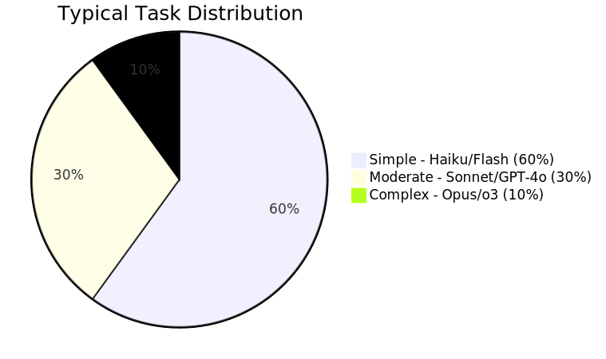

<p align="center">
  
</p>

<h1 align="center">LLM Router</h1>

<p align="center">
  <strong>One MCP server. Every AI model. Smart routing.</strong>
</p>

<p align="center">
  Route text, image, video, and audio tasks to 20+ AI providers — automatically picking the best model for the job based on your budget and active profile.
</p>

<p align="center">
  <a href="#quick-start">Quick Start</a> &bull;
  <a href="#how-it-works">How It Works</a> &bull;
  <a href="#providers">Providers</a> &bull;
  <a href="#routing-profiles">Profiles</a> &bull;
  <a href="#budget-control">Budget Control</a> &bull;
  <a href="docs/PROVIDERS.md">Provider Setup</a>
</p>

<p align="center">
  <a href="https://github.com/ypollak2/llm-router/actions"></a>
  <a href="https://github.com/ypollak2/llm-router/blob/main/LICENSE"></a>
  
  
  
</p>

---

## The Problem

You use Claude Code (or any MCP client). You also have access to GPT-4o, Gemini, Perplexity, DALL-E, Runway, ElevenLabs — but switching between them is manual, slow, and expensive.

**LLM Router** gives your AI assistant one unified interface to all of them — and it automatically picks the right one based on what you're doing and what you can afford.

```
You:     "Research the latest AI funding rounds"
Router:  → Perplexity Sonar Pro (search-augmented, best for current facts)

You:     "Generate a hero image for the landing page"
Router:  → Flux Pro via fal.ai (best quality/cost for images)

You:     "Write unit tests for the auth module"
Router:  → Claude Sonnet (top coding model, within budget)

You:     "Create a 5-second product demo clip"
Router:  → Kling 2.0 via fal.ai (best value for short video)
```

### Why It Saves 40–70%

Most AI tasks don't need the most powerful model. The router matches complexity to capability automatically:

<p align="center">
  
</p>

| | Without Router | With Router |
|--|---------------|-------------|
| Simple tasks (60%) | Opus $$$$ | Haiku $ |
| Moderate tasks (30%) | Opus $$$$ | Sonnet $$ |
| Complex tasks (10%) | Opus $$$$ | Opus $$$$ |
| **Monthly estimate** | **~$50** | **~$15–20** |

---

## Quick Start

### Option A: Claude Code Plugin (Recommended)

```bash
claude plugin add ypollak2/llm-router
```

### Option B: Manual Install

```bash
git clone https://github.com/ypollak2/llm-router.git
cd llm-router
uv sync
./scripts/install.sh    # registers as MCP server in Claude Code
```

### Get Running in 3 Steps

<p align="center">
  
</p>

> **Start for free**: Google's Gemini API has a [free tier](https://aistudio.google.com/apikey) with 1M tokens/day — no credit card needed. [Groq](https://console.groq.com/keys) also offers a generous free tier with ultra-fast inference.

### What You Get

- **20 MCP tools** — Smart routing, text, image, video, audio, setup, usage monitoring
- **`/route` skill** — Smart task classification and routing in one command
- **Smart classifier** — Auto-picks Claude Haiku/Sonnet/Opus based on complexity
- **Claude subscription monitoring** — Live session/weekly usage from claude.ai
- **Codex desktop integration** — Route tasks to local OpenAI Codex (free)
- **LLM Orchestrator agent** — Autonomous multi-step task decomposition across models

---

## How It Works

### Architecture

<p align="center">
  
</p>

### Routing Decision Flow

<p align="center">
  
</p>

---

## Smart Routing (Claude Code Models)

Use Claude Code's own models (Haiku/Sonnet/Opus) **without extra API keys** via the smart classifier:

```
llm_classify("What is the capital of France?")
→ [S] simple (99%) → haiku

llm_classify("Write a REST API with auth and pagination")
→ [M] moderate (98%) → sonnet

llm_classify("Design a distributed CQRS architecture")
→ [C] complex (85%) → opus
```

### Complexity-First Routing

Complexity drives model selection — this is the real savings mechanism. You don't need opus for "what time is it?" and you don't want haiku for architecture design. Budget pressure is a late safety net, not the primary router.

```bash
# In .env
QUALITY_MODE=balanced        # best | balanced | conserve
MIN_MODEL=haiku              # floor: never route below this
```

| Claude Usage | Effect |
|-------------|--------|
| 0-85% | No downshift — complexity routing handles efficiency |
| 85-95% | Downshift by 1 tier + suggest external fallback |
| 95%+ | Downshift by 2 tiers + recommend external (Codex, OpenAI, Gemini) |

Budget pressure comes from **real Claude subscription data** (session %, weekly %) fetched live from claude.ai. The router also factors in **time until session reset** — if you're at 90% but the session resets in 5 minutes, no downshift needed.

### External Fallback

When Claude quota is tight (85%+), the router ranks available external models:

```
llm_classify("Design auth architecture")
# -> complex -> sonnet (downshifted from opus)
#    pressure: [========..] 90%
#    >> fallback: codex/gpt-5.4 (free, preserves Claude quota)
```

- **Codex (local)**: Free — uses your OpenAI desktop subscription
- **OpenAI API**: GPT-4o, o3 (ranked by quality, filtered by budget)
- **Gemini API**: gemini-2.5-pro, gemini-2.5-flash

Per-provider budgets via `LLM_ROUTER_BUDGET_OPENAI=10.00`, `LLM_ROUTER_BUDGET_GEMINI=5.00`.

### Claude Subscription Monitoring

Live usage data from your claude.ai account — no guessing:

```
+----------------------------------------------------------+
|                Claude Subscription (Live)                |
+----------------------------------------------------------+
|   Session      [====........]  35%  resets in 3h 7m      |
|   Weekly (all) [===.........]  23%  resets Fri 01:00 PM  |
|   Sonnet only  [===.........]  26%  resets Wed 10:00 AM  |
+----------------------------------------------------------+
|   OK 35% pressure -- full model selection                |
+----------------------------------------------------------+
```

Fetched via Playwright from claude.ai's internal JSON API (same data the settings page uses). One `browser_evaluate` call, cached in memory for routing decisions.

---

## Providers

### Text & Code LLMs

| Provider | Models | Free Tier | Best For |
|----------|--------|-----------|----------|
| **Google Gemini** | 2.5 Pro, 2.5 Flash | **Yes** (1M tokens/day) | Generation, long context |
| **Groq** | Llama 3.3, Mixtral | **Yes** | Ultra-fast inference |
| **OpenAI** | GPT-4o, GPT-4o-mini, o3 | No | Code, analysis, reasoning |
| **Perplexity** | Sonar, Sonar Pro | No | Research, current events |
| **Anthropic** | Claude Sonnet, Haiku | No | Nuanced writing, safety |
| **Deepseek** | V3, Reasoner | Yes (limited) | Cost-effective reasoning |
| **Mistral** | Large, Small | Yes (limited) | Multilingual |
| **Together** | Llama 3, CodeLlama | Yes (limited) | Open-source models |
| **xAI** | Grok 3 | No | Real-time information |
| **Cohere** | Command R+ | Yes (trial) | RAG, enterprise search |

### Image Generation

| Provider | Models | Best For |
|----------|--------|----------|
| **Google Gemini** | Imagen 3 | High quality, integrated with text models |
| **fal.ai** | Flux Pro, Flux Dev | Quality/cost ratio, fast generation |
| **OpenAI** | DALL-E 3, DALL-E 2 | Prompt adherence, text in images |
| **Stability AI** | Stable Diffusion 3 | Fine control, open weights |

### Video Generation

| Provider | Models | Best For |
|----------|--------|----------|
| **Google Gemini** | Veo 2 | Integrated with Gemini ecosystem |
| **Runway** | Gen-3 Alpha | Professional quality, motion control |
| **fal.ai** | Kling, minimax | Value, fast generation |
| **Replicate** | Various | Open-source video models |

### Audio & Voice

| Provider | Models | Best For |
|----------|--------|----------|
| **ElevenLabs** | Multilingual v2 | Voice cloning, highest quality |
| **OpenAI** | TTS-1, TTS-1-HD | Cost-effective text-to-speech |

> **20+ providers and growing.** See [docs/PROVIDERS.md](docs/PROVIDERS.md) for full setup guides with API key links.

---

## MCP Tools

Once installed, Claude Code gets these 20 tools:

| Tool | What It Does |
|------|-------------|
| **Smart Routing** | |
| `llm_classify` | Classify complexity + recommend model with time-aware budget pressure |
| `llm_route` | Auto-classify, then route to the best external LLM |
| `llm_track_usage` | Report Claude Code token usage for budget tracking |
| **Text & Code** | |
| `llm_query` | General questions — auto-routed to the best text LLM |
| `llm_research` | Search-augmented answers via Perplexity |
| `llm_generate` | Creative content — writing, summaries, brainstorming |
| `llm_analyze` | Deep reasoning — analysis, debugging, problem decomposition |
| `llm_code` | Coding tasks — generation, refactoring, algorithms |
| **Media** | |
| `llm_image` | Image generation — Gemini Imagen, DALL-E, Flux, or SD |
| `llm_video` | Video generation — Gemini Veo, Runway, Kling, etc. |
| `llm_audio` | Voice/audio — TTS via ElevenLabs or OpenAI |
| **Orchestration** | |
| `llm_orchestrate` | Multi-step pipelines across multiple models |
| `llm_pipeline_templates` | List available orchestration templates |
| **Monitoring & Setup** | |
| `llm_check_usage` | Check live Claude subscription usage (session %, weekly %) |
| `llm_update_usage` | Feed live usage data from claude.ai into the router |
| `llm_codex` | Route tasks to local Codex desktop agent (free, uses OpenAI sub) |
| `llm_setup` | Discover API keys, add providers, get setup guides |
| `llm_set_profile` | Switch routing profile (budget / balanced / premium) |
| `llm_usage` | Unified dashboard — Claude sub, Codex, APIs, savings in one view |
| `llm_health` | Check provider availability and circuit breaker status |
| `llm_providers` | List all supported and configured providers |

---

## Routing Profiles

<p align="center">
  
</p>

Three built-in profiles control the cost/quality tradeoff:

| | Budget | Balanced | Premium |
|--|--------|----------|---------|
| **Text** | Gemini Flash, GPT-4o-mini | GPT-4o, Claude Sonnet | o3, Claude Opus |
| **Research** | Perplexity Sonar | Sonar Pro | Sonar Pro |
| **Code** | Deepseek, Gemini Flash | Claude Sonnet, GPT-4o | Claude Opus, o3 |
| **Image** | Flux Dev, Imagen 3 Fast | Flux Pro, Imagen 3, DALL-E 3 | Imagen 3, DALL-E 3 |
| **Video** | minimax, Veo 2 | Kling, Veo 2, Runway Turbo | Veo 2, Runway Gen-3 |
| **Audio** | OpenAI TTS | ElevenLabs | ElevenLabs |

Switch anytime:
```
llm_set_profile("budget")    # Development, drafts, exploration
llm_set_profile("balanced")  # Production work, client deliverables
llm_set_profile("premium")   # Critical tasks, maximum quality
```

---

## Budget Control

Set a monthly budget to prevent overspending:

```bash
# In .env
LLM_ROUTER_MONTHLY_BUDGET=50   # USD, 0 = unlimited
```

The router:
- **Tracks real-time spend** across all providers in SQLite
- **Blocks requests** when the monthly budget is reached
- **Shows budget status** in `llm_usage`

```
llm_usage("month")

## Usage Summary (month)
Calls: 142
Tokens: 240,000 in + 80,000 out = 320,000 total
Cost: $3.4200
Avg latency: 1200ms

### Budget Status
Monthly budget: $50.00
Spent this month: $3.4200 (6.8%)
Remaining: $46.5800
```

---

## Multi-Step Orchestration

Chain tasks across different models in a pipeline:

<p align="center">
  
</p>

```
llm_orchestrate("Research AI trends and write a report", template="research_report")
```

Built-in templates:

| Template | Steps | Pipeline |
|----------|-------|----------|
| `research_report` | 3 | Research → Analyze → Write |
| `competitive_analysis` | 4 | Multi-source research → SWOT → Report |
| `content_pipeline` | 4 | Research → Draft → Review → Polish |
| `code_review_fix` | 3 | Review → Fix → Test |

---

## Configuration

### Environment Variables

```bash
# Required: at least one provider
GEMINI_API_KEY=AIza...         # Free tier! https://aistudio.google.com/apikey
OPENAI_API_KEY=sk-proj-...
PERPLEXITY_API_KEY=pplx-...

# Optional: more providers (add as many as you want)
ANTHROPIC_API_KEY=sk-ant-...
DEEPSEEK_API_KEY=...
GROQ_API_KEY=gsk_...
FAL_KEY=...
ELEVENLABS_API_KEY=...

# Router config
LLM_ROUTER_PROFILE=balanced        # budget | balanced | premium
LLM_ROUTER_MONTHLY_BUDGET=0        # USD, 0 = unlimited

# Smart routing (Claude Code model selection)
DAILY_TOKEN_BUDGET=0               # tokens/day, 0 = unlimited
QUALITY_MODE=balanced              # best | balanced | conserve
MIN_MODEL=haiku                    # floor: haiku | sonnet | opus
```

See [.env.example](.env.example) for the full list of supported providers.

### Claude Code Integration

After running `./scripts/install.sh`, your `~/.claude.json` will include:

```json
{
  "mcpServers": {
    "llm-router": {
      "command": "uv",
      "args": ["run", "--directory", "/path/to/llm-router", "llm-router"]
    }
  }
}
```

---

## Development

```bash
# Install with dev dependencies
uv sync --extra dev

# Run tests
uv run pytest -v

# Run integration tests (requires real API keys)
uv run pytest tests/test_integration.py -v

# Lint
uv run ruff check src/
```

---

## Roadmap

See [ROADMAP.md](ROADMAP.md) for the detailed roadmap with phases and priorities.

### Completed (v0.1 + v0.2)

- [x] Core text LLM routing (10+ providers)
- [x] Configurable profiles (budget / balanced / premium)
- [x] Cost tracking with SQLite
- [x] Health checks with circuit breaker
- [x] Image generation (Gemini Imagen 3, DALL-E, Flux, SD)
- [x] Video generation (Gemini Veo 2, Runway, Kling, minimax)
- [x] Audio/voice routing (ElevenLabs, OpenAI TTS)
- [x] Monthly budget enforcement
- [x] Multi-step orchestration with pipeline templates
- [x] Claude Code plugin with orchestrator agent and /route skill
- [x] Freemium tier gating
- [x] CI with GitHub Actions
- [x] Smart complexity-first routing (simple->haiku, moderate->sonnet, complex->opus)
- [x] Live Claude subscription monitoring (session %, weekly %, Sonnet %)
- [x] Time-aware budget pressure (factors in session reset proximity)
- [x] External fallback ranking when Claude is tight (Codex, OpenAI, Gemini)
- [x] Codex desktop integration (local agent, free via OpenAI subscription)
- [x] Unified usage dashboard (Claude sub + Codex + APIs + savings)
- [x] `llm_setup` tool for API discovery and secure key management
- [x] Per-provider budget limits
- [x] ASCII box-drawing dashboard (terminal-friendly, no Unicode issues)

### Next Up

- [ ] Periodic usage pulse (auto-refresh during sessions)
- [ ] Streaming responses
- [ ] Gemini Imagen/Veo API integration via LiteLLM
- [ ] Web dashboard for usage analytics
- [ ] PyPI package distribution
- [ ] Automatic Playwright refresh hook for Claude usage

---

## Contributing

We welcome contributions! See [CONTRIBUTING.md](CONTRIBUTING.md) for guidelines.

Key areas where help is needed:
- Adding new provider integrations
- Improving routing intelligence
- Testing across different MCP clients
- Documentation and examples

---

## License

[MIT](LICENSE) — use it however you want.

---

<p align="center">
  <sub>Built with <a href="https://litellm.ai">LiteLLM</a> and <a href="https://modelcontextprotocol.io">MCP</a></sub>
</p>
