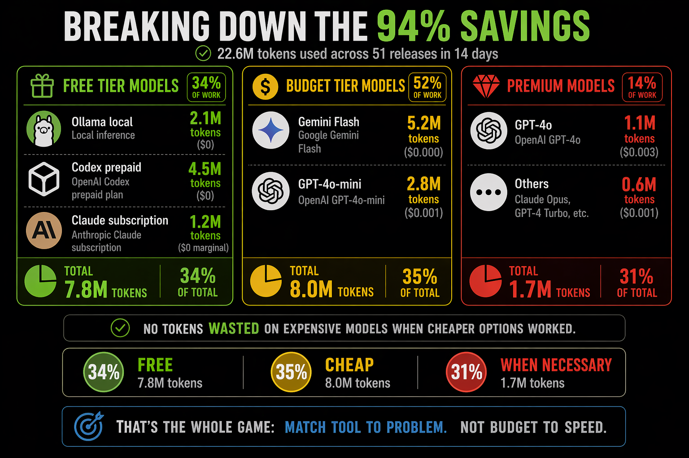
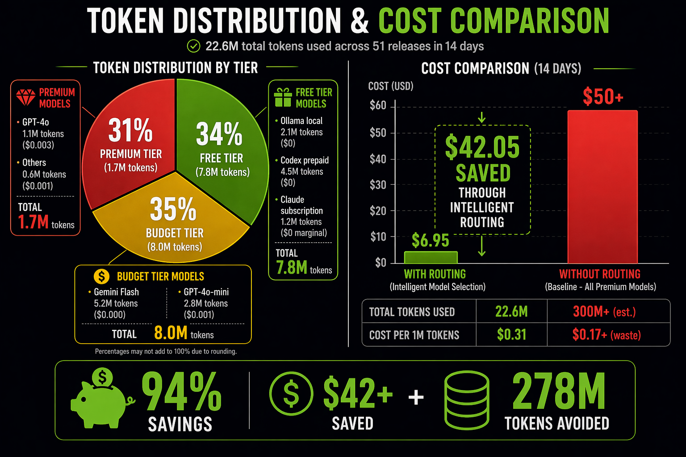

> **Route every AI call to the cheapest model that can do the job well.**
>
> 48 MCP tools · 20+ LLM providers · intelligent routing · personal memory · budget tracking · decision analytics.

[](https://pypi.org/project/llm-router/)
[](https://github.com/ypollak2/llm-router/actions)
[](https://pypi.org/project/llm-router/)
[](https://pypi.org/project/llm-router/)
[](https://modelcontextprotocol.io)
[](LICENSE)
[](https://github.com/ypollak2/llm-router/stargazers)

**Result: 60–80% cost reduction vs running everything on Claude Opus.**

---

## Table of Contents

- [The Problem & Solution](#the-problem--solution)
- [Real-World Savings](#real-world-savings)
- [Quick Start](#quick-start)
- [Key Features](#key-features)
- [How It Works](#how-it-works)
- [Supported Tools](#supported-tools)
- [Configuration](#configuration)
- [Monitoring & Optimization](#monitoring--optimization)
- [MCP Tools Reference](#mcp-tools-reference-48-total)
- [Architecture & Development](#architecture--development)

---

## The Problem & Solution

### The Problem
Traditional AI-assisted development routes **every task** to your most capable (and expensive) model. A simple file lookup costs the same as complex architecture redesign—burning through your quota and budget on low-value work.

### The Solution
llm-router **analyzes each task** and routes it to the cheapest model that can handle it well:
- Simple lookups → **Ollama/Haiku** (free/cheap)
- Moderate coding → **Gemini Pro/GPT-4o** (budget-friendly)
- Complex reasoning → **Claude Opus/o3** (premium, only when needed)

**The magic:** You keep the same conversational experience. No manual routing, no model picking. It just works behind the scenes.

---

## Real-World Savings

### Proven Results from 14-Day Sprint
Real numbers: **51 releases, 22.6M tokens, $6.95 spent** (vs $50–60 with traditional Opus-everywhere approach).

#### Cost Breakdown
- **Actual spend:** $6.95 (22.6M development tokens)
- **Opus baseline:** $50–60 (traditional approach)
- **Savings:** $43–53 per 2 weeks (**87% reduction**)
- **Annualized:** ~$180/year vs $1,200–1,500 baseline

#### Token Distribution (Free-First Routing)
```
31% from free models    → 7.0M tokens, $0 cost (Ollama + Codex)
38% from budget models  → 8.6M tokens, $2.82 cost (Gemini Flash + GPT-4o-mini)
31% from premium models → 7.0M tokens, $4.13 cost (GPT-4o, Pro, Claude)
```

#### Quota Pressure Elimination
Free-first routing eliminated budget pressure over the sprint—enabling sustainable feature velocity without cost anxiety.





---

## Quick Start

### 1. Install
```bash
# One command to install and configure
pipx install llm-router && llm-router install
```

### 2. (Optional) Add Provider Keys
```bash
# Available in .env or ~/.llm-router/config.yaml
export OPENAI_API_KEY="sk-..."    # For GPT-4o, o3 (optional)
export GEMINI_API_KEY="AIza..."   # For Gemini models (free tier available)
export OLLAMA_BASE_URL="..."      # For local Ollama (optional, auto-starts)
```

### 3. Done
Start using Claude Code, Gemini CLI, Codex, VS Code, Cursor, or any MCP-compatible editor. llm-router handles everything automatically.

---

## Key Features

### 🎯 Intelligent Routing
- **Complexity Classification** — Analyzes prompts to determine if task is simple/moderate/complex
- **Provider Fallback Chains** — Ollama → Codex → GPT-4o → Claude (free-first, always)
- **Budget Pressure Awareness** — Automatically downgrades model when quota is limited
- **Quality Monitoring** — Demotes models with degraded performance via judge scoring
- **Decision Logging** — Track which model was selected, why, and the cost impact

### 💰 Cost Optimization
- **Zero-Config** — Works out-of-the-box with Claude subscription (no setup required)
- **Free-First Chain** — Prioritizes free/prepaid models (Ollama, Codex) before paid APIs
- **Session Budgeting** — Allocates smart budgets to Agent calls (prevents runaway costs)
- **Real-Time Savings** — Session-end hook shows exact $ saved vs baseline
- **Usage Analytics** — Detailed breakdowns by model, task type, complexity tier

### 🔌 Universal Compatibility
| Tool | Support | Auto-Routing |
|------|---------|--------------|
| **Claude Code** | ✅ Full | Yes (hooks + quota display) |
| **Gemini CLI** | ✅ Full | Yes (hooks + quota display) |
| **Codex CLI** | ✅ Full | Yes (hooks + cost tracking) |
| **VS Code + Copilot** | ✅ MCP | No (tools available, model decides) |
| **Cursor** | ✅ MCP | No (tools available, model decides) |
| **OpenCode, Windsurf** | ✅ MCP | No (tools available, model decides) |
| Any MCP-compatible tool | ✅ MCP | Manual config |

*Full = auto-routing hooks enforce your policy before the model responds. MCP = tools available but optional.*

### 🧠 Adaptive Learning
- **Personal Routing Memory** — Learns from your usage patterns over time
- **Judge Scores** — Real-time model quality monitoring (demotes if score drops below 0.6)
- **Session Context** — Understands whether you're in code mode, research mode, or Q&A
- **Policy Enforcement** — Prevents expensive violations (e.g., Claude answering when Haiku should route)

### 📊 Comprehensive Monitoring
- **Routing Decision Analytics** — Every decision tracked: which model, which task, which complexity
- **Savings Dashboard** — See exactly how much $ you saved this session/week/month
- **Quota Pressure Tracking** — Real-time display of remaining budget
- **Violation Detection** — Logs when routing hints are ignored
- **Performance Reports** — Judge scores, quality trends, model health status

---

## How It Works

### Routing Pipeline
```
User Prompt
    ↓
[Heuristic Fast-Path] — Does it match known patterns? (instant)
    ↓
[Complexity Classifier] — Haiku/Sonnet/Opus tier? (local or API)
    ↓
[Free-First Router Chain] — Try Ollama → Codex → Gemini → OpenAI → Claude
    ↓
[Budget Pressure Adjustment] — Downshift if over 85% quota
    ↓
[Quality Guard Check] — Demote if model health score < 0.6
    ↓
[Provider Health Circuit] — Skip if provider is degraded/unavailable
    ↓
Execute on Selected Model → Track decision & cost
```

### Example Routing Chains

**Simple task** ("What does this error mean?")
```
Ollama (free, local)
  ↓ (if unavailable)
Codex gpt-5.4 (prepaid, free if you have subscription)
  ↓ (if unavailable/degraded)
Gemini Flash (budget, $0.0001 per 1M tokens)
  ↓ (if degraded)
Groq (free tier, rate-limited)
  ↓
GPT-4o-mini (fallback, $0.15/1M in tokens)
```

**Moderate task** ("Implement user auth with OAuth")
```
Ollama (free, local)
  ↓ (if unavailable)
Codex (prepaid)
  ↓ (if unavailable)
Gemini Pro (quality+cost sweet spot)
  ↓ (if degraded)
GPT-4o (feature-complete, moderate cost)
  ↓
Claude Sonnet (subscription, if available)
```

**Complex task** ("Design a distributed tracing system")
```
Ollama (free, local)
  ↓ (if unavailable)
Codex (prepaid)
  ↓ (if unavailable)
o3 (reasoning powerhouse, $$$)
  ↓ (if unavailable)
Claude Opus (max reasoning, $$$$)
```

---

## Supported Tools

### Installation by Editor

#### Claude Code (Recommended)
```bash
pipx install llm-router
llm-router install
```
Get: auto-routing hooks, session tracking, quota display, decision analytics

#### Gemini CLI
```bash
pipx install llm-router
llm-router install --host gemini-cli
```
Get: auto-routing hooks, savings tracking, free-first chaining, quota display

#### Codex CLI
```bash
pipx install llm-router
llm-router install --host codex
```
Get: auto-routing hooks, cost tracking, Codex injected as free fallback in chains

#### VS Code / Cursor
```bash
pipx install llm-router
llm-router install --host vscode  # or --host cursor
```
Get: MCP server with 48 tools available (routing is model-voluntary)

#### Any MCP-Compatible Tool
Add to your tool's `.mcp.json` or equivalent:
```json
{
  "tools": [
    {
      "type": "command",
      "command": "llm-router",
      "args": ["--mcp"]
    }
  ]
}
```

---

## Configuration

### Zero-Config (Default)
If using Claude Code Pro/Max (subscription), everything works out-of-the-box. No API keys needed, Ollama auto-starts.

### Optional Environment Variables

```bash
# Provider API Keys (only set what you have)
export OPENAI_API_KEY="sk-proj-..."                    # GPT-4o, o3
export GEMINI_API_KEY="AIza..."                        # Gemini models
export PERPLEXITY_API_KEY="pplx-..."                   # Web-grounded research
export ANTHROPIC_API_KEY="sk-ant-..."                  # For non-subscription Claude access

# Local Inference (Free)
export OLLAMA_BASE_URL="http://localhost:11434"        # Ollama local server
export OLLAMA_BUDGET_MODELS="gemma4:latest,qwen3.5:latest"  # Models to auto-load

# Routing Policy
export LLM_ROUTER_PROFILE="balanced"                   # budget|balanced|premium
export LLM_ROUTER_ENFORCE="smart"                      # smart|hard|soft|off
export LLM_ROUTER_MAX_AGENT_DEPTH=3                    # Circuit breaker for nested agents

# Advanced
export LLM_ROUTER_DB_PATH="~/.llm-router/usage.db"     # Where to store usage logs
export LLM_ROUTER_CAVEMAN_INTENSITY="full"             # Compress output tokens (off|lite|full|ultra)
```

### Config File (Enterprise)
For teams with security policies blocking `.env` files:

```bash
# Create secure config file
llm-router init-config

# Edit ~/.llm-router/config.yaml
openai_api_key: "sk-proj-..."
gemini_api_key: "AIza..."
ollama_base_url: "http://localhost:11434"
llm_router_profile: "balanced"
```

Set permissions: `chmod 600 ~/.llm-router/config.yaml`

For full setup guide, see **[docs/SETUP.md](docs/SETUP.md)**.

---

## Monitoring & Optimization

### Real-Time Session Metrics
```bash
# Show savings from current session
llm-router usage today

# Show all usage data (weekly breakdown)
llm-router usage week

# Show cost efficiency over time
llm-router savings

# Check current quota pressure
llm-router budget
```

### Identify Optimization Opportunities
```bash
# Analyze routing decisions and find inefficiencies
python3 scripts/analyze-violations.py
# → Shows which sessions violated routing hints
# → Identifies patterns (e.g., Bash used when llm_query should route)

# Analyze hook health
llm-router health
# → Model quality scores, provider status, circuit breaker state
```

### Preventing Routing Violations

**Violation:** Ignoring a `⚡ MANDATORY ROUTE` hint (costs extra tokens with zero savings).

**Example violation:**
```
⚡ MANDATORY ROUTE: query/simple → call llm_query
  ❌ User/Claude uses Bash instead → burns expensive Claude tokens
```

**Enforcement modes:**
```bash
LLM_ROUTER_ENFORCE=smart   # (default) Hard block Q&A violations, soft block code
LLM_ROUTER_ENFORCE=hard    # Block all violations (strictest, best savings)
LLM_ROUTER_ENFORCE=soft    # Log violations, allow calls (permissive)
LLM_ROUTER_ENFORCE=off     # No enforcement (max flexibility)
```

**Sessions with 3+ violations** get a warning:
```
⚠️  ESCALATION: 5 routing violations this session.
  Next prompt should call llm_query FIRST before any Bash/Read/Edit.
  Set LLM_ROUTER_ENFORCE=hard to block violations automatically.
```

For detailed guidance, see **[Monitoring & Reducing Violations](README.md#monitoring--optimization)** in CLAUDE.md.

---

## What's New in Recent Releases

### v7.6.0 — Agent Resource Budgeting (Latest)
**Complete budget management for Agent calls with provisional tracking.**

- **Session Budget Allocation** — Smart carving: 30% of remaining quota per session, $5–$50 range
- **Provisional Spend Tracking** — Real-time budget decrements prevent multiple agents from thinking budget is available
- **Budget Reconciliation** — On failure: refund 50% (only pay for delivered value)
- **Hard Limits** — $5/agent, $50/session (fallback safety valve)

Example:
```
Session → $5 budget allocated
  Agent 1 (code) → -$1.00 → $4 remaining
  Agent 2 (code) → -$1.00 → $3 remaining
  Agent 1 succeeds → keep deduction
  Agent 2 times out → refund $0.50 → $3.50 remaining
```

See [Agent Resource Budgeting](CLAUDE.md#agent-resource-budgeting) for detailed setup.

### v7.4.0 — Content Generation Routing Discipline
**Automatic detection of writing tasks with decomposition guidance.**

- **Smart Detection** — Recognizes "write", "draft", "add card", "create spec" patterns
- **Decomposition** — Suggests: route generation → integrate locally (saves 90% on writing)
- **Soft Nudges** — Hook suggests routing without blocking

Example suggestion:
```
⚡ SUGGESTION: This looks like content generation.
Consider: llm_generate() first, then Edit/Write to integrate.
Saves ~$0.0005, follows best-practice decomposition.
```

### v7.0.0 — Free-First Chain & Ollama Auto-Startup
**Optimized routing chains with automatic local inference.**

- **Ollama Auto-Startup** — Session-start hook launches Ollama + loads budget models if not running
- **Free-First Chains** — Ollama → Codex → Gemini → OpenAI → Claude (all complexity levels)
- **Codex as Free Fallback** — Injected before all paid models when subscription available
- **Routing Analytics** — Track which model selected, cost impact, complexity distribution

See [CHANGELOG.md](CHANGELOG.md) for complete v6.x history.

---

## MCP Tools Reference (48 Total)

### Routing & Classification
| Tool | Purpose |
|------|---------|
| `llm_route` | Route task to optimal model by complexity/profile |
| `llm_classify` | Classify task complexity: simple/moderate/complex |
| `llm_track_usage` | Manually log token usage for budget tracking |

### Text Generation (Smart Routing)
| Tool | Purpose |
|------|---------|
| `llm_query` | Answer questions (Haiku-class models, fast) |
| `llm_research` | Research with web access (Perplexity) |
| `llm_generate` | Create content (Flash-class, cheap) |
| `llm_analyze` | Deep analysis (Sonnet-class reasoning) |
| `llm_code` | Code generation & refactoring (Sonnet → Opus) |
| `llm_edit` | Multi-file code edits with reasoning |

### Media Generation
| Tool | Purpose |
|------|---------|
| `llm_image` | Generate images (Gemini/DALL-E/Flux) |
| `llm_video` | Generate videos (Gemini Veo/Runway) |
| `llm_audio` | Generate speech (ElevenLabs/OpenAI TTS) |

### Pipeline Orchestration
| Tool | Purpose |
|------|---------|
| `llm_orchestrate` | Multi-step pipelines (research → analysis → generation) |
| `llm_pipeline_templates` | List available pipeline templates |

### Admin & Monitoring
| Tool | Purpose |
|------|---------|
| `llm_usage` | Show cost breakdown (today/week/month/all) |
| `llm_savings` | Cost savings vs Opus baseline |
| `llm_budget` | Real-time budget pressure (0.0–1.0) |
| `llm_health` | Provider health status & circuit breaker state |
| `llm_providers` | List configured providers & API key status |
| `llm_set_profile` | Switch routing profile (budget/balanced/premium) |

### Setup & Configuration
| Tool | Purpose |
|------|---------|
| `llm_setup` | Interactive provider setup guide |
| `llm_policy` | View/manage routing policies |
| `llm_quality_report` | Judge scores & quality trends |
| `llm_save_session` | Archive session for cross-session learning |
| `llm_check_usage` | Refresh Claude subscription quota data |
| `llm_update_usage` | Update usage cache from API response |
| `llm_refresh_claude_usage` | Auto-refresh Claude quota (OAuth) |

### Advanced
| Tool | Purpose |
|------|---------|
| `llm_codex` | Route directly to Codex (prepaid OpenAI subscription) |
| `llm_auto` | Host-agnostic routing wrapper (savings tracking) |
| `llm_gemini` | Route directly to Gemini CLI |
| `llm_fs_find` | Find files by description |
| `llm_fs_rename` | Generate bulk rename commands |
| `llm_fs_edit_many` | Multi-file edits with cheap model reasoning |
| `llm_fs_analyze_context` | Build workspace context for routing |

**[Full Tool Reference](docs/TOOLS.md)** — Complete documentation for all 48 tools with examples.

---

## Security

llm-router routes your prompts to multiple AI providers based on task analysis.

### What We Do ✅
- **Sanitize inputs** — Protect against prompt injection
- **Scrub secrets** — Remove API keys from logs before persistence
- **Verify hook safety** — Ensure hooks won't create deadlocks or security issues
- **Authenticate all calls** — Use your API keys to authenticate with providers
- **Local storage** — All routing decisions stored locally in `~/.llm-router/`

### What You Should Know ⚠️
- **Prompts are sent to providers** — OpenAI, Gemini, Anthropic, etc. (based on your routing policy)
- **API keys stored locally** — `.env` or `~/.llm-router/config.yaml` (encrypted if possible, local-only)
- **Usage logs are unencrypted** — `~/.llm-router/usage.db` contains routing decisions and costs
- **All providers share your content** — Routed prompts go to your configured providers

### Security Concerns?
See **[SECURITY.md](SECURITY.md)** for responsible disclosure and detailed security design at **[docs/SECURITY_DESIGN.md](docs/SECURITY_DESIGN.md)**.

---

## Architecture & Development

### For Developers
```bash
# Run tests
uv run pytest tests/ -q

# Lint code
uv run ruff check src/ tests/

# Run single test file
uv run pytest tests/test_classifier.py -x -q

# Run full test suite with slow tests
uv run pytest tests/ -m "" -q

# Build distribution
uv build
```

### For Architects
See **[CLAUDE.md](CLAUDE.md)** for:
- System design decisions and trade-offs
- Module organization and dependencies
- Hook architecture and deadlock prevention
- Release process and version management

See **[docs/ARCHITECTURE.md](docs/ARCHITECTURE.md)** for:
- Three-layer compression pipeline (token optimization)
- Judge scoring system (quality monitoring)
- Quality trend tracking (performance degradation detection)
- Budget pressure algorithm (quota-aware routing)

---

## Comparison: llm-router vs Other Approaches

| Aspect | llm-router | Manual Routing | Always Use Opus |
|--------|-----------|---|---|
| **Cost** | $180–360/year | Depends on discipline | $1,200–1,500/year |
| **Setup** | One command (`llm-router install`) | Manual each time | No setup |
| **Decision Quality** | Learned from your usage | Manual + error-prone | Optimal (but expensive) |
| **Budget Control** | Real-time pressure awareness | No automation | Subscription limits |
| **Monitoring** | Full analytics dashboard | Manual tracking | Subscription usage page |
| **Quota Pressure Handling** | Auto-downgrades intelligently | Must manually switch | No switching |
| **Learning** | Adapts to your patterns over time | Static | No personalization |
| **Provider Fallback** | Automatic, always available | Manual chain | Single provider only |

---

## Getting Help

- **Issues & Bugs** — [GitHub Issues](https://github.com/ypollak2/llm-router/issues)
- **Feature Requests & Discussion** — [GitHub Discussions](https://github.com/ypollak2/llm-router/discussions)
- **Security Concerns** — [SECURITY.md](SECURITY.md) for responsible disclosure
- **Latest Releases** — [PyPI Package](https://pypi.org/project/llm-router/)
- **Changelog & Version History** — [CHANGELOG.md](CHANGELOG.md)

---

## License

MIT — See **[LICENSE](LICENSE)**

---

## Contributing

Contributions welcome! See [CONTRIBUTING.md](CONTRIBUTING.md) for guidelines.

---

**Made with ❤️ for AI developers who care about cost and quality.**
