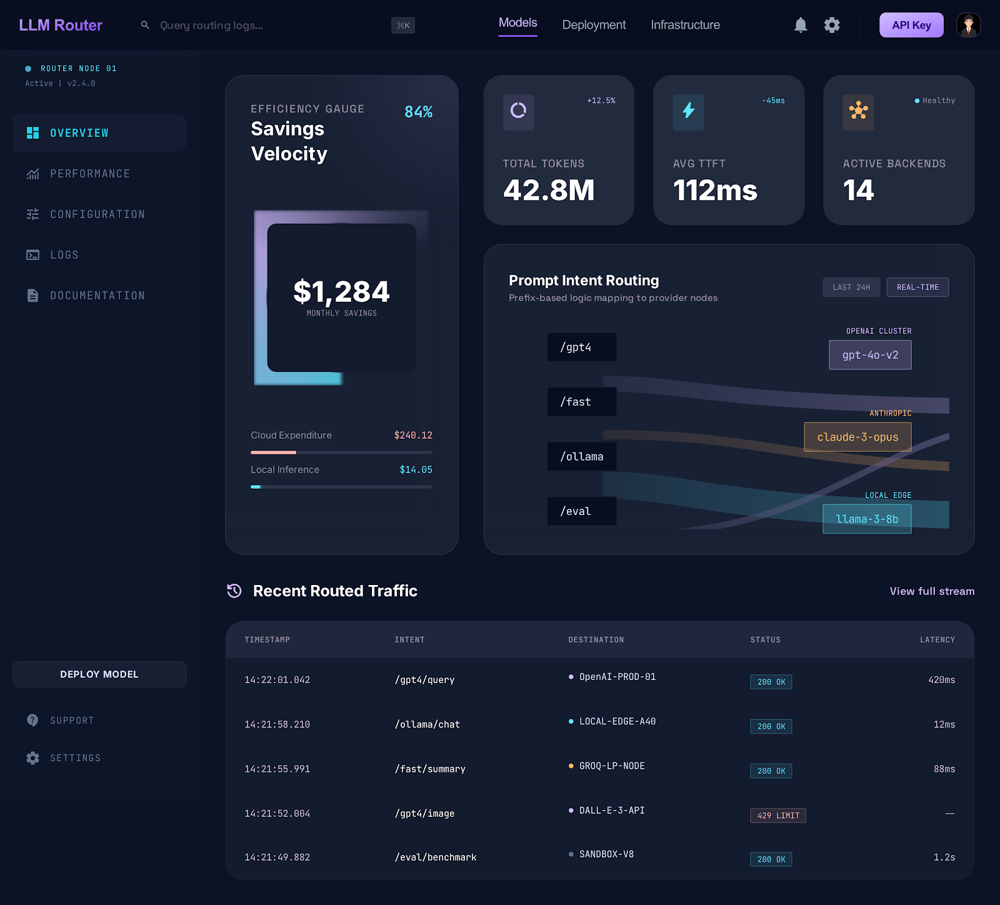
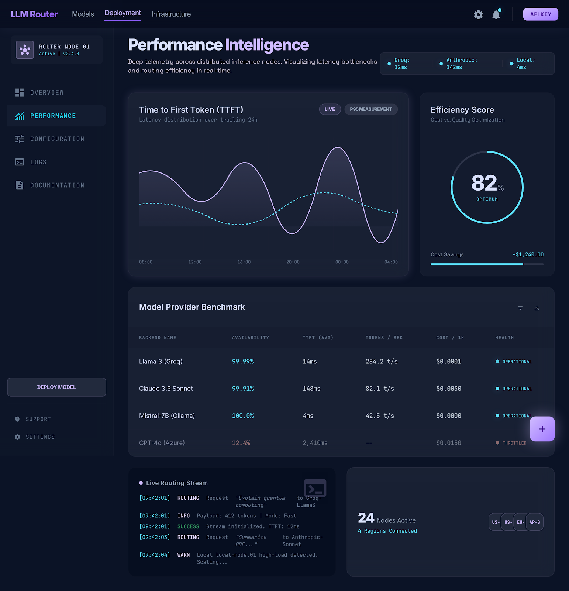
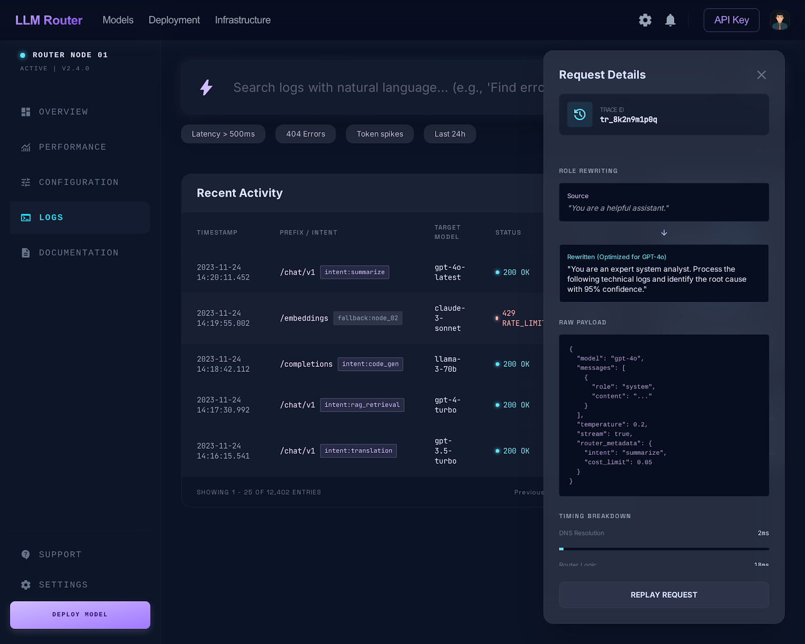

<p align="center">
  
</p>

<h1 align="center">LLM Router</h1>

<p align="center">
  <strong>One MCP server. Every AI model. Smart routing.</strong>
</p>

<p align="center">
  Route text, image, video, and audio tasks to 20+ AI providers — automatically picking the best model for the job based on your budget and active profile.
</p>

<p align="center">
  <a href="#quick-start">Quick Start</a> &bull;
  <a href="#how-it-works">How It Works</a> &bull;
  <a href="#providers">Providers</a> &bull;
  <a href="#mcp-tools">Tools</a> &bull;
  <a href="#configuration">Configuration</a> &bull;
  <a href="docs/PROVIDERS.md">Provider Setup</a>
</p>

<p align="center">
  <a href="https://github.com/ypollak2/llm-router/actions"></a>
  <a href="https://github.com/ypollak2/llm-router/blob/main/LICENSE"></a>
  
  
  
  <a href="https://pypi.org/project/claude-code-llm-router/"></a>
</p>

---

## The Problem

You use Claude Code. You also have GPT-4o, Gemini, Perplexity, DALL-E, Runway, ElevenLabs — but switching between them is manual, slow, and expensive.

**LLM Router** gives your AI assistant one unified interface to all of them — and automatically picks the right one based on what you're doing and what you can afford.

```
You:     "Research the latest AI funding rounds"
Router:  → Perplexity Sonar Pro (search-augmented, best for current facts)

You:     "Generate a hero image for the landing page"
Router:  → Flux Pro via fal.ai (best quality/cost for images)

You:     "Write unit tests for the auth module"
Router:  → Claude Sonnet (top coding model, within budget)

You:     "Create a 5-second product demo clip"
Router:  → Kling 2.0 via fal.ai (best value for short video)
```

### How It Saves You Money

Not every task needs the same model. Without a router, everything goes to the same expensive model — like hiring a surgeon to change a lightbulb.

```
"What does os.path.join do?"     → Gemini Flash    ($0.000001 — literally free)
"Refactor the auth module"       → Claude Sonnet   ($0.003)
"Design the full system arch"    → Claude Opus     ($0.015)
```

| Task type | Without Router | With Router | Savings |
|-----------|---------------|-------------|---------|
| Simple queries (60% of work) | Opus — $0.015 | Haiku/Gemini Flash — $0.0001 | **99%** |
| Moderate tasks (30% of work) | Opus — $0.015 | Sonnet — $0.003 | **80%** |
| Complex tasks (10% of work) | Opus — $0.015 | Opus — $0.015 | 0% |
| **Blended monthly estimate** | **~$50/mo** | **~$8–15/mo** | **70–85%** |

> 💡 **With Ollama**: simple tasks route to a free local model — those 60% of queries cost **$0**.

---

## Quick Start

### Option A: PyPI (Recommended)

```bash
pip install claude-code-llm-router
```

### Option B: Claude Code Plugin

```bash
claude plugin add ypollak2/llm-router
```

### Option C: Manual Install

```bash
git clone https://github.com/ypollak2/llm-router.git
cd llm-router
uv sync
```

### Enable Global Auto-Routing

Make the router evaluate **every prompt** across all projects:

```bash
# From the MCP tool:
llm_setup(action='install_hooks')

# Or from the CLI:
llm-router install
```

This installs hooks + rules to `~/.claude/` so every Claude Code session auto-routes tasks to the optimal model.

> **Start for free**: Google's Gemini API has a [free tier](https://aistudio.google.com/apikey) with 1M tokens/day. [Groq](https://console.groq.com/keys) also offers a generous free tier with ultra-fast inference.

### What You Get

- **30 MCP tools** — smart routing, text/code, image/video/audio, streaming, orchestration, usage monitoring, web dashboard
- **Auto-route hook** — intercepts every prompt before your top-tier model sees it; heuristic → Ollama → cheap API classifier chain, hooks self-update on `pip upgrade`
- **Claude subscription mode** — routes entirely within your CC subscription; Codex (free) before paid externals; external only when quota exhausted
- **Anthropic prompt caching** — auto-injects `cache_control` breakpoints on long system prompts; up to 90% savings on repeated context
- **Semantic dedup cache** — Ollama embeddings + cosine similarity skip identical-intent calls at zero cost
- **Web dashboard** — `llm-router dashboard` → `localhost:7337`; cost trends, model distribution, recent decisions
- **Hard spend caps** — `LLM_ROUTER_DAILY_SPEND_LIMIT` and `LLM_ROUTER_MONTHLY_BUDGET` raise before any call
- **Prompt classification cache** — SHA-256 LRU cache for instant repeat classifications
- **Circuit breaker + health** — catches 429s, marks unhealthy providers, auto-recovers
- **Quality logging** — records every routing decision; `llm_quality_report` shows accuracy, savings, downshift rate
- **Cross-platform** — macOS, Linux, Windows (desktop notifications, background processes, path handling)

---

## Dashboard

The built-in web dashboard (`llm_dashboard` or `llm-router dashboard`) gives you a live view of routing decisions, cost trends, and subscription pressure.

| Overview | Performance |
|---|---|
|  |  |

| Logs & Analysis |
|---|
|  |

> **Design:** Liquid Glass dark theme — Inter + JetBrains Mono, Material Symbols, Tailwind CSS. Auto-refreshes every 30 s.

---

## How It Works

### Auto-Route Hook — Every Prompt, Cheaper Model First

The `UserPromptSubmit` hook intercepts **all prompts** before your top-tier model sees them.

| Prompt | Classified as | Model used |
|--------|---------------|------------|
| `why doesn't the router work?` | `analyze/moderate` | Haiku |
| `how does benchmarks.py work?` | `query/simple` | Ollama / Haiku |
| `fix the bug in profiles.py` | `code/moderate` | Haiku / Sonnet |
| `implement a distributed cache` | `code/complex` | Sonnet / Opus |
| `write a blog post about LLMs` | `generate/moderate` | Haiku / Gemini Flash |
| `git status` (raw shell command) | *(skipped — terminal op)* | — |

Classification chain (stops at first success):

```
1. Heuristic scoring    instant, free   → high-confidence patterns route immediately
2. Ollama local LLM     free, ~1s       → catches what heuristics miss
3. Cheap API            ~$0.0001        → Gemini Flash / GPT-4o-mini fallback
4. Query catch-all      instant, free   → any remaining question → Haiku
```

Hook scripts are versioned and self-update — existing users get improvements automatically after `pip install --upgrade`.

### Claude Code Subscription Mode

If you use Claude Code Pro/Max, you already pay for Haiku, Sonnet, and Opus. Enable subscription mode and the router routes **within your subscription first** — Codex (free via OpenAI subscription) before any paid API call, external only when quota is exhausted.

```bash
# In .env
LLM_ROUTER_CLAUDE_SUBSCRIPTION=true
```

#### Default Routing (No Pressure)

| Complexity | Model | Cost |
|-----------|-------|------|
| simple | Claude Haiku 4.5 | free (subscription) |
| moderate | Sonnet (passthrough) | free (you're already using it) |
| complex | Claude Opus 4.6 | free (subscription) |
| research | Perplexity Sonar Pro | ~$0.005/query |

#### Pressure Cascade

| Condition | simple | moderate | complex |
|-----------|--------|----------|---------|
| session < 95%, sonnet < 95% | Haiku (sub) | Sonnet (sub) | Opus (sub) |
| sonnet ≥ 95% | Codex → external | Codex → external | Opus (sub) |
| weekly ≥ 95% or session ≥ 95% | Codex → external | Codex → external | Codex → external |

Run `llm_check_usage` at session start to populate accurate pressure data. Hooks flag `⚠️ STALE` when usage data is >30 minutes old.

#### External Fallback Chains (free-first)

| Tier | Chain |
|---|---|
| BUDGET (simple) | Ollama → Codex/gpt-5.4 → Codex/o3 → Gemini Flash → Groq → GPT-4o-mini |
| BALANCED (moderate) | Ollama → Codex/gpt-5.4 → Codex/o3 → GPT-4o → Gemini Pro → DeepSeek |
| PREMIUM (complex) | Ollama → Codex/gpt-5.4 → Codex/o3 → o3 → Gemini Pro |

Live subscription status:

```
+----------------------------------------------------------+
|                Claude Subscription (Live)                |
+----------------------------------------------------------+
|   Session      [====........]  35%  resets in 3h 7m      |
|   Weekly (all) [===.........]  23%  resets Fri 01:00 PM  |
|   Sonnet only  [===.........]  26%  resets Wed 10:00 AM  |
+----------------------------------------------------------+
|   OK 35% pressure -- full model selection                |
+----------------------------------------------------------+
```

---

## Providers

| Provider | Models | Free Tier | Best For |
|----------|--------|-----------|----------|
| **🦙 Ollama** | Any local model | **Yes (free forever)** | Privacy, zero cost, offline |
| **Google Gemini** | 2.5 Pro, 2.5 Flash | **Yes** (1M tokens/day) | Generation, long context |
| **Groq** | Llama 3.3, Mixtral | **Yes** | Ultra-fast inference |
| **OpenAI** | GPT-4o, GPT-4o-mini, o3 | No | Code, analysis, reasoning |
| **Perplexity** | Sonar, Sonar Pro | No | Research, current events |
| **Anthropic** | Claude Sonnet, Haiku | No | Nuanced writing, safety |
| **Deepseek** | V3, Reasoner | Yes (limited) | Cost-effective reasoning |
| **Mistral** | Large, Small | Yes (limited) | Multilingual |
| **Together** | Llama 3, CodeLlama | Yes (limited) | Open-source models |
| **xAI** | Grok 3 | No | Real-time information |
| **Cohere** | Command R+ | Yes (trial) | RAG, enterprise search |

Image, video, and audio providers (fal.ai, Runway, Stability AI, ElevenLabs, etc.) — see [docs/PROVIDERS.md](docs/PROVIDERS.md) for full setup guides.

> 🦙 **Ollama** runs models locally — no API key, no cost, no data sent externally. [Setup guide →](docs/PROVIDERS.md#ollama--local-models-free-private)

---

## MCP Tools

Once installed, Claude Code gets these 29 tools:

| Tool | What It Does |
|------|-------------|
| **Smart Routing** | |
| `llm_classify` | Classify complexity + recommend model with time-aware budget pressure |
| `llm_route` | Auto-classify, then route to the best external LLM |
| `llm_track_usage` | Report Claude Code token usage for budget tracking |
| `llm_stream` | Stream LLM responses for long-running tasks |
| **Text & Code** | |
| `llm_query` | General questions — auto-routed to the best text LLM |
| `llm_research` | Search-augmented answers via Perplexity |
| `llm_generate` | Creative content — writing, summaries, brainstorming |
| `llm_analyze` | Deep reasoning — analysis, debugging, problem decomposition |
| `llm_code` | Coding tasks — generation, refactoring, algorithms |
| `llm_edit` | Route code-edit reasoning to a cheap model → returns exact `{file, old_string, new_string}` pairs |
| **Media** | |
| `llm_image` | Image generation — Gemini Imagen, DALL-E, Flux, or SD |
| `llm_video` | Video generation — Gemini Veo, Runway, Kling, etc. |
| `llm_audio` | Voice/audio — TTS via ElevenLabs or OpenAI |
| **Orchestration** | |
| `llm_orchestrate` | Multi-step pipelines across multiple models |
| `llm_pipeline_templates` | List available orchestration templates |
| **Monitoring & Setup** | |
| `llm_check_usage` | Check live Claude subscription usage (session %, weekly %) |
| `llm_update_usage` | Feed live usage data from claude.ai into the router |
| `llm_refresh_claude_usage` | Force-refresh Claude subscription data via OAuth |
| `llm_codex` | Route tasks to local Codex desktop agent (free, uses OpenAI sub) |
| `llm_setup` | Discover API keys, add providers, validate keys, install global hooks |
| `llm_rate` | Rate last response (👍/👎) — stored in `routing_decisions` for quality tracking |
| `llm_quality_report` | Routing accuracy, classifier stats, savings metrics, downshift rate |
| `llm_set_profile` | Switch routing profile (budget / balanced / premium) |
| `llm_usage` | Unified dashboard — Claude sub, Codex, APIs, savings in one view |
| `llm_health` | Check provider availability and circuit breaker status |
| `llm_providers` | List all supported and configured providers |
| `llm_cache_stats` | View cache hit rate, entries, memory estimate, evictions |
| `llm_cache_clear` | Clear the classification cache |
| **Session Memory** | |
| `llm_save_session` | Summarize + persist current session for cross-session context injection |

> **Context injection**: text tools (`llm_query`, `llm_research`, `llm_generate`, `llm_analyze`, `llm_code`) automatically prepend recent conversation history to every external call — GPT-4o, Gemini, and Perplexity receive the same context you have. Controlled by `LLM_ROUTER_CONTEXT_ENABLED` (default: on).

---

## Routing Profiles

Three built-in profiles map to task complexity. Switch anytime:

```
llm_set_profile("budget")    # Development, drafts, exploration
llm_set_profile("balanced")  # Production work, client deliverables
llm_set_profile("premium")   # Critical tasks, maximum quality
```

| | Budget (simple) | Balanced (moderate) | Premium (complex) |
|--|--------|----------|---------|
| **Text** | Ollama → Haiku → Gemini Flash | Sonnet → GPT-4o → DeepSeek | Opus → Sonnet → o3 |
| **Code** | Ollama → Codex → DeepSeek → Haiku | Codex → Sonnet → GPT-4o | Codex → Opus → o3 |
| **Research** | Perplexity Sonar | Perplexity Sonar Pro | Perplexity Sonar Pro |
| **Image** | Flux Dev, Imagen Fast | Flux Pro, Imagen 3, DALL-E 3 | Imagen 3, DALL-E 3 |
| **Video** | minimax, Veo 2 | Kling, Veo 2, Runway Turbo | Veo 2, Runway Gen-3 |
| **Audio** | OpenAI TTS | ElevenLabs | ElevenLabs |

Model order is pressure-aware — as Claude quota is consumed, chains reorder to preserve remaining budget. See [BENCHMARKS.md](docs/BENCHMARKS.md) for how model quality scores drive rankings.

---

## Budget Control

```bash
# In .env
LLM_ROUTER_MONTHLY_BUDGET=50   # USD, 0 = unlimited
```

The router tracks real-time spend across all providers in SQLite and blocks requests when the monthly budget is reached.

```
llm_usage("month")
→ Calls: 142 | Tokens: 320,000 | Cost: $3.42 | Budget: 6.8% of $50
```

Per-provider budgets: `LLM_ROUTER_BUDGET_OPENAI=10.00`, `LLM_ROUTER_BUDGET_GEMINI=5.00`.

---

## Multi-Step Orchestration

Chain tasks across models in a pipeline:

```
llm_orchestrate("Research AI trends and write a report", template="research_report")
```

| Template | Pipeline |
|----------|----------|
| `research_report` | Research → Analyze → Write |
| `competitive_analysis` | Multi-source research → SWOT → Report |
| `content_pipeline` | Research → Draft → Review → Polish |
| `code_review_fix` | Review → Fix → Test |

---

## Configuration

```bash
# Required: at least one provider
GEMINI_API_KEY=AIza...         # Free tier! https://aistudio.google.com/apikey
OPENAI_API_KEY=sk-proj-...
PERPLEXITY_API_KEY=pplx-...

# Optional: more providers
ANTHROPIC_API_KEY=sk-ant-...
DEEPSEEK_API_KEY=...
GROQ_API_KEY=gsk_...
FAL_KEY=...
ELEVENLABS_API_KEY=...

# Router config
LLM_ROUTER_PROFILE=balanced               # budget | balanced | premium
LLM_ROUTER_MONTHLY_BUDGET=0              # USD, 0 = unlimited
LLM_ROUTER_CLAUDE_SUBSCRIPTION=false     # true = Claude Code Pro/Max user

# Ollama (two independent roles — classifier and task answerer)
LLM_ROUTER_OLLAMA_URL=http://localhost:11434    # hook classifier
LLM_ROUTER_OLLAMA_MODEL=qwen3.5:latest
OLLAMA_BASE_URL=http://localhost:11434          # router answerer
OLLAMA_BUDGET_MODELS=llama3.2,qwen2.5-coder:7b

# Smart routing (Claude Code model selection)
QUALITY_MODE=balanced          # best | balanced | conserve
MIN_MODEL=haiku                # floor: haiku | sonnet | opus
```

See [.env.example](.env.example) for the full list.

> **Ollama note**: `LLM_ROUTER_OLLAMA_URL` is for the hook classifier (classifying complexity); `OLLAMA_BASE_URL` is for the router answerer (actually answering tasks). Configuring one does not enable the other. See [docs/PROVIDERS.md](docs/PROVIDERS.md) for the full local-first setup.

---

## Development

```bash
uv sync --extra dev
uv run pytest tests/ -q --ignore=tests/test_integration.py
uv run ruff check src/ tests/
llm-router install   # deploy hooks to ~/.claude/
```

See [CLAUDE.md](CLAUDE.md) for architecture, module layout, and contribution guidelines.

---

## Roadmap

See [CHANGELOG.md](CHANGELOG.md) for what's been shipped. Coming next:

| Version | Theme | Headline features |
|---|---|---|
| ~~v1.3~~ | ~~Observability~~ | ✅ Web dashboard, prompt caching, semantic dedup cache, hard daily cap, cross-platform notifications |
| v1.4 | Routing Intelligence | Task-aware model preferences, reasoning model tier, learned routing |
| v1.5 | Agentic & Team | Agent-tree budget tracking, multi-user profiles, YAML pipelines |
| v2.0 | Learning Router | Self-improving classifier trained on your own routing history |

See [ROADMAP.md](ROADMAP.md) for design notes and competitive context.

---

## Contributing

See [CONTRIBUTING.md](CONTRIBUTING.md). Key areas: new provider integrations, routing intelligence, MCP client testing, documentation.

---

## License

[MIT](LICENSE) — use it however you want.

---

<p align="center">
  <sub>Built with <a href="https://litellm.ai">LiteLLM</a> and <a href="https://modelcontextprotocol.io">MCP</a></sub>
</p>
