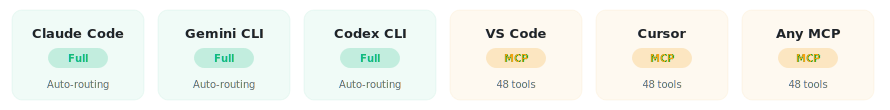

<p align="center">
  <picture>
    <source media="(prefers-color-scheme: dark)" srcset="docs/readme/hero-dark.svg">
    <source media="(prefers-color-scheme: light)" srcset="docs/readme/hero-light.svg">
    
  </picture>
</p>

<h1 align="center">LLM Router</h1>

<p align="center">
  <strong>A local control plane for AI coding tools.</strong><br/>
  Routes tasks to the cheapest model that can do the job well.<br/>
  Protects quota. Enforces policy. Tracks spend. Falls back on failure.
</p>

<p align="center">
  <a href="https://pypi.org/project/llm-routing/"></a>
  <a href="https://github.com/ypollak2/llm-router/actions"></a>
  <a href="https://github.com/ypollak2/llm-router/stargazers"></a>
  <a href="https://pypi.org/project/llm-routing/"></a>
  <a href="https://pypi.org/project/llm-routing/"></a>
  <a href="https://modelcontextprotocol.io"></a>
  <a href="LICENSE"></a>
</p>

---

## Why This Exists

AI coding assistants route every task — simple questions, complex architecture — to the same expensive model. You pay full price for work that a cheaper model handles equally well.

llm-router sits between your AI tool and the LLM providers. It classifies each task by complexity, picks the cheapest capable model, and falls back through a provider chain on failure. You don't change your workflow. The router handles model selection automatically.

**Use this if:**
- You use Claude Code, Codex CLI, or Gemini CLI and want to reduce spend
- You want automatic fallback when a provider is down or rate-limited
- You want local Ollama models tried first (free) before paid APIs
- You want visibility into token spend across providers

**Don't use this if:**
- You always want the best possible model regardless of cost
- You don't use MCP-compatible tools
- You need guaranteed latency (routing adds classification overhead)

<p align="center">
  <picture>
    <source media="(prefers-color-scheme: dark)" srcset="docs/readme/why-route-dark.svg">
    <source media="(prefers-color-scheme: light)" srcset="docs/readme/why-route-light.svg">
    
  </picture>
</p>

---

## Quick Start

### 1. Install

```bash
pip install llm-routing
llm-router install
```

> **Package name**: `llm-routing` on PyPI. CLI command: `llm-router`.

### 2. Add providers (optional)

```bash
export OPENAI_API_KEY="sk-..."      # GPT-4o, o3
export GEMINI_API_KEY="AIza..."     # Gemini Flash/Pro (free tier available)
export OLLAMA_BASE_URL="http://localhost:11434"  # Local models (free)
```

Works with **zero API keys** on Claude Code Pro/Max subscriptions — routing uses MCP tools that call external models only when beneficial.

### 3. Verify

```bash
llm-router install --check   # Preview what will be installed
llm-router health            # Check provider connectivity
```

In Claude Code, ask a simple question. The session-end summary shows routing decisions and savings.

---

## How It Works

```
User prompt
    │
    ▼
┌──────────────────────┐
│ Complexity Classifier │  ← Heuristic (free, instant) or Ollama/Flash ($0.0001)
└──────────┬───────────┘
           │
           ▼
┌──────────────────────┐
│  Free-First Router   │  ← Tries cheapest model first, walks up the chain
│                      │
│  Ollama (free)       │
│  → Codex (prepaid)   │
│  → Gemini Flash      │
│  → GPT-4o / Claude   │
└──────────┬───────────┘
           │
           ▼
┌──────────────────────┐
│  Guards (parallel)   │  ← Circuit breaker, budget pressure, quality check
└──────────┬───────────┘
           │
           ▼
      Response + cost logged to local SQLite
```

### Routing examples

| Task | Complexity | Chain |
|------|-----------|-------|
| "What does this error mean?" | Simple | Ollama → Codex → Gemini Flash → Groq |
| "Implement OAuth" | Moderate | Ollama → Codex → GPT-4o → Gemini Pro |
| "Design distributed tracing" | Complex | Ollama → Codex → o3 → Claude Opus |

Classification is free (regex heuristics catch ~70% of tasks) or near-free (local Ollama / Gemini Flash for ambiguous cases).

---

## Host Support

| Host | Auto-Routing | MCP Tools | Savings Potential |
|------|:------------:|:---------:|:-----------------:|
| **Claude Code** | Full (hooks) | 60 tools | 60–80% |
| **Codex CLI** | Full (hooks) | 60 tools | 60–80% |
| **Gemini CLI** | Full (hooks) | 60 tools | 50–70% |
| **VS Code / Cursor** | Manual | 60 tools | 30–50% |
| **Any MCP client** | Manual | 60 tools | Varies |

<p align="center">
  <picture>
    <source media="(prefers-color-scheme: dark)" srcset="docs/readme/editors-dark.svg">
    <source media="(prefers-color-scheme: light)" srcset="docs/readme/editors-light.svg">
    
  </picture>
</p>

**Full** = hooks intercept prompts and route automatically. No workflow change needed.
**Manual** = MCP tools are available; you invoke them explicitly (e.g., call `llm_query`).

```bash
llm-router install                    # Claude Code (default)
llm-router install --host codex       # Codex CLI
llm-router install --host gemini-cli  # Gemini CLI
llm-router install --host vscode      # VS Code
llm-router install --host cursor      # Cursor
```

See [docs/HOST_SUPPORT_MATRIX.md](docs/HOST_SUPPORT_MATRIX.md) for full details on each host.

---

## What You Can Do

| Use case | How |
|----------|-----|
| Route simple questions to free local models | Auto (hooks) or `llm_query` |
| Protect Claude subscription quota | Budget pressure monitoring + auto-downgrade |
| Fall back across providers on failure | Automatic chain with circuit breakers |
| Track token spend and savings | `llm_usage`, `llm_savings`, session-end reports |
| Enforce routing policy for your team | `LLM_ROUTER_POLICY=aggressive` |
| Generate images/video/audio | `llm_image`, `llm_video`, `llm_audio` |
| Run multi-step research pipelines | `llm_orchestrate` with templates |
| Bulk-edit files with cheap models | `llm_fs_edit_many` |

---

## Providers

Routing chains are built from your configured providers. You only need one.

| Provider | Models | Cost | Setup |
|----------|--------|------|-------|
| **Ollama** | gemma4, qwen3.5, llama3, etc. | Free (local) | `OLLAMA_BASE_URL` |
| **OpenAI** | GPT-4o, o3, GPT-4o-mini | Paid API | `OPENAI_API_KEY` |
| **Google** | Gemini Flash, Pro | Free tier + paid | `GEMINI_API_KEY` |
| **Anthropic** | Claude Sonnet, Opus, Haiku | Paid API or subscription | `ANTHROPIC_API_KEY` or subscription |
| **Perplexity** | Web-grounded research | Paid API | `PERPLEXITY_API_KEY` |
| **Groq** | Fast inference (Llama, Mixtral) | Free tier | `GROQ_API_KEY` |
| **Codex** | GPT-5.4, o3 (prepaid desktop) | Included with Codex CLI | Auto-detected |

See [docs/PROVIDERS.md](docs/PROVIDERS.md) for setup instructions and model recommendations.

---

## Routing Policies

Control how aggressively the router offloads to cheap models.

| Policy | Confidence Threshold | Typical Savings | Best For |
|--------|:-------------------:|:---------------:|----------|
| **Aggressive** | 2 | 60–75% | Maximum cost reduction |
| **Balanced** (default) | 4 | 35–45% | Cost/quality tradeoff |
| **Conservative** | 6 | 10–15% | Quality over cost |

```bash
export LLM_ROUTER_POLICY=aggressive     # Or: balanced, conservative
export LLM_ROUTER_ENFORCE=smart          # smart | hard | soft | off
export LLM_ROUTER_PROFILE=balanced       # budget | balanced | premium
```

`LLM_ROUTER_ENFORCE` controls how strictly the auto-route hook blocks direct model use:
- `smart` — route when confident, pass through when uncertain
- `hard` — always route, block unrouted tool calls
- `soft` — suggest routing, never block
- `off` — disable hook enforcement

---

## MCP Tools (60)

llm-router exposes 60 MCP tools organized by function:

| Category | Tools | Examples |
|----------|:-----:|---------|
| Routing & classification | 7 | `llm_route`, `llm_classify`, `llm_auto`, `llm_stream` |
| Text generation | 6 | `llm_query`, `llm_code`, `llm_analyze`, `llm_research` |
| Media generation | 3 | `llm_image`, `llm_video`, `llm_audio` |
| Pipeline orchestration | 2 | `llm_orchestrate`, `llm_pipeline_templates` |
| Admin & monitoring | 20+ | `llm_usage`, `llm_budget`, `llm_health`, `llm_savings` |
| Filesystem operations | 4 | `llm_fs_find`, `llm_fs_edit_many` |
| Subscription tracking | 3 | `llm_check_usage`, `llm_refresh_claude_usage` |

**Slim mode** (`LLM_ROUTER_SLIM=routing` or `core`) reduces registered tools to save context tokens in constrained environments.

[Full Tool Reference](docs/TOOLS.md)

---

## Savings: How It Works

Savings are calculated by comparing actual spend against a baseline of routing every task to Claude Sonnet/Opus.

**Methodology:**
1. Each routed task logs: model used, tokens consumed, estimated cost
2. A baseline cost is computed as if the same tokens were processed by the most expensive model in the chain
3. Savings = `(baseline - actual) / baseline`

**Assumptions and limitations:**
- Baseline assumes you would have used Opus/Sonnet for everything (worst case)
- Token estimates use `len(text) / 4` approximation, not exact tokenizer counts
- Cost data comes from LiteLLM's pricing tables (may lag provider price changes)
- Savings vary significantly by workload — code-heavy sessions route more to cheap models
- The router itself adds small overhead (classification costs ~$0.0001 per ambiguous task)

**Observed range:** 35–80% savings depending on policy and task mix. The "87%" figure in some docs represents a single-user peak over a specific development period, not a guaranteed outcome.

---

## Trust, Privacy, and Local-First Design

llm-router runs entirely on your machine. There is no hosted proxy, no telemetry, no account required.

| What | Where | Details |
|------|-------|---------|
| **Your prompts** | Sent to configured providers | Exactly like using those providers directly |
| **API keys** | `.env` or `~/.llm-router/config.yaml` | Local files, never transmitted |
| **Usage logs** | `~/.llm-router/usage.db` | Unencrypted SQLite (filesystem permissions) |
| **Classification cache** | In-memory | Cleared on process restart |
| **Hook scripts** | `~/.claude/hooks/` | Local shell scripts, inspectable |

**What we do:**
- Scrub API keys from structured logs
- Detect hook deadlocks before installation
- Store all data locally in `~/.llm-router/`
- Respect provider rate limits and TOS

**What you should know:**
- Prompts are sent to whichever provider the router selects — review your provider's privacy policy
- Usage logs (SQLite) are not encrypted at rest — use full-disk encryption if needed
- The router cannot prevent model jailbreaks or prompt injection at the provider level

See [SECURITY.md](SECURITY.md) for responsible disclosure policy and [docs/SECURITY_DESIGN.md](docs/SECURITY_DESIGN.md) for the full threat model.

---

## Configuration

Minimal setup — only configure what you have:

```bash
# Provider keys (set any combination)
export OPENAI_API_KEY="sk-proj-..."
export GEMINI_API_KEY="AIza..."
export OLLAMA_BASE_URL="http://localhost:11434"
export OLLAMA_BUDGET_MODELS="gemma4:latest,qwen3.5:latest"

# Routing behavior
export LLM_ROUTER_PROFILE="balanced"       # budget | balanced | premium
export LLM_ROUTER_POLICY="balanced"        # aggressive | balanced | conservative
export LLM_ROUTER_ENFORCE="smart"          # smart | hard | soft | off
```

For teams or environments where `.env` is restricted:

```bash
# User-level config (no project .env needed)
mkdir -p ~/.llm-router && chmod 700 ~/.llm-router
cat > ~/.llm-router/config.yaml << 'EOF'
openai_api_key: "sk-proj-..."
gemini_api_key: "AIza..."
ollama_base_url: "http://localhost:11434"
llm_router_profile: "balanced"
EOF
chmod 600 ~/.llm-router/config.yaml
```

---

## Documentation

| Document | Purpose |
|----------|---------|
| [Quick Start (2 min)](docs/QUICKSTART_2MIN.md) | Fastest path to working routing |
| [Getting Started](docs/GETTING_STARTED.md) | Full setup walkthrough |
| [Host Support Matrix](docs/HOST_SUPPORT_MATRIX.md) | Per-host feature comparison |
| [Providers](docs/PROVIDERS.md) | Provider setup and model recommendations |
| [Tool Reference](docs/TOOLS.md) | All 60 MCP tools with examples |
| [Architecture](docs/ARCHITECTURE.md) | Internal design and module structure |
| [Troubleshooting](docs/TROUBLESHOOTING.md) | Common issues and fixes |
| [Security Design](docs/SECURITY_DESIGN.md) | Threat model and data handling |

---

## Contributing

Contributions welcome. See [CONTRIBUTING.md](CONTRIBUTING.md) for full guidelines.

```bash
git clone https://github.com/ypollak2/llm-router.git
cd llm-router
uv sync --extra dev
uv run pytest tests/ -q         # Run tests (1700+)
uv run ruff check src/ tests/   # Lint
```

---

## Package Names

| Name | What it is |
|------|-----------|
| `llm-routing` | Current PyPI package (`pip install llm-routing`) |
| `llm-router` | CLI command and GitHub repo name |
| `claude-code-llm-router` | Deprecated legacy package (redirects to `llm-routing`) |

---

<p align="center">
  <a href="https://github.com/ypollak2/llm-router/stargazers">
    <picture>
      <source media="(prefers-color-scheme: dark)" srcset="docs/readme/star-cta-dark.svg">
      <source media="(prefers-color-scheme: light)" srcset="docs/readme/star-cta-light.svg">
      
    </picture>
  </a>
</p>

<p align="center">
  <a href="https://github.com/ypollak2/llm-router/issues">Issues</a> · <a href="https://pypi.org/project/llm-routing/">PyPI</a> · <a href="CHANGELOG.md">Changelog</a>
</p>

<p align="center"><sub>MIT License</sub></p>
