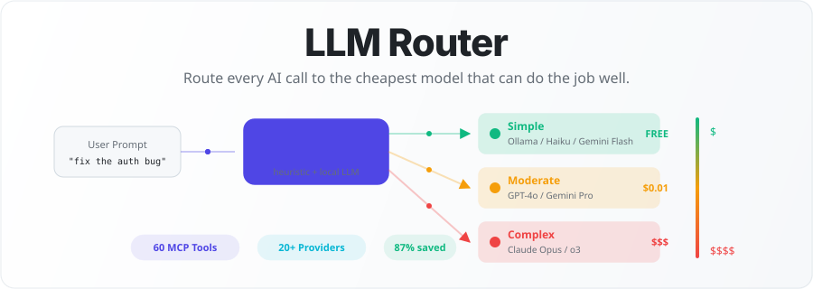
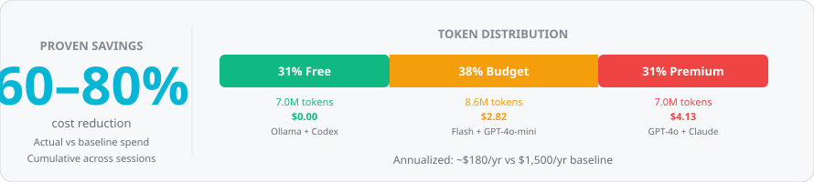

<p align="center">
  <picture>
    <source media="(prefers-color-scheme: dark)" srcset="docs/readme/hero-dark.svg">
    <source media="(prefers-color-scheme: light)" srcset="docs/readme/hero-light.svg">
    
  </picture>
</p>

<h1 align="center">llm-router</h1>

<p align="center">
  <strong>Make Claude Code, Codex, and Gemini CLI use the cheapest model that can still do the job well.</strong><br/>
  Save 35-80% on routine prompts, protect premium quota, and fall back automatically when providers fail.
</p>

<p align="center">
  <a href="https://pypi.org/project/llm-routing/"></a>
  <a href="https://pepy.tech/projects/llm-routing"></a>
  <a href="https://pepy.tech/projects/claude-code-llm-router"></a>
  <a href="https://github.com/ypollak2/llm-router/actions"></a>
  <a href="https://github.com/ypollak2/llm-router/stargazers"></a>
  <a href="https://pypi.org/project/llm-routing/"></a>
  <a href="LICENSE"></a>
  <a href="https://github.com/ypollak2/llm-router/discussions"></a>
  <a href="https://github.com/RouteWorks/RouterArena"></a>
</p>

<p align="center">
  <strong>Install in 30 seconds</strong>
</p>

<p align="center">

```bash
pip install llm-routing
```

</p>

<p align="center">
  <sub>Works with Claude Code, Codex, and Gemini CLI · No API keys required on Claude Pro/Max</sub>
</p>

<p align="center">
  <strong>Local-first.</strong> No hosted proxy. No account required.
</p>

<p align="center">
  <a href="https://github.com/ypollak2/llm-router/stargazers">
    <picture>
      <source media="(prefers-color-scheme: dark)" srcset="docs/readme/star-cta-dark.svg">
      <source media="(prefers-color-scheme: light)" srcset="docs/readme/star-cta-light.svg">
      
    </picture>
  </a>
</p>

<details>
<summary><b>📑 Table of Contents</b></summary>

- [Why People Install This](#why-people-install-this)
- [What You Get](#what-you-get)
- [Ranked #8 on RouterArena](#ranked-8-on-routerarena)
- [Need Enterprise-Grade Routing? Meet Chuzom](#need-enterprise-grade-routing-meet-chuzom)
- [Quick Start](#quick-start)
- [Example Routing](#example-routing)
- [Works With](#works-with)
- [How It Works](#how-it-works)
- [What You Can Do](#what-you-can-do)
- [Providers](#providers)
- [Routing Policies](#routing-policies)
- [MCP Tools (60)](#mcp-tools-60)
- [Savings: How It Works](#savings-how-it-works)
- [Trust, Privacy, and Local-First Design](#trust-privacy-and-local-first-design)
- [Configuration](#configuration)
- [Documentation](#documentation)
- [Contributing](#contributing)
- [Package Names](#package-names)
- [Star History](#star-history)
- [Activity](#activity)

</details>

---

## Why People Install This

AI coding tools send too many prompts to premium models by default.

That means:

- You waste paid tokens on simple questions
- You burn through Claude, Gemini, or OpenAI quota faster than necessary
- You stop working when one provider is rate-limited or down

`llm-router` sits between your coding tool and your model providers. It classifies each prompt, tries the cheapest capable model first, and falls back automatically when needed.

You keep the same workflow. The router changes the model choice underneath.

<p align="center">
  <picture>
    <source media="(prefers-color-scheme: dark)" srcset="docs/readme/why-route-dark.svg">
    <source media="(prefers-color-scheme: light)" srcset="docs/readme/why-route-light.svg">
    
  </picture>
</p>

---

## What You Get

- Route trivial prompts to free or cheap models first
- Keep premium models for the prompts that actually need them
- Fall back across providers automatically
- Track usage and estimated savings locally
- Run everything on your own machine

---

## Ranked #8 on RouterArena

`llm-router` was independently benchmarked and ranked **#8** on [RouterArena](https://github.com/RouteWorks/RouterArena) — a community leaderboard that evaluates model routers on routing accuracy, latency, cost efficiency, and fallback reliability.

---

## Need Enterprise-Grade Routing? Meet Chuzom

**[Chuzom](https://github.com/Chuzom/Chuzom)** is the enterprise-ready evolution of the ideas in `llm-router`. If you're deploying at team or org scale, Chuzom adds the layer of control, governance, and integration that individual-developer tools don't need but enterprises do.

| Capability | `llm-router` | [Chuzom](https://github.com/Chuzom/Chuzom) |
|---|:---:|:---:|
| Free-first routing chain | ✅ | ✅ |
| Claude / Codex / Gemini CLI hooks | ✅ | ✅ |
| MCP tool interface | ✅ | ✅ |
| Local-only, no proxy | ✅ | ✅ |
| Team-wide policy enforcement | — | ✅ |
| Audit log & compliance export | — | ✅ |
| SSO / SAML / OIDC integration | — | ✅ |
| Role-based provider access controls | — | ✅ |
| Multi-workspace / org model budgets | — | ✅ |
| SLA-backed support | — | ✅ |

`llm-router` is the right choice for individual developers and small teams who want local cost savings with zero ops overhead. For organizations that need governance, auditability, and enterprise integrations, **[Chuzom](https://github.com/Chuzom/Chuzom)** is built for that.

---

## Quick Start

### 1. Install

```bash
pip install llm-routing
llm-router install
```

> Package name: `llm-routing` on PyPI. CLI command: `llm-router`.

### 2. Add providers (optional)

```bash
export OPENAI_API_KEY="sk-..."          # GPT-4o, o3
export GEMINI_API_KEY="AIza..."         # Gemini Flash/Pro (free tier available)
export OLLAMA_BASE_URL="http://localhost:11434"  # Local models (free)
export OPENROUTER_API_KEY="sk-or-v1-…"  # 343 OpenRouter models (qwen, deepseek, grok, …)
```

Works with **zero API keys** on Claude Code Pro/Max subscriptions — routing uses MCP tools that call external models only when beneficial. Add `OPENROUTER_API_KEY` to unlock the open-weight workhorse pool used by the `cost_aggressive` policy.

### 3. Verify

```bash
llm-router health            # Check provider connectivity
```

If you already use Claude Code, Codex, or Gemini CLI, keep your existing workflow and let `llm-router` choose models underneath it.

---

## Example Routing

| Prompt | Routed to |
|--------|-----------|
| "What does this Python error mean?" | Ollama / Gemini Flash / Codex |
| "Refactor this endpoint" | GPT-4o / Gemini Pro |
| "Design a distributed tracing strategy" | o3 / Claude Opus |

The exact chain depends on your configured providers, budget profile, and routing policy.

---

## Works With

| Tool | Mode | Typical Savings |
|------|------|-----------------|
| **Claude Code** | Full auto-routing via hooks | 60–80% |
| **Codex CLI** | Full auto-routing via hooks | 60–80% |
| **Gemini CLI** | Full auto-routing via hooks | 50–70% |
| **VS Code / Cursor** | Manual MCP tools | 30–50% |
| **Any MCP client** | Manual MCP tools | Varies |

<p align="center">
  <picture>
    <source media="(prefers-color-scheme: dark)" srcset="docs/readme/editors-dark.svg">
    <source media="(prefers-color-scheme: light)" srcset="docs/readme/editors-light.svg">
    
  </picture>
</p>

- **Full auto-routing** means hooks intercept prompts and route automatically with no workflow change.
- **Manual MCP tools** means routing is available on demand through tools such as `llm_query`.

```bash
llm-router install                    # Claude Code (default)
llm-router install --host codex       # Codex CLI
llm-router install --host gemini-cli  # Gemini CLI
llm-router install --host vscode      # VS Code
llm-router install --host cursor      # Cursor
```

See [docs/HOST_SUPPORT_MATRIX.md](docs/HOST_SUPPORT_MATRIX.md) for full details on each host.

### Protect Claude Code 5-hour quota

For a strict boundary that never automatically falls through to native Claude, configure:

```yaml
# ~/.llm-router/routing.yaml
enforce: smart
mode: zero_claude
```

In `zero_claude` mode, prompts either complete through direct external execution or are blocked before Claude Code invokes its model. Prefix a prompt with `claude:` when you intentionally want a native Claude turn.

---

## How It Works

```
User prompt
    │
    ▼
┌──────────────────────┐
│ Complexity Classifier │  ← Heuristic (free, instant) or Ollama/Flash ($0.0001)
└──────────┬───────────┘
           │
           ▼
┌──────────────────────┐
│  Free-First Router   │  ← Tries cheapest model first, walks up the chain
│                      │
│  Ollama (free)       │
│  → Codex (prepaid)   │
│  → Gemini Flash      │
│  → GPT-4o / Claude   │
└──────────┬───────────┘
           │
           ▼
┌──────────────────────┐
│  Guards (parallel)   │  ← Circuit breaker, budget pressure, quality check
└──────────┬───────────┘
           │
           ▼
      Response + cost logged to local SQLite
```

Classification is free for many tasks (regex heuristics catch ~70%) or near-free for ambiguous prompts when using local Ollama or Gemini Flash.

---

## What You Can Do

| Use case | How |
|----------|-----|
| Route simple questions to free local models | Auto (hooks) or `llm_query` |
| Protect Claude subscription quota | Budget pressure monitoring + auto-downgrade |
| Fall back across providers on failure | Automatic chain with circuit breakers |
| Track token spend and savings | `llm_usage`, `llm_savings`, session-end reports |
| Enforce routing policy for your team | `LLM_ROUTER_POLICY=aggressive` |
| Generate images/video/audio | `llm_image`, `llm_video`, `llm_audio` |
| Run multi-step research pipelines | `llm_orchestrate` with templates |
| Bulk-edit files with cheap models | `llm_fs_edit_many` |
| Compare two routing policies | `llm-router policy diff <a> <b>` (v10) |
| Benchmark + track Arena score | `llm-router benchmark run` / `regress` (v10) |

---

## CLI (operational commands)

Beyond the install + auth flow, `llm-router` ships several operational subcommands:

```bash
llm-router benchmark list                              # list registered benchmark runners
llm-router benchmark run routerarena --split sub_10    # route a dataset and score it
llm-router benchmark regress --policy <p> --benchmark <b>  # detect score regressions
llm-router policy diff balanced cost_aggressive        # per-prompt model + cost delta
```

These power the routing self-improvement loop: routing decisions get persisted to a SQLite outcomes table; benchmark runs against a reference dataset establish baseline scores; `regress` flags drops > 0.005 in release-over-release comparisons. See [docs/CLI.md](docs/CLI.md) for the full subcommand reference.

---

## Providers

Routing chains are built from your configured providers. You only need one.

### Text LLM Providers

| Provider | Models | Cost | Setup |
|----------|--------|------|-------|
| **Ollama** | gemma4, qwen3.5, llama3, etc. | Free (local) | `OLLAMA_BASE_URL` |
| **OpenAI** | GPT-4o, o3, GPT-4o-mini | Paid API | `OPENAI_API_KEY` |
| **Google** | Gemini Flash, Pro | Free tier + paid | `GEMINI_API_KEY` |
| **Anthropic** | Claude Sonnet, Opus, Haiku | Paid API or subscription | `ANTHROPIC_API_KEY` or subscription |
| **xAI** | Grok-3 | Paid API | `XAI_API_KEY` |
| **DeepSeek** | DeepSeek Chat, Reasoner | Paid API (ultra-cheap) | `DEEPSEEK_API_KEY` |
| **Mistral** | Mistral Large, Small | Paid API | `MISTRAL_API_KEY` |
| **Cohere** | Command R+ | Paid API | `COHERE_API_KEY` |
| **Perplexity** | Sonar Pro (web-grounded) | Paid API | `PERPLEXITY_API_KEY` |
| **Groq** | Fast inference (Llama, Mixtral) | Free tier | `GROQ_API_KEY` |
| **Together** | Open-source models | Paid API | `TOGETHER_API_KEY` |
| **HuggingFace** | Open-source models | Free tier + paid | `HF_TOKEN` |
| **OpenRouter** | 343 models (qwen3-235b, deepseek-v4-flash, grok-4.3, gemini-flash-lite, claude, gpt, …) | Paid API (one key, all providers) | `OPENROUTER_API_KEY` |
| **Codex** | GPT-5.4, o3 (prepaid desktop) | Included with Codex CLI | Auto-detected |

### Media Providers

| Provider | Type | Setup |
|----------|------|-------|
| **fal** | Image (Flux), Video (Kling) | `FAL_KEY` |
| **Stability** | Image (Stable Diffusion 3) | `STABILITY_API_KEY` |
| **ElevenLabs** | Audio / TTS | `ELEVENLABS_API_KEY` |
| **Runway** | Video (Gen-3) | `RUNWAY_API_KEY` |
| **Replicate** | Various open-source models | `REPLICATE_API_TOKEN` |

See [docs/PROVIDERS.md](docs/PROVIDERS.md) for setup instructions and model recommendations.

---

## Routing Policies

Control how aggressively the router offloads to cheap models. Policies ship as YAML files in `src/llm_router/policies/` — write your own to override workhorses, subject specialists, and per-task chains.

| Policy | Confidence Threshold | Typical Savings | Best For |
|--------|:-------------------:|:---------------:|----------|
| **Aggressive** | 2 | 60–75% | Maximum cost reduction |
| **Balanced** (default) | 4 | 35–45% | Cost/quality tradeoff |
| **Conservative** | 6 | 10–15% | Quality over cost |
| **`cost_aggressive`** | 3 | 70–85% | OpenRouter open-weight workhorses + subject specialists. Activate with `OPENROUTER_API_KEY`. New in v10. |

```bash
export LLM_ROUTER_POLICY=aggressive     # Or: balanced, conservative, cost_aggressive
export LLM_ROUTER_ENFORCE=smart          # smart | hard | soft | off
export LLM_ROUTER_PROFILE=balanced       # budget | balanced | premium
export LLM_ROUTER_BANDIT=on              # on (default) | off — opt out of telemetry-driven chain reorder
```

The `cost_aggressive` policy routes via OpenRouter:
```bash
export OPENROUTER_API_KEY=sk-or-v1-...
export LLM_ROUTER_POLICY=cost_aggressive
# Now: code → qwen3-coder-next, medical → gemini-flash-lite, reasoning → grok-4.3, …
```

See [docs/POLICIES.md](docs/POLICIES.md) for the YAML schema and how to author your own policy.

`LLM_ROUTER_ENFORCE` controls how strictly the auto-route hook blocks direct model use:
- `smart` — route when confident, pass through when uncertain
- `hard` — always route, block unrouted tool calls
- `soft` — suggest routing, never block
- `off` — disable hook enforcement

---

## MCP Tools (60)

llm-router exposes 60 MCP tools organized by function:

| Category | Tools | Examples |
|----------|:-----:|---------|
| Routing & classification | 7 | `llm_route`, `llm_classify`, `llm_auto`, `llm_stream` |
| Text generation | 6 | `llm_query`, `llm_code`, `llm_analyze`, `llm_research` |
| Media generation | 3 | `llm_image`, `llm_video`, `llm_audio` |
| Pipeline orchestration | 2 | `llm_orchestrate`, `llm_pipeline_templates` |
| Admin & monitoring | 20+ | `llm_usage`, `llm_budget`, `llm_health`, `llm_savings` |
| Filesystem operations | 4 | `llm_fs_find`, `llm_fs_edit_many` |
| Subscription tracking | 3 | `llm_check_usage`, `llm_refresh_claude_usage` |

**Slim mode** (`LLM_ROUTER_SLIM=routing` or `core`) reduces registered tools to save context tokens in constrained environments.

[Full Tool Reference](docs/TOOLS.md)

---

## Savings: How It Works

<p align="center">
  <picture>
    <source media="(prefers-color-scheme: dark)" srcset="docs/readme/savings-dark.svg">
    <source media="(prefers-color-scheme: light)" srcset="docs/readme/savings-light.svg">
    
  </picture>
</p>

Savings are calculated by comparing actual spend against a baseline of routing every task to Claude Sonnet/Opus.

**Methodology:**
1. Each routed task logs: model used, tokens consumed, estimated cost
2. A baseline cost is computed as if the same tokens were processed by the most expensive model in the chain
3. Savings = `(baseline - actual) / baseline`

**Assumptions and limitations:**
- Baseline assumes you would have used Opus/Sonnet for everything (worst case)
- Token estimates use `len(text) / 4` approximation, not exact tokenizer counts
- Cost data comes from LiteLLM's pricing tables (may lag provider price changes)
- Savings vary significantly by workload — code-heavy sessions route more to cheap models
- The router itself adds small overhead (classification costs ~$0.0001 per ambiguous task)

**Observed range:** 35–80% savings depending on policy and task mix. The "87%" figure in some docs represents a single-user peak over a specific development period, not a guaranteed outcome.

---

## Trust, Privacy, and Local-First Design

llm-router runs entirely on your machine. There is no hosted proxy, no telemetry, no account required.

| What | Where | Details |
|------|-------|---------|
| **Your prompts** | Sent to configured providers | Exactly like using those providers directly |
| **API keys** | `.env` or `~/.llm-router/config.yaml` | Local files, never transmitted |
| **Usage logs** | `~/.llm-router/usage.db` | Unencrypted SQLite (filesystem permissions) |
| **Classification cache** | In-memory | Cleared on process restart |
| **Hook scripts** | `~/.claude/hooks/` | Local shell scripts, inspectable |

**What we do:**
- Scrub API keys from structured logs
- Detect hook deadlocks before installation
- Store all data locally in `~/.llm-router/`
- Respect provider rate limits and TOS

**What you should know:**
- Prompts are sent to whichever provider the router selects — review your provider's privacy policy
- Usage logs (SQLite) are not encrypted at rest — use full-disk encryption if needed
- The router cannot prevent model jailbreaks or prompt injection at the provider level

See [SECURITY.md](SECURITY.md) for responsible disclosure policy and [docs/SECURITY_DESIGN.md](docs/SECURITY_DESIGN.md) for the full threat model.

---

## Configuration

Minimal setup — only configure what you have:

```bash
# Provider keys (set any combination)
export OPENAI_API_KEY="sk-proj-..."
export GEMINI_API_KEY="AIza..."
export OLLAMA_BASE_URL="http://localhost:11434"
export OLLAMA_BUDGET_MODELS="gemma4:latest,qwen3.5:latest"

# Routing behavior
export LLM_ROUTER_PROFILE="balanced"       # budget | balanced | premium
export LLM_ROUTER_POLICY="balanced"        # aggressive | balanced | conservative
export LLM_ROUTER_ENFORCE="smart"          # smart | hard | soft | off
```

For teams or environments where `.env` is restricted:

```bash
# User-level config (no project .env needed)
mkdir -p ~/.llm-router && chmod 700 ~/.llm-router
cat > ~/.llm-router/config.yaml << 'EOF'
openai_api_key: "sk-proj-..."
gemini_api_key: "AIza..."
ollama_base_url: "http://localhost:11434"
llm_router_profile: "balanced"
EOF
chmod 600 ~/.llm-router/config.yaml
```

---

## Documentation

| Document | Purpose |
|----------|---------|
| [Quick Start (2 min)](docs/QUICKSTART_2MIN.md) | Fastest path to working routing |
| [Getting Started](docs/GETTING_STARTED.md) | Full setup walkthrough |
| [Host Support Matrix](docs/HOST_SUPPORT_MATRIX.md) | Per-host feature comparison |
| [Providers](docs/PROVIDERS.md) | Provider setup and model recommendations |
| [Tool Reference](docs/TOOLS.md) | All 60 MCP tools with examples |
| [Architecture](docs/ARCHITECTURE.md) | Internal design and module structure |
| [Troubleshooting](docs/TROUBLESHOOTING.md) | Common issues and fixes |
| [Security Design](docs/SECURITY_DESIGN.md) | Threat model and data handling |

---

## Contributing

Contributions welcome. See [CONTRIBUTING.md](CONTRIBUTING.md) for full guidelines.

```bash
git clone https://github.com/ypollak2/llm-router.git
cd llm-router
uv sync --extra dev
uv run pytest tests/ -q         # Run tests (1900+)
uv run ruff check src/ tests/   # Lint
```

---

## Package Names

| Name | What it is |
|------|-----------|
| `llm-routing` | Current PyPI package (`pip install llm-routing`) |
| `llm-router` | CLI command and GitHub repo name |
| `claude-code-llm-router` | Deprecated legacy package (redirects to `llm-routing`) |

---

## Star History

<p align="center">
  <a href="https://star-history.com/#ypollak2/llm-router&Date">
    <picture>
      <source media="(prefers-color-scheme: dark)" srcset="https://api.star-history.com/svg?repos=ypollak2/llm-router&type=Date&theme=dark" />
      <source media="(prefers-color-scheme: light)" srcset="https://api.star-history.com/svg?repos=ypollak2/llm-router&type=Date" />
      
    </picture>
  </a>
</p>

<p align="center">
  <sub>⭐ If llm-router saved you money, star the repo — it helps other developers discover it.</sub>
</p>

---

## Activity

<p align="center">
  
</p>

---

<p align="center">
  <a href="https://github.com/ypollak2/llm-router/issues">Issues</a> · <a href="https://github.com/ypollak2/llm-router/discussions">Discussions</a> · <a href="https://pypi.org/project/llm-routing/">PyPI</a> · <a href="CHANGELOG.md">Changelog</a>
</p>

<p align="center"><sub>MIT License</sub></p>
