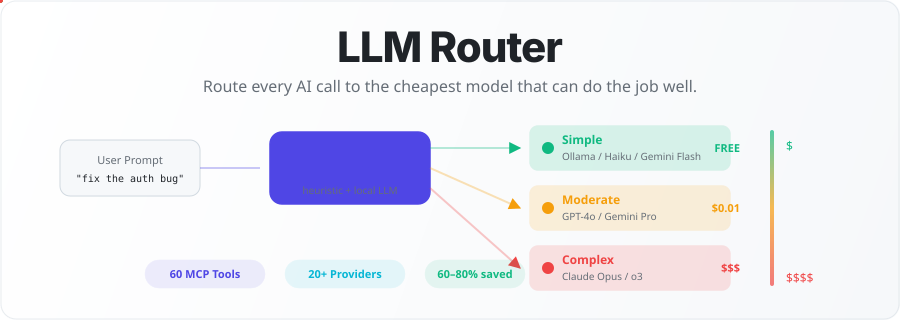
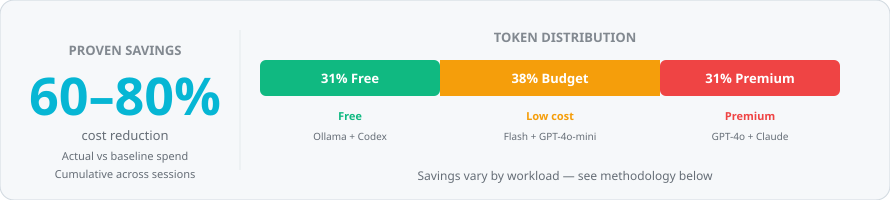

<p align="center">
  <picture>
    <source media="(prefers-color-scheme: dark)" srcset="assets/readme/hero-dark.svg">
    <source media="(prefers-color-scheme: light)" srcset="assets/readme/hero-light.svg">
    
  </picture>
</p>

<h1 align="center">llm-router</h1>

<p align="center">
  <strong>Make Claude Code, Codex, and Gemini CLI use the cheapest model that can still do the job well.</strong><br/>
  Save 35-80% on routine prompts, protect premium quota, and fall back automatically when providers fail.
</p>

<p align="center">
  <a href="https://pypi.org/project/llm-routing/"></a>
  <a href="https://pepy.tech/projects/llm-routing"></a>
  <a href="https://pepy.tech/projects/claude-code-llm-router"></a>
  <a href="https://github.com/ypollak2/llm-router/actions"></a>
  <a href="https://github.com/ypollak2/llm-router/stargazers"></a>
  <a href="https://pypi.org/project/llm-routing/"></a>
  <a href="LICENSE"></a>
  <a href="https://github.com/ypollak2/llm-router/discussions"></a>
  <a href="https://github.com/RouteWorks/RouterArena"></a>
  <a href="https://mcptoplist.com/server/glama%2Fypollak2%2Fllm-router"></a>
</p>

<p align="center">
  <strong>Install in 30 seconds</strong>
</p>

<p align="center">

```bash
pip install llm-routing   # PyPI name is llm-routing; the CLI command is llm-router
```

</p>

<p align="center">
  <sub>Works with Claude Code, Codex, and Gemini CLI · No API keys required on Claude Pro/Max</sub>
</p>

<p align="center">
  <strong>Local-first.</strong> No hosted proxy. No account required.
</p>

<p align="center">
  <a href="https://github.com/ypollak2/llm-router/stargazers">
    <picture>
      <source media="(prefers-color-scheme: dark)" srcset="assets/readme/star-cta-dark.svg">
      <source media="(prefers-color-scheme: light)" srcset="assets/readme/star-cta-light.svg">
      
    </picture>
  </a>
</p>

<details>
<summary><b>📑 Table of Contents</b></summary>

- [Why People Install This](#why-people-install-this)
- [On the RouterArena leaderboard](#on-the-routerarena-leaderboard)
- [Quick Start](#quick-start)
- [Example Routing](#example-routing)
- [Works With](#works-with)
- [How It Works](#how-it-works)
- [Features](#features)
- [CLI](#cli)
- [Providers](#providers)
- [Routing Policies](#routing-policies)
- [MCP Tools](#mcp-tools)
- [Savings: How It Works](#savings-how-it-works)
- [Trust, Privacy, and Local-First Design](#trust-privacy-and-local-first-design)
- [Configuration](#configuration)
- [Documentation](#documentation)
- [Enterprise](#enterprise)
- [Contributing](#contributing)

</details>

---

## Why People Install This

AI coding tools send too many prompts to premium models by default.

That means:

- You waste paid tokens on simple questions
- You burn through Claude, Gemini, or OpenAI quota faster than necessary
- You stop working when one provider is rate-limited or down

`llm-router` sits between your coding tool and your model providers. It classifies each prompt, tries the cheapest capable model first, and falls back automatically when needed.

You keep the same workflow. The router changes the model choice underneath.

<p align="center">
  <picture>
    <source media="(prefers-color-scheme: dark)" srcset="assets/readme/why-route-dark.svg">
    <source media="(prefers-color-scheme: light)" srcset="assets/readme/why-route-light.svg">
    
  </picture>
</p>

---

## On the RouterArena leaderboard

`llm-router` is independently benchmarked on [RouterArena](https://github.com/RouteWorks/RouterArena), a community leaderboard that scores model routers on an accuracy-versus-cost curve, plus optimality, robustness and latency. Rank moves as new routers land — see the [live leaderboard](https://github.com/RouteWorks/RouterArena#leaderboard) for the current standing.

---

## Quick Start

### 1. Install

```bash
pip install llm-routing
llm-router install
```

> Package name: `llm-routing` on PyPI. CLI command: `llm-router`.

### 2. Add providers (optional)

```bash
export OPENAI_API_KEY="sk-..."          # GPT-4o, o3
export GEMINI_API_KEY="AIza..."         # Gemini Flash/Pro (free tier available)
export OLLAMA_BASE_URL="http://localhost:11434"  # Local models (free)
export OPENROUTER_API_KEY="sk-or-v1-…"  # 343 OpenRouter models (qwen, deepseek, grok, …)
```

Works with **zero API keys** on Claude Code Pro/Max subscriptions — routing uses MCP tools that call external models only when beneficial. Add `OPENROUTER_API_KEY` to unlock the open-weight workhorse pool used by the `cost_aggressive` policy.

### 3. Verify

```bash
llm-router health            # Check provider connectivity
```

If you already use Claude Code, Codex, or Gemini CLI, keep your existing workflow and let `llm-router` choose models underneath it.

---

## Example Routing

| Prompt | Routed to |
|--------|-----------|
| "What does this Python error mean?" | Ollama / Gemini Flash / Codex |
| "Refactor this endpoint" | GPT-4o / Gemini Pro |
| "Design a distributed tracing strategy" | o3 / Claude Opus |

The exact chain depends on your configured providers, budget profile, and routing policy.

---

## Works With

| Tool | Mode | Savings (this host) |
|------|------|-----------------|
| **Claude Code** | Full auto-routing via hooks | 60–80% |
| **Codex CLI** | Full auto-routing via hooks | 60–80% |
| **Gemini CLI** | Full auto-routing via hooks | 50–70% |
| **VS Code / Cursor** | Manual MCP tools | 30–50% |
| **Any MCP client** | Manual MCP tools | Varies |

<p align="center">
  <picture>
    <source media="(prefers-color-scheme: dark)" srcset="assets/readme/editors-dark.svg">
    <source media="(prefers-color-scheme: light)" srcset="assets/readme/editors-light.svg">
    
  </picture>
</p>

- **Full auto-routing** means hooks intercept prompts and route automatically with no workflow change.
- **Manual MCP tools** means routing is available on demand through tools such as `llm_query`.

```bash
llm-router install                    # Claude Code (default)
llm-router install --host codex       # Codex CLI
llm-router install --host gemini-cli  # Gemini CLI
llm-router install --host vscode      # VS Code
llm-router install --host cursor      # Cursor
```

See [guide/HOST_SUPPORT_MATRIX.md](guide/HOST_SUPPORT_MATRIX.md) for full details on each host.

### Protect your Claude Code 5-hour quota

`enforce: smart` + `mode: zero_claude` makes prompts either complete externally or stop
before native Claude runs — see
**[guide/GETTING_STARTED.md](guide/GETTING_STARTED.md)**.

---

## How It Works

```
User prompt
    │
    ▼
┌──────────────────────┐
│ Complexity Classifier │  ← Heuristic (free, instant) or Ollama/Flash ($0.0001)
└──────────┬───────────┘
           │
           ▼
┌──────────────────────┐
│  Free-First Router   │  ← Tries cheapest model first, walks up the chain
│                      │
│  Ollama (free)       │
│  → Codex (prepaid)   │
│  → Gemini Flash      │
│  → GPT-4o / Claude   │
└──────────┬───────────┘
           │
           ▼
┌──────────────────────┐
│  Guards (parallel)   │  ← Circuit breaker, budget pressure, quality check
└──────────┬───────────┘
           │
           ▼
      Response + cost logged to local SQLite
```

Classification is free for many tasks (regex heuristics catch ~70%) or near-free for ambiguous prompts when using local Ollama or Gemini Flash.

---

## Features

Beyond "send cheap prompts to cheap models":

- **Secrets never leave your machine.** A prompt containing an API key, token or private
  key routes to local models only — fail-closed, so it cannot reach an external provider.
- **Cost-inverted subscription routing.** Free/local first for simple and moderate
  prompts, your one paid seat first for complex ones, and the seat demoted when its quota
  is strained. Opt in with `LLM_ROUTER_SUBSCRIPTION_PROVIDER`.
- **Automatic fallback with circuit breakers.** A provider that fails or rate-limits is
  skipped, not retried into the ground.
- **You can see it working.** A status line, terminal title and OS notification show the
  last model routed, savings and health — for hosts with no native statusline.
- **Session-end summary.** Savings vs baseline, tier mix, per-provider cost, latency
  p50/p95/p99 and top routes.
- **Media and pipelines too.** `llm_image` / `llm_video` / `llm_audio`, and
  `llm_orchestrate` for multi-step research.

---

## CLI

```bash
llm-router install      # wire up your host (Claude Code by default)
llm-router health       # provider connectivity
llm-router status       # savings + quota at a glance
llm-router doctor       # diagnose a broken setup
```

Full command reference: **[guide/GETTING_STARTED.md](guide/GETTING_STARTED.md)**

---

## Providers

20+ providers, free-first. **Ollama** (local, free) leads the chain; **OpenRouter**
(343 models behind one key) is the biggest single unlock; **Gemini** and **Groq** have
usable free tiers. Anthropic works via your existing Claude subscription — no API key
needed.

Every provider, its models, cost tier and env var: **[guide/PROVIDERS.md](guide/PROVIDERS.md)**

---

## Routing Policies

A policy sets how eagerly the router routes away from your premium model —
`conservative` (10–15% savings) through `balanced` (the default, 35–45%) to
`cost_aggressive` (70–85%, needs `OPENROUTER_API_KEY`).

```bash
llm-router policy set cost_aggressive
```

All six policies, thresholds and the YAML schema: **[guide/POLICIES.md](guide/POLICIES.md)**

---

## MCP Tools

60 tools across routing, analysis, code, media, budget and diagnostics — exposed to any
MCP host. The default `consolidated` surface shows 11 front-door tools; set
`LLM_ROUTER_SLIM=full` for all 60.

Every tool with its signature: **[guide/TOOLS.md](guide/TOOLS.md)**

---

## Savings: How It Works

<p align="center">
  <picture>
    <source media="(prefers-color-scheme: dark)" srcset="assets/readme/savings-dark.svg">
    <source media="(prefers-color-scheme: light)" srcset="assets/readme/savings-light.svg">
    
  </picture>
</p>

Savings are calculated by comparing actual spend against a baseline of routing every task to Claude Sonnet/Opus.

**Methodology:**
1. Each routed task logs: model used, tokens consumed, estimated cost
2. A baseline cost is computed as if the same tokens were processed by the most expensive model in the chain
3. Savings = `(baseline - actual) / baseline`

**Assumptions and limitations:**
- Baseline assumes you would have used Opus/Sonnet for everything (worst case)
- Token estimates use `len(text) / 4` approximation, not exact tokenizer counts
- Cost data comes from LiteLLM's pricing tables (may lag provider price changes)
- Savings vary significantly by workload — code-heavy sessions route more to cheap models
- The router itself adds small overhead (classification costs ~$0.0001 per ambiguous task)

**Observed range:** 35–80% savings depending on policy and task mix. The "87%" figure in some docs represents a single-user peak over a specific development period, not a guaranteed outcome.

---

## Trust, Privacy, and Local-First Design

llm-router runs entirely on your machine. There is no hosted proxy, no telemetry, no account required.

| What | Where | Details |
|------|-------|---------|
| **Your prompts** | Sent to configured providers | Exactly like using those providers directly |
| **API keys** | `.env` or `~/.llm-router/config.yaml` | Local files, never transmitted |
| **Usage logs** | `~/.llm-router/usage.db` | Unencrypted SQLite (filesystem permissions) |
| **Classification cache** | In-memory | Cleared on process restart |
| **Hook scripts** | `~/.claude/hooks/` | Local shell scripts, inspectable |

**What we do:**
- Scrub API keys from structured logs
- Detect hook deadlocks before installation
- Store all data locally in `~/.llm-router/`
- Respect provider rate limits and TOS

**What you should know:**
- Prompts are sent to whichever provider the router selects — review your provider's privacy policy
- Usage logs (SQLite) are not encrypted at rest — use full-disk encryption if needed
- The router cannot prevent model jailbreaks or prompt injection at the provider level

### `LLM_ROUTER_DIRECT_EXECUTION` — read this before your first run

**This is on by default.** When enabled, `hooks/auto-route.py` tries to answer a prompt
locally before Claude Code sees it. For prompts it classifies as needing file work, it runs
a tool-calling agent loop that hands the local model three tools — `write_file`, `edit_file`
and `run_command` — **unsupervised, with no confirmation step**, for up to 15 iterations.
`run_command` executes through a shell.

What is actually enforced:

- `write_file` / `edit_file` are confined to the project root. This works as described.
- `run_command` is filtered by a small regex blocklist of top-level destructive patterns.

What that blocklist does **not** stop (measured, not estimated): targeted deletes inside the
project (`rm -rf ./src`), `$HOME` deletes via shell expansion, `git push --force`,
`git reset --hard`, arbitrary `npm`/`pip install`, reads outside the project
(`cat ../../.ssh/id_rsa`), network exfiltration (`curl -X POST … -d @.env`), and echoing
API keys. It stops catastrophic *system* damage — not project damage, credential
disclosure, or exfiltration.

**Turn it off:**

```bash
export LLM_ROUTER_DIRECT_EXECUTION=false
```

Routing still works with it disabled; you lose only the local pre-answer path.

See [SECURITY.md](https://github.com/ypollak2/llm-router/blob/main/SECURITY.md) for the full
analysis and the responsible disclosure policy.

---

## Configuration

Everything is environment variables — no config file required to start:

```bash
export OPENROUTER_API_KEY="sk-or-v1-..."          # biggest single unlock
export OLLAMA_BASE_URL="http://localhost:11434"   # local, free
export LLM_ROUTER_POLICY="cost_aggressive"        # routing policy
export LLM_ROUTER_ENFORCE="smart"                 # off | advise | smart | hard
```

Full reference, config file schema and per-host overrides:
**[guide/GETTING_STARTED.md](guide/GETTING_STARTED.md)**

---

## Documentation

Full index: **[guide/README.md](guide/README.md)**

| Document | Purpose |
|----------|---------|
| [Quick Start (2 min)](guide/QUICKSTART_2MIN.md) | Fastest path to working routing |
| [Getting Started](guide/GETTING_STARTED.md) | Full setup walkthrough |
| [Host Support Matrix](guide/HOST_SUPPORT_MATRIX.md) | Per-host feature comparison |
| [Providers](guide/PROVIDERS.md) | Provider setup and model recommendations |
| [Routing Policies](guide/POLICIES.md) | `routing.yaml` schema and authoring your own policy |
| [Tool Reference](guide/TOOLS.md) | All 60 MCP tools with examples |
| [Architecture](guide/ARCHITECTURE.md) | Internal design and module structure |
| [Troubleshooting](guide/TROUBLESHOOTING.md) | Common issues and fixes |
| [Testing the Router](guide/TESTING.md) | Isolation suite for verifying routing health |
| [Benchmarks](docs/BENCHMARKS.md) | Model cost/latency/quality table, regenerated by CI |
| [Changelog](CHANGELOG.md) | Release notes ([archive](CHANGELOG-ARCHIVE.md)) |

---

## Enterprise

`llm-router` is built for individual developers and small teams: local cost savings, zero
ops overhead, no hosted anything. If you need team-wide policy enforcement, audit export,
SSO or per-org budgets, that is what **[Chuzom](https://github.com/Chuzom/Chuzom)** is for.

---

## Contributing

Contributions welcome. See [CONTRIBUTING.md](CONTRIBUTING.md) for full guidelines.

```bash
git clone https://github.com/ypollak2/llm-router.git
cd llm-router
uv sync --extra dev
uv run pytest tests/ -q         # Run tests (1900+)
uv run ruff check src/ tests/   # Lint
```

---

-|-----------|
| `llm-routing` | Current PyPI package (`pip install llm-routing`) |
| `llm-router` | CLI command and GitHub repo name |
| `claude-code-llm-router` | Deprecated legacy package (redirects to `llm-routing`) |

---

<p align="center">
  <sub>⭐ If llm-router saved you money, star the repo — it helps other developers discover it.</sub>
</p>

---

<p align="center">
  <a href="https://github.com/ypollak2/llm-router/issues">Issues</a> · <a href="https://github.com/ypollak2/llm-router/discussions">Discussions</a> · <a href="https://pypi.org/project/llm-routing/">PyPI</a> · <a href="CHANGELOG.md">Changelog</a>
</p>

<p align="center"><sub>MIT License</sub></p>
