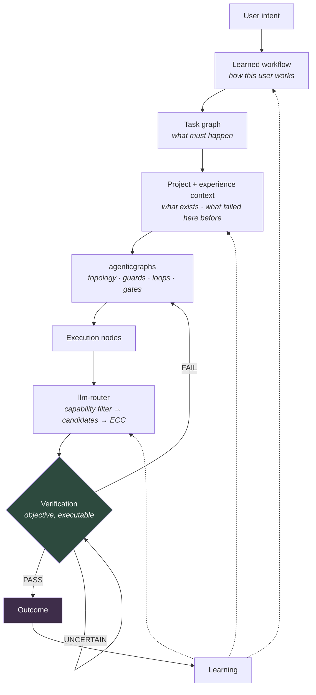

# Execution-strategy architecture

Architecture review for evolving llm-router from *"choose a model"* to *"choose
and continuously improve the execution strategy most likely to complete a task
verifiably, for the least total resource"*.

Written 2026-09-23 against `main` @ `5b32c01`. **Nothing implemented.**

---

## Read in this order

| # | Document | What it settles |
|---|---|---|
| 1 | [CURRENT_ARCHITECTURE.md](CURRENT_ARCHITECTURE.md) | What exists, with file:line and measured numbers |
| 2 | [GAP_ANALYSIS.md](GAP_ANALYSIS.md) | Exists / Partial / Missing / Should-not-build, per capability |
| 3 | [TARGET_ARCHITECTURE.md](TARGET_ARCHITECTURE.md) | Boundaries, contracts, storage, MVP→V3 |
| 4 | [KNOWLEDGE_MODEL.md](KNOWLEDGE_MODEL.md) | Schemas, confidence, scope, decay, precedence |
| 5 | [TASK_GRAPH_COMPILER.md](TASK_GRAPH_COMPILER.md) | NL → intent → convention → graph |
| 6 | [ROUTING_MODEL.md](ROUTING_MODEL.md) | Capability filter, ECC, escalation, exploration |
| 7 | [LEARNING_SYSTEM.md](LEARNING_SYSTEM.md) | What is learnable, and the safeguards |
| 8 | [TOKEN_EFFICIENCY.md](TOKEN_EFFICIENCY.md) | Retrieve, rank, compress, budget, reuse |
| 9 | [OBSERVABILITY.md](OBSERVABILITY.md) | The report, and what it refuses to print |
| 10 | [IMPLEMENTATION_PLAN.md](IMPLEMENTATION_PLAN.md) | Phases, gates, risks, rollback |
| 11 | [TEST_PLAN.md](TEST_PLAN.md) | Including cold start — the steady state |
| 12 | [EVALUATION_PLAN.md](EVALUATION_PLAN.md) | Metrics, arms, and what falsifies each phase |
| 13 | [ARCHITECTURE_CHALLENGE.md](ARCHITECTURE_CHALLENGE.md) | **Read this one.** The design attacked, not defended |

---

## The four findings that shaped everything

1. **The outcome substrate the design assumes does not exist.** `judge_score`
   populated in **0 of 1601** rows · `cost_usd` has **2 distinct values** ·
   `subject` — which the bandit *indexes on* — NULL in **1601 of 1601** ·
   `corrections` **0 rows** against 9 wired writers · `success` is 1 in 99.5%.

2. **There is no notion of a task.** No `parent_task_id`, `workflow_id` or
   `node_id` in any of 16 tables. Multi-node learning has nothing to attach to.

3. **13 episodes in 7 days.** Cold start is the *steady state*, not a phase.
   Nothing on the critical path may require learned outcomes.

4. **Much of it already exists.** MGEE (`src/llm_router/agentic/`) has
   executable-only acceptance, a constrained planner vocabulary, a frozen
   done-frontier ledger and a termination proof. agenticgraphs has guarded
   cycles, subgraphs, and a human gate a model cannot sign.

## Three decisions that differ from the brief

- **Four knowledge systems → three stores.** Experience and Capability/Outcome
  are one dataset at two aggregations; storing both guarantees drift.
- **No runtime graph mutation.** It would destroy the termination proof. Every
  §17 example is a router node with guarded edges — static topology, dynamic path.
- **Safety does not outrank an explicit instruction.** You must be able to say
  "skip the audit, it's a typo fix" and be obeyed. Safety outranks *learned*
  conventions; it may require the override to be explicit and recorded.

## And one inversion

**llm-router's verification is stronger than agenticgraphs'.** AGR admits 61 of
83 graphs let the model grade itself. `acceptance.py` refuses self-report
categorically. So llm-router owns verification and AGR calls it — not the naive
split where AGR owns everything execution-shaped.

---

## The MVP

Three things, smaller than Phase 2:

1. The **capability filter**, fail-closed.
2. The **episode record**.
3. **One hand-written graph**, run in-process, per-node routing, `acceptance.py`
   verification.

That is §28 working with zero learning. If it does not show value, nothing later
will — everything later optimises it.

## The experiment that could kill the thesis

Run §28 through the graph, and again as **one strong model with the same prompt
and the same acceptance checks**. If the single call matches verified completion
for fewer total tokens, the orchestration layer is overhead and the answer is a
better prompt plus objective checks. Cheap, and runnable the moment Phase 2
exists — which is when it should be run, before anything is built on the
assumption that it passes.

---

## The long-term system

Each arrow answers one question:

**WHAT** must be done · **HOW** this user prefers it · **WHAT HAPPENED** when
similar work was tried · **WHO** is most capable of each part · **WHAT MINIMUM
CONTEXT** is needed · **HOW TO VERIFY** it was genuinely completed · and **HOW
TO DO ALL OF IT** for the least total resource that still yields a verified
success.

The dotted arrows are the only paths by which anything is learned, and they all
originate at a **verified** outcome. There is no route by which a model's
opinion of its own work becomes evidence.
