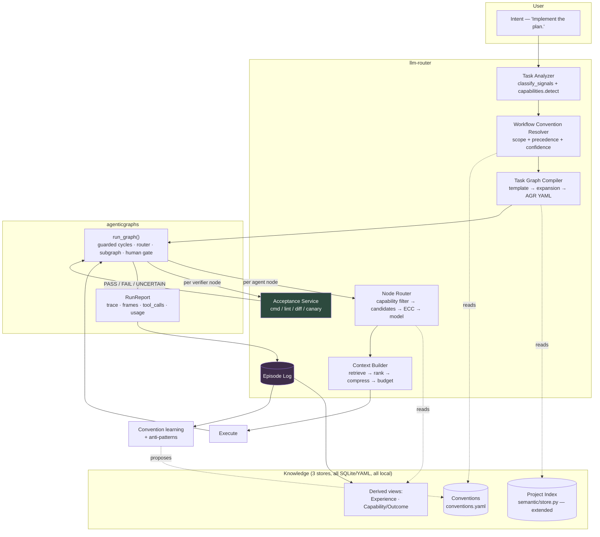
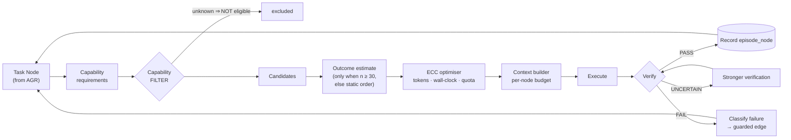

# TARGET_ARCHITECTURE.md

The shape to build toward. Boundaries are drawn so that **llm-router depends on
agenticgraphs, never the reverse** — agenticgraphs keeps working with a bare
OpenAI endpoint and no llm-router present.

---

## 1. Ownership

| Concern | Owner | Rationale |
|---|---|---|
| Graph topology, scheduling, guards, cycles, retries, parallel groups, subgraph composition, journal/resume, human gates | **agenticgraphs** | Built, tested, spec'd at v1.9. Reimplementing is waste |
| Task classification, capability filtering, model selection, token/cost accounting, context building | **llm-router** | Built, and the product's reason to exist |
| **Acceptance / verification checks** | **llm-router** | `acceptance.py` refuses self-report; AGR admits 61 of 83 graphs do not. The stronger implementation owns it |
| Episode log, conventions, experience | **llm-router** | It is the only side that sees the user across projects and sessions |
| The contract between them | **shared, tiny** | Two JSON shapes, versioned — see §4 |

**The high-value integration nobody has built:** AGR `verifier` nodes delegating
to llm-router's constrained check vocabulary. That upgrades 61 of 83 graphs from
self-report to executable verification, and benefits agenticgraphs on its own.

---

## 2. System view



Two things the diagram asserts deliberately:

- **Verification (`ACC`) sits in llm-router**, called by AGR — not inside AGR.
- **The episode log is the only thing that feeds learning.** There is no second
  path by which a model's opinion becomes training data.

---

## 3. Per-node execution



The **fail-closed rule** is architectural, not a detail: a model whose
capabilities are *unknown* is **not eligible**. This repo has shipped six
instances of unknown rendering as the favourable answer (unknown provenance →
production, unknown table → missing column, unreadable counter → zero, absent
latency → fastest, unscored prompt → confident route, unrecorded confidence →
low confidence). This would be the seventh.

---

## 4. The llm-router ↔ agenticgraphs contract

Two shapes. Versioned. Nothing else crosses the boundary.

```jsonc
// R → A : a graph, in AGR's own YAML/dict form. No new format.
// A → R : a node execution request
{ "contract": "1.0", "episode_id": "...", "node_id": "implement.api",
  "node_kind": "agent", "prompt": "...", "abilities": ["read_file"],
  "outputs": ["diff"], "budget": { "tokens": 12000 } }

// A → R : an acceptance request (the inversion)
{ "contract": "1.0", "episode_id": "...", "node_id": "verify.tests",
  "check": { "kind": "cmd", "argv": ["pytest", "-q", "tests/x.py"] } }
// R → A
{ "verdict": "PASS" | "FAIL" | "UNCERTAIN", "deterministic": true,
  "detail": "...", "evidence": { "exit_code": 0, "stdout_tail": "..." } }
```

**Integration mode: in-process** (`run_graph()` called directly), decided
2026-09-23. It sidesteps two blockers:

- The gateway returns **HTTP 400** on `tools`/`tool_choice`
  (`_refuse_tools_if_present`), so AGR's `ToolRunner` cannot use it.
- `gateway_service.py` has **zero callers** — the gateway process is not
  startable from any packaged entry point.

**Risk that could reverse this:** AGR's `LLMRunner` posts to a URL. If it cannot
accept an *injected runner*, in-process collapses back into the HTTP path and
both blockers return. **Verify before building on it.**

**Version coupling:** pin AGR exactly. An AGR upgrade re-runs the replay
baseline, because its scheduler changes routing behaviour indirectly.

---

## 5. Storage

Three stores. No graph database, no vector database.

```
~/.llm-router/                        (paths.state_path — the EXISTING root)
  usage.db                            + episode, episode_node, episode_event
  semantic/<project_slug>/store.db    existing code index, extended
  conventions/
    conventions.yaml                  hand-editable; tens of entries
    candidates.jsonl                  append-only observations, pre-promotion
```

Rules, each paid for by an incident:

- **One root, existing slug convention.** A parallel `~/.llm-router-*` tree is
  the OKF-SCOPE-04 mistake — four modules disagreeing on scope cost a
  cross-project contamination bug.
- **Conventions are a file the user can open, edit and delete.** If the only way
  to correct one is through the system that inferred it, it is not inspectable,
  and §5 requires inspectable.
- **Test isolation must hold.** `knowledge/projects/` currently has 12,448
  subdirs, many named after test fixtures. A new store that repeats this is
  worse than no store.

---

## 6. Component maturity (§30)

| Component | MVP | V2 | V3 | Research only |
|---|---|---|---|---|
| Capability filter | ✅ | | | |
| Episode log | ✅ | | | |
| Static workflow templates (hand-written YAML) | ✅ | | | |
| Node-level routing through llm-router | ✅ | | | |
| Acceptance service for AGR verifier nodes | ✅ | | | |
| Per-node context budget | ✅ | | | |
| Blast radius from the import graph | | ✅ | | |
| Convention candidate detection | | ✅ | | |
| Convention auto-apply + undo | | ✅ | | |
| Context artifact reuse by fingerprint | | ✅ | | |
| Anti-patterns / negative learning | | | ✅ | |
| Outcome prediction (n ≥ 30 per cell) | | | ✅ | |
| Contextual bandits / counterfactual evaluation | | | | 🔬 |
| Learned ranker, embeddings-for-context-selection | | | | 🔬 |
| Runtime graph mutation | ❌ never — see `ARCHITECTURE_CHALLENGE.md` Q1 | | | |

**After MVP, §28's scenario works** — "Implement the plan" builds and runs the
right graph — with a hand-written template and **zero learning**. Everything
after is improvement, not function. That property is the point of the ordering.
