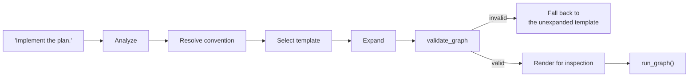
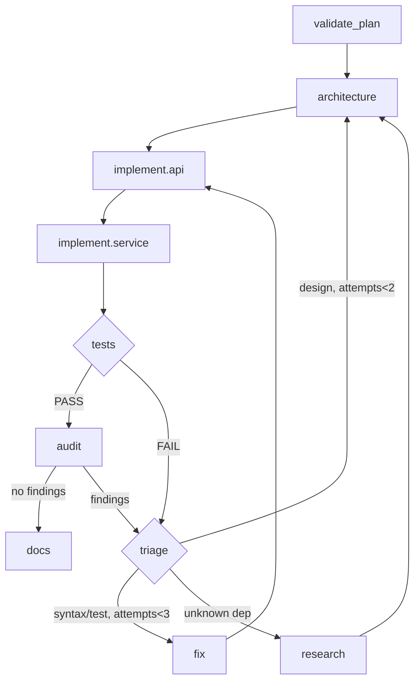

# TASK_GRAPH_COMPILER.md

Natural language → Intent → Convention → Template → Expansion → AGR graph.

The output is **an AGR YAML dict**. No new graph format is introduced: AGR
graphs are pure data, JSON-Schema validated, and `validate_graph` exists
precisely to check a generated candidate.

---

## 1. Pipeline



**`validate_graph` failure falls back to the template, never to nothing.** An
expansion is an optimisation; if it cannot be validated, the hand-written
skeleton still runs. This is what keeps the compiler from being a new way to
fail.

---

## 2. Stage 1 — Analyze (deterministic, existing code)

| Output | Source | State |
|---|---|---|
| `task_type` | `classify.classify_signals()` | Exists |
| `complexity` | same | Exists |
| `capabilities` | `capabilities.detect_capabilities()` | Exists, shadowed |
| `scope_key` | `semantic/scope.resolve_scope_or_none()` | Exists |
| `risk` | **new** — derived, see below | Missing |
| `confident` | `ClassifySignal.confident` | Exists, **zero readers in `src/`** |

**`confident` must be read here.** Measured over n=1571 real prompts: **41.4%
score zero** in every category and **49.8%** are decided by `low_signal_default`
rather than by any score. A compiler that treats a defaulted classification as a
measured one will select a workflow for half its inputs on no evidence.

Rule: `confident == False` ⇒ **never auto-apply a convention.** Ask, or use the
unopinionated default path. This is the single most important line in the
compiler, and it costs nothing — the flag already exists.

`risk` is derived, not modelled: destructive verbs (`migrate`, `drop`,
`release`, `force-push`, `delete`), files matched against blast radius, and
whether the change touches auth/payment/security paths. Coarse by design — it
gates the §23 carve-out, and a wrong `risk=high` costs a confirmation prompt
while a wrong `risk=low` costs a destructive auto-run.

---

## 3. Stage 2 — Resolve convention

```
candidates = [c for c in conventions if scope_matches(c, analysis)]
winner     = max(candidates, key=precedence_key)   # KNOWLEDGE_MODEL §3
```

Produces a **decision record**, not just a choice:

```json
{ "convention_id": "implementation_with_verification_loop",
  "mode": "auto",
  "why": "task_type=implementation, complexity=moderate, repo=llm-router",
  "confidence": 0.86, "occurrences": 17, "sessions": 11,
  "rejected": [{"id":"quick_fix_no_audit","reason":"scope: max_diff_lines=50 < 300"}] }
```

`rejected` is not decoration — it is the counterfactual, and without it nobody
can later ask why the other convention did not fire.

---

## 4. Stage 3 — Template

A hand-written AGR YAML per convention. **Written by a human, not generated.**
The MVP ships one, and §28's scenario works from it with zero learning.

```yaml
# workflows/implementation_with_verification_loop.yaml
apiVersion: agr/v1.9
termination: { max_steps: 60 }
state: { inputs: [plan, scope_key] }
nodes:
  - { id: validate_plan,  kind: agent,    outputs: [gaps] }
  - { id: architecture,   kind: agent,    outputs: [design] }
  - { id: implement,      kind: agent,    outputs: [diff], retries: { max: 1 } }
  - { id: tests,          kind: verifier, outputs: [verdict] }
  - { id: audit,          kind: agent,    outputs: [findings] }
  - { id: triage,         kind: router }
  - { id: fix,            kind: agent,    outputs: [diff] }
  - { id: docs,           kind: agent,    outputs: [notes] }
edges:
  - { from: validate_plan, to: architecture }
  - { from: architecture,  to: implement }
  - { from: implement,     to: tests }
  - { from: tests,         to: audit,  when: "verdict == 'PASS'" }
  - { from: tests,         to: triage, when: "verdict != 'PASS'" }
  - { from: audit,         to: docs,   when: "len(findings) == 0" }
  - { from: audit,         to: triage, when: "len(findings) > 0" }
  # guarded back-edges — AGR's lint REJECTS an unconditional one
  - { from: triage, to: fix,          when: "failure_class in ['syntax','test'] and attempts < 3" }
  - { from: triage, to: architecture, when: "failure_class == 'design' and attempts < 2" }
  - { from: triage, to: research,     when: "failure_class == 'unknown_dep'" }
  - { from: fix,    to: implement,    when: "attempts < 3" }
verification:
  - { assert: "verdict == 'PASS'", describe: "tests pass before docs" }
```

**This is §17 without runtime mutation.** Every example the brief gives for
"modify execution based on outcomes" — syntax error → cheap model, architectural
mismatch → back to Architecture, unknown dependency → Research, repeated failure
→ stronger model — is a **router node with guarded edges**. Topology static,
path dynamic. AGR's `max_steps` plus the `attempts` guards preserve the
termination proof that runtime mutation would destroy.

---

## 5. Stage 4 — Expansion (§8)

The template says *implement*. Expansion says *implement what*, using the
project index — never a model's guess about the repo.

```
expand(node, analysis):
    files   = project_index.relevant(analysis.intent, scope_key)   # ranked
    layers  = group_by_layer(files)     # migration | api | service | ui
    tests   = blast_radius(files) ∩ kind=test
    if len(layers) <= 1:  return node                # do NOT expand
    return subgraph(nodes=[one per layer], then=verifier(tests))
```

Three constraints that keep expansion from becoming the problem:

- **Expansion is refusable.** One layer ⇒ no expansion. A 3-node graph that runs
  beats an 11-node graph that is impressive.
- **Expansion is bounded.** AGR caps subgraph nesting at depth 3 and forbids
  cycles across refs; the compiler must not try to exceed it.
- **Expansion is evidence-driven.** Layers come from the index, not from asking
  a model to imagine the architecture. If the index is stale (`content_hash`
  mismatch), expansion is skipped and that is reported.

---

## 6. Worked example — §28

Input: **"Implement the plan."**

```
Analyze     task_type=implementation  complexity=moderate  confident=True
            capabilities={read,write,shell,test}  risk=medium  scope=llm-router
Resolve     implementation_with_verification_loop   conf 0.86  n=17/11 sessions
            rejected: quick_fix_no_audit (scope: max_diff_lines)
Template    8 nodes, 4 guarded back-edges
Expand      index → migration(0) api(2) service(5) ui(0) ⇒ 2 layers ⇒ expand
            implement → [implement.api, implement.service] + verifier(tests)
Validate    validate_graph OK; no unconditional back-edge; max_steps 60
Render      shown to the user (auto-apply still prints the graph)
```



Per-node routing is **separate** (see `ROUTING_MODEL.md`) — the graph says
*what*, llm-router says *by whom*. The brief requires this separation and it is
what keeps a topology change from silently being a cost change.

---

## 7. What the compiler must never do

| Never | Why |
|---|---|
| Emit a graph that fails `validate_graph` | Fall back to the template |
| Emit an unconditional back-edge | AGR's lint rejects it; the guard is the termination proof |
| Expand beyond AGR's depth-3 subgraph cap | Raises `SubgraphError` |
| Auto-apply a convention when `confident == False` | 49.8% of real prompts are decided by a default |
| Auto-apply when `risk` exceeds the convention's `risk_max` | Route to `kind: human` instead |
| Ask a model what the repo contains | That is what the index is for; a guess here poisons every downstream node |
