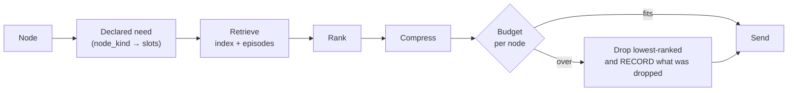

# TOKEN_EFFICIENCY.md

llm-router exists to reduce unnecessary model spend. The new architecture adds
graphs, conventions and experience — **all of which are ways to put more text in
a prompt**. This document is the constraint that stops that.

---

## 1. What exists today

| Stage | Exists? | Code |
|---|---|---|
| Structural compression | **Yes** | `context_optimizer.optimize_context()` — skipped entirely for free/local models |
| Recency truncation | **Yes** | old turns capped at 200 chars |
| OKF concept injection | **Yes** | `context_injection.inject()`, fixed `limit=3` |
| Response cache | **Yes** | `result_cache.py` (SQLite FTS) |
| Semantic cache | **Yes** | `semantic_cache.py`, threshold 0.98 + `_discriminator()` |
| **Retrieval with ranking** | **No** | nothing scores context |
| **Per-node token budget** | **No** | |
| **Context artifact reuse** | **No** | three content hashes exist, none for this |
| **Provider prompt caching** | **No** | `usage.cache_hit` / `cache_savings_usd` columns exist with **no writer** — a standing claim gap |

---

## 2. The pipeline to build



**`DROP` records what it dropped.** A silently truncated context is
indistinguishable from a context that never had the information — and that
ambiguity is what makes "the model didn't know X" unanswerable after the fact.
The dropped set goes into `episode_node`, so a failure can be attributed to a
budget rather than to the model.

---

## 3. Declared need per node kind

Context is **pulled by slot**, not pushed wholesale. Each node kind declares
what it may receive; anything not declared is not retrievable.

| Node kind | May receive | Must NOT receive |
|---|---|---|
| `research` | intent, external sources | repo source, experience |
| `architecture` | intent, module-level index, relevant ADRs | file bodies, test output |
| `implement` | target files, direct dependencies, acceptance criteria, **prior failures on these files** | whole repo, all conventions, full experience |
| `verifier` | the diff, the check definition | the implementer's reasoning |
| `audit` | the diff, acceptance criteria | the implementer's reasoning (§15 independence) |
| `docs` | the diff, public API surface | build logs, failures |

Two rows are doing real work:

- **`implement` gets prior failures on *these files*** — that is the Experience
  Graph paying for itself, scoped to blast radius, not a history dump.
- **`verifier` and `audit` are denied the implementer's reasoning.** An auditor
  primed with the author's justification is not independent. This is §15
  enforced in the context builder rather than hoped for.

---

## 4. Ranking

No new infrastructure. Reuse what is there.

```
score(item, node) = w_g · graph_proximity      # hops in the import graph
                  + w_e · embedding_similarity  # nomic-embed-text, already local
                  + w_r · recency
                  + w_f · prior_failure_here    # §3, scoped
                  − w_s · staleness             # content_hash mismatch
```

Graph proximity first, embeddings second. The import graph is **exact**; an
embedding is a guess. When an exact signal is available, ranking on the guess is
a regression dressed as sophistication.

`staleness` is subtractive and never disqualifying on its own — a stale file may
still be the right file, but it should lose to a fresh one.

---

## 5. Budgets

```
budget(node) = min(model.context_window · 0.5, kind_default[node.kind])
```

Half the window, not all of it: output needs room, and a prompt that fills the
window leaves no margin for a retry with one more piece of evidence.

Illustrative defaults, to be **calibrated on the replay corpus, not chosen**:
research 4k · architecture 12k · implement 16k · verifier 2k · audit 8k ·
docs 6k.

**The budget is enforced, not advisory.** An advisory budget is a comment.

---

## 6. Context reuse across nodes (§13)

The one genuinely new mechanism.

```
artifact_id = sha256(canonical(content))
```

Stored once per episode; nodes reference the id. `implement` and `audit` in the
same episode share one architecture artifact instead of rebuilding it.

Derived artifacts are explicit: `audit` receives a *summary* of the architecture
artifact, keyed by `(artifact_id, "summary")`, computed once.

**Provider prompt caching is an optimisation, never an assumption.** Anthropic's
cache_control may be used when present, but the architecture must be correct
without it — and the current schema columns for it have no writer, so the first
honest step is to stop implying it exists.

---

## 7. Anti-dumping rules

The failure mode this document exists to prevent: solving context problems by
sending more.

| Rule | Why |
|---|---|
| **Never send the convention store.** Send the selected convention's *name and graph*, nothing else | Conventions are routing metadata, not task content |
| **Never send the experience corpus.** Send failures scoped to the files in blast radius, capped at 3 | §3 is a filter, not a payload |
| **Never send the whole project index.** Send the ranked slice that fits the budget | |
| **Never send the graph to a node.** A node needs its own inputs; it does not need the topology | The topology is AGR's concern |
| **Expansion that does not reduce per-node context is not an improvement** | The point of splitting `implement` into layers is that each layer needs less, not that there are more nodes |

That last rule is the honest test of §8: if expanding a node into five leaves
each of the five needing the same context, expansion has added five model calls
and saved nothing.

---

## 8. Measurement

Existing baseline: `scripts/bench_session_replay.py`, 5 real sessions, **76%
drafts / 66% acceptable** over 115 prompts (80%/70% over the 105 routable). Its
own backlog item N7 warns the number needs 3 runs with a reported spread before
it is trustworthy — so **do that first**, before using it to judge anything.

| Metric | Definition |
|---|---|
| **Tokens per verified success** | Primary. Total tokens across all attempts ÷ episodes reaching PASS |
| Context precision | Fraction of sent context the node actually referenced |
| Context recall | Fraction of failures attributable to *missing* context |
| Budget hit rate | How often `DROP` fired, and what it dropped |
| Artifact reuse rate | Tokens saved by reuse ÷ tokens that would have been rebuilt |

**Precision and recall must be reported together.** Precision alone is trivially
maximised by sending nothing, and this repo has already been misled by
one-sided measures — the interception rate looked healthy until it was measured
in bytes rather than command counts, and eligibility turned out not to be
interception (26 commands passed the allowlist, 9 actually intercepted).

### The claim rule

Any token-reduction figure goes through `savings.canonical_savings()` with the
hardcoded `_baseline_model()`, carries its **n** and window, and is **omitted
when unmeasured**.

`savings.py`'s `SURFACES` registry exists because ~20 user-facing surfaces each
invented their own baseline. The brief's §19 example prints *"Estimated naive
baseline: 240K, Token reduction: 65%"* — **a baseline nobody ran is not a
measurement.** Shipping the report without the savings line is always available
and is often right.
