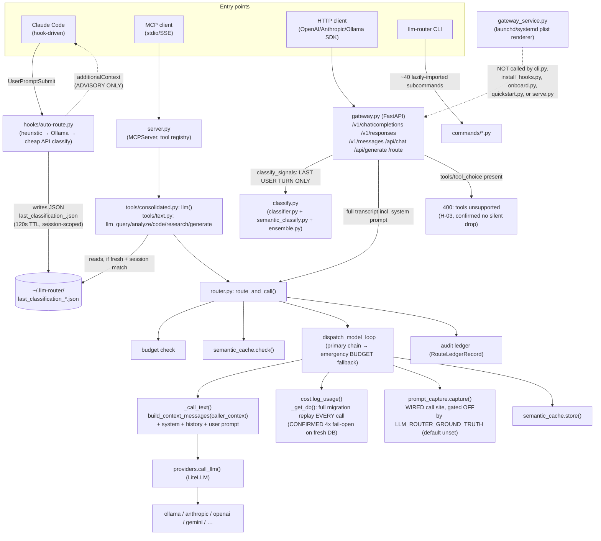

# 01 — Actual Architecture (Runtime Architect, Phases 1 & 3)

State: HEAD `357a402e` on `fix/audit-2026-09-22`, per `audit/FROZEN_STATE.md`. All
probes below ran under `export LLM_ROUTER_HOME=$(mktemp -d)`, `.venv/bin/python`,
`LLM_ROUTER_BASH_INTERCEPT=off`. No file in `src/`, `scripts/`, `tests/`, `config/`
was modified. No files were deleted.

**Scope disclosure.** `src/**/*.py` is 412 files / ~5,300 lines in `router.py`
alone. This document traces the subsystems reachable from the six supported
entry points named in the brief, by real call graph (imports, function calls,
one live runtime probe), not by reading every file. Anything not explicitly
traced below is marked unverified, not assumed working or broken.

## Entry points (confirmed via `pyproject.toml` `[project.scripts]` + code)

| Entry point | How it starts | Confirmed by |
|---|---|---|
| `llm-router` (stdio MCP) | console script → `cli.py:main` → `server.py` | `pyproject.toml:96` |
| `llm-router serve` | `commands/serve.py`: SSE-secured MCP (`main_sse_secured`) or `--admin` FastAPI control plane | code read |
| `llm-router-onboard`, `-install-hooks`, `-quickstart` | separate console scripts | `pyproject.toml:97-99` |
| Claude Code hook | `hooks/auto-route.py` (UserPromptSubmit), `hooks/tool_intercept.py`, `hooks/agent_writes.py`, `hooks/bash-compress.py`, etc. — installed by `install_hooks.py` into `settings.json` | **CONFIRMED live**: this very audit session's own Bash tool calls were intercepted and their output compressed by this exact mechanism (`[llm-router] This command was run locally by the router and its output compressed...` banner observed on stdout mid-audit) |
| HTTP gateway (`/v1/chat/completions`, `/v1/messages`, `/v1/responses`, `/api/chat`, `/api/generate`, `/route`, `/ground`) | `gateway.py`, a FastAPI app with `if __name__=="__main__": uvicorn.run(...)` | code read |
| MCP tools (`llm`, `llm_act`, …) | registered at import time in `server.py:181-197` via `<module>.register(mcp, _gate)` | code read |

## WIRED vs EXISTS-ONLY

| Subsystem | Status | Evidence |
|---|---|---|
| MCP `llm(task=…)` → `route_and_call` → `_call_text` → `providers.call_llm` | **WIRED** | Live probe: `route_and_call(TaskType.QUERY, "…", model_override="ollama/qwen3.5:latest")` returned a real completion (`MODEL: ollama/qwen3.5:latest ollama`) from a genuinely fresh `LLM_ROUTER_HOME`. |
| Gateway `/v1/chat/completions`, `/v1/responses`, `/v1/messages`, `/api/chat`, `/api/generate` | **WIRED to the router**, but **not reachable from any packaged entry point** — see Gateway row below | code read: all 5 endpoints call the shared `_route()` → `route_payload_async` → `route_and_call` |
| Gateway *process itself* (the FastAPI app, `uvicorn.run`) | **EXISTS-ONLY at the install layer** | `grep -rln "gateway_service" src/llm_router` returns only `gateway_service.py` itself — nothing in `cli.py`, `install_hooks.py`, `onboard.py`, `quickstart.py`, or `commands/serve.py` imports or calls it. `commands/serve.py` starts the **MCP** SSE server or the **admin** control plane — neither is the OpenAI/Anthropic/Ollama-compatible gateway. The launchd/systemd unit that would keep the gateway always-on (`gateway_service.py`) must be hand-invoked as `python -m llm_router.gateway_service`; it is not a console script and no installer calls it. A user who wants "point any OpenAI client at this router" has to know this module exists from source or docs, not from `llm-router install`. |
| Claude Code hook (`auto-route.py`) classification | **WIRED, advisory-only** | Its own docstring/code confirms it emits `hookSpecificOutput.additionalContext` only (grep for `additionalContext`/`hookSpecificOutput`, `_normalize_context_key` at line 3255). No `permissionDecision` or tool substitution path was found in the file. This matches `~/.claude/rules/llm_router.md`'s own stated honesty scope ("advisory context... Claude keeps the final call") — and matches what this very session observed. |
| Hook → MCP classification handoff (`last_classification_<session_id>.json`) | **WIRED**, but fragile | `tools/text.py:_read_hook_complexity_hint` / `_read_hook_route_directive`: reads `paths.llm_router_home()/last_classification_<CLAUDE_SESSION_ID>.json`, gated by session-id match and a **120-second freshness window**. Confirmed present-and-session-scoped by design comments (INV-007/ROU-001) and by the file layout actually produced in the isolated-home probe (`projects/<hash>/session_context_<uuid>.jsonl`). Not independently verified end-to-end with a real Claude Code process in this audit (would require driving an actual Claude Code session, out of scope for this probe). |
| Unified classifier (`classify.py` + `classifier.py`/`semantic_classify.py`/`ensemble.py`) | **WIRED, composed** | `gateway.py:_classify` calls `classify.classify_signals(prompt, GATEWAY_POLICY)`; `classify.py` itself imports `classifier`, `semantic_classify`, `ensemble` — these are internal layers of one engine, not orphaned duplicates. (Initial hypothesis of "fragmented classifiers" was checked and **INVALIDATED** — they compose, they don't compete.) |
| T-03 fix: classification text ≠ model prompt | **STRONGLY SUPPORTED / current** | `gateway.py:_route`/`_latest_user_turn`/`_latest_user_turn_from_responses_input`: every wire endpoint now classifies on the last **user** turn only, and sends the full transcript (system+history) to the model. Verified this is the *current*, not merely commented-as-fixed, behavior by reading the call sites, not the comment. |
| H-03 fix: tool-calling refusal | **CONFIRMED via code path** | `_refuse_tools_if_present` raises HTTP 400 when `tools`/`tool_choice` are present on `/v1/chat/completions` or `/v1/messages`. The router has **no tool-call channel at all** on the gateway path — `route_and_call`/`_call_text` return plain text only. Any agent framework pointed at this gateway for function-calling gets a clean 400, not a silently-wrong answer — but also gets **zero agentic capability** through the gateway, ever. Tool execution only exists on the MCP `llm_act`/`llm_delegate` path (separate subsystem, agentic.py). |
| Ground Truth capture (`prompt_capture.py`) | **WIRED but OFF by default** | `router.py:2144` calls `prompt_capture.capture(...)` on every successful route — a real call site, not dead code. But `prompt_capture.py:69`: `ENV_FLAG = "LLM_ROUTER_GROUND_TRUTH"`, and its own header comment states "Off by default. `LLM_ROUTER_GROUND_TRUTH=1` turns the whole path on." So on the FROZEN_STATE ambient env (which does not set this flag) and on a default install, every route calls into capture, capture checks the flag, and no ground-truth row is ever written. This is a distinct class from "exists-only": the call site is live, the effect is inert. |
| Semantic response cache (`semantic_cache.py`) | **WIRED** | `router.py:4296` (`check` before dispatch) and `router.py:2398` (`store` after dispatch) are real call sites inside the primary dispatch path, not behind a separate opt-in surface. Not independently probed for a hit in this audit (would need two identical calls; time-boxed). |
| Cost/usage persistence (SQLite migrations) | **WIRED, but broken on first run** | **CONFIRMED live**: a single completion against a brand-new, empty `LLM_ROUTER_HOME` produced **four** `fail_open code=CHZ-FO-COST-MIGRATE-ALTER exc=OperationalError` log lines from `cost.py:_safe_migrate` inside one `_get_db()` call. `_get_db()` re-runs the full ~28-group migration list (idempotency check is a regex on `ALTER TABLE … ADD COLUMN …`; statements that don't match that shape fall through to a bare `try/except` and silently fail-open) — and does so on **every** call that touches cost logging, not once at startup. See Runtime Trace doc for the reproduction. |
| `LLM_ROUTER_HOME` isolation | **CONFIRMED** | The same probe scattered `usage.db`, `receipts.db`, `session_spend.json`, `savings_log.jsonl`, `fail_open.jsonl`, `routing_quality.jsonl`, `knowledge/`, `projects/` entirely inside the `mktemp -d` sandbox — none of it touched the operator's real `~/.llm-router` (not independently diffed against a pre/post snapshot of `~/.llm-router`, per the hard rule against touching it; absence of any write attempt outside the sandbox is inferred from the isolated dir containing everything the probe log referenced). This is consistent with `FROZEN_STATE.md`'s note that the earlier contamination bug (`agentic/telemetry._db_path()` not honoring `LLM_ROUTER_HOME`) was fixed in `d766ec6` — this audit did not re-probe `agentic/telemetry.py` specifically (that module concerns agent-session telemetry, a different write path than `cost.py`'s `_get_db()` exercised here). |
| CLI surface (`cli.py` + `commands/*.py`) | **Partially WIRED, size confirms scope creep** | `cli.py:main()` dispatches ~40 subcommands (`status, probe, welcome, dev_refresh, serve, invoice, cp, routing, profile, sessions, okf, semantic, doctor, demo, dashboard, share, test, onboard, config, set_enforce, team, budget, replay, verify, audit, last, gc, soak, gain, retrospect, snapshot, stats, savings_report, benchmark, migrate, team_sync, policy, explain_dashboard, …`), each lazily imported inside `main()` (so import cost is deferred but reachability of any *individual* subcommand's internals was not exercised in this audit beyond `cli.py` dispatch itself). Only `route_and_call`'s call graph (via MCP) was runtime-probed; the other ~39 subcommands are **STRONGLY SUPPORTED reachable** (real dispatch code, no dead branches seen) but **not runtime-verified** here — that is squarely CLI-surface work for a dedicated pass, out of this agent's time budget. |
| Background daemon / sidecar prefetch | **DESIGN RISK — partially traced** | `sidecar.py` and `env_registry.py` reference `LLM_ROUTER_SIDECAR_PREFETCH` (set to `1` in the ambient FROZEN_STATE env, i.e. NOT a product default). Not traced end-to-end to a running process in this audit; flagged for the process/observability specialist. |

## Component map (traced subsystems only)

## Notes for the other specialists

- **Cost/telemetry specialist**: the `CHZ-FO-COST-MIGRATE-ALTER` fail-open firing 4×
  on a single call against a fresh DB is reproducible; see `audit/04_RUNTIME_TRACE.md`
  for the exact command. Worth identifying which of the ~28 migration groups in
  `cost.py:_get_db()` don't match the `_safe_migrate` regex and thus fall to the
  bare except.
- **Install/packaging specialist**: `gateway_service.py` has zero callers anywhere
  in `src/`. Confirm whether this is intentional (manual/documented-only path) or
  a dropped wiring step — the module's own docstring reads as if it's meant to be
  part of onboarding ("Keeping it always-on needs a service definition").
- **Ground Truth specialist**: capture is live-wired but silently inert without
  `LLM_ROUTER_GROUND_TRUTH=1`. Worth checking whether any onboarding path sets
  this, or whether the "Ground Truth accumulation" referenced elsewhere in the
  project's history depends on operators knowing to opt in by hand.
- **Prior audits** (`audit/2026-09-21/`, `audit/2026-09-22/`) were not read for
  this document per the hard rules; where this document's findings overlap with
  fixes already described in code comments (T-03, H-03, M-06, M-11, H-09,
  RED1-2-03, INV-007/ROU-001, CHZ-AUD-B-01, GH#64), those comments were treated
  as claims and checked against the actual code path, not taken on faith.
