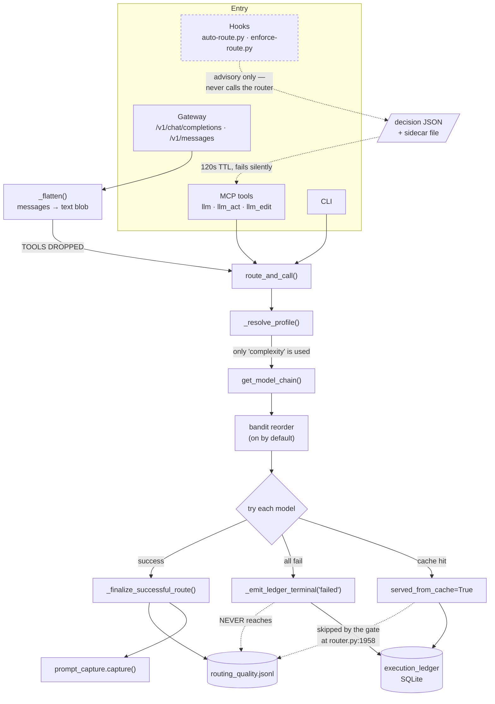
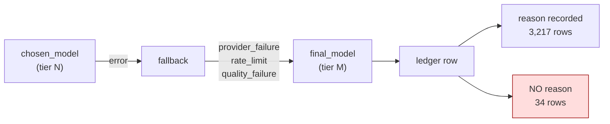
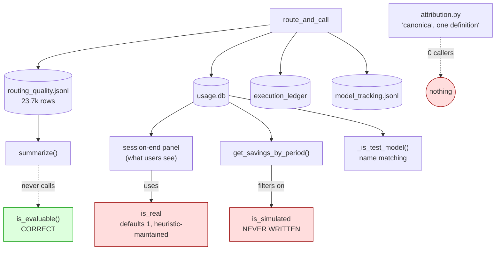
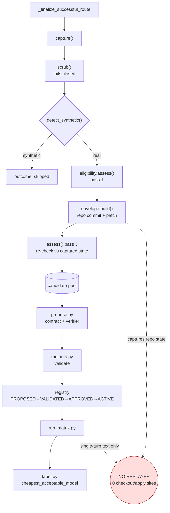
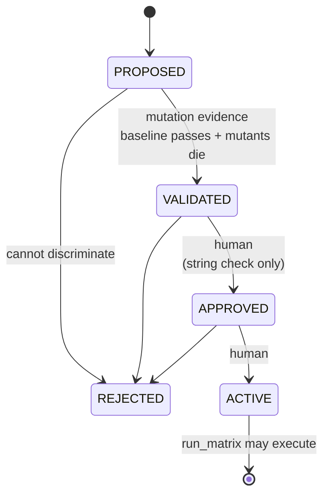

# Architecture as built

v14.1.0 · 2026-09-21. Derived from code, not documentation. Where the diagrams
differ from the docs, the diagrams are right.

**Scale:** 413 `.py` files under `src/llm_router/`; `router.py` is 5,050 lines and
`cost.py` 3,763. 680 test files. `~/.llm-router` holds 1,096 entries and 5.0 GB —
of which **4.8 GB is a vendored RouterArena checkout**, not router state.

---

## 1. Runtime routing

**Three things this diagram makes visible that the docs do not:**
- Hooks never call the router. They are gates; the sidecar bridging their
  classification to the MCP tool has a 120-second TTL and fails silently.
- The gateway flattens messages to text, and **tool definitions are discarded by
  Pydantic before the handler body runs**.
- Two of the three terminal outcomes — failure and cache hit — **cannot reach the
  quality ledger**.

---

## 2. Fallback and attribution

19.3% of real rows show `chosen_model ≠ final_model` — expected escalation. **34
of those carry `fallback_occurred=False` and `fallback_reason=None`**: the model
that ran differs from the one recorded as chosen, with no persisted explanation.

---

## 3. Telemetry — four stores, four provenance schemes

The green box is the correct mechanism. Nothing that produces a user-visible
number uses it.

---

## 4. Ground Truth accumulation

The envelope captures everything needed to replay. **Nothing consumes it** — so
EDIT tasks, which the gate is tuned to admit, cannot be graded.

---

## 5. Verifier lifecycle

Confidence is computed **from mutation evidence, never asserted** — genuinely
sound. The human gate is `actor == "assistant"`; any other string passes.

---

## Component classification

| Class | Modules |
|---|---|
| **Runtime-critical** | `router`, `cost`, `config`, `server`, `cli`, `context`, `classify`, `providers`, `profiles`, `policy`, `budget`, `session_store`, `routing_quality`, `pricing`, `paths` |
| **Optional / gated** | `bandit`, `judge`, `semantic_classify`, `semantic_cache`, `result_cache`, `prompt_cache`, `ensemble`, `grounding` |
| **Tooling-only** | `onboard`, `quickstart`, `banner`, `install_hooks`, all 43 `commands/` |
| **Benchmark-only** | `benchmark_fetcher`, `benchmarks`, `model_evaluator` |
| **Apparently dead** | `budget_lineage_reconciliation`, `feedback_handler`, `hook_deadlock_checker`, `oauth_token_rotation`, `service_manager`, `attribution` |
| **Broken** | `control_plane/api` (ImportError on import) |
| **Decoy** | `context_signal` — docstring says "NOT the one in production" |

---

## Persistence

| Store | Size | Concurrency safety |
|---|---|---|
| `routing_quality.jsonl` | 23 MB | **Safe** — 2,000 concurrent appends, zero corruption |
| `usage.db` | 6 MB | 1/12 cold starts `database is locked`; 5/12 swallowed migration failures |
| `result_cache.db` | 256 KB | 2/12 cold starts locked — `busy_timeout` set *after* WAL, opposite of the project's own fix |
| `quota_tracker` usage.json | small | **32–38% read failure** under load — non-atomic whole-file rewrite, 10 hooks consume it |
| `ground_truth_candidates.jsonl` | — | `Pool.admit` loses increments (19 vs 21) |
| `harness/RouterArena/` | **4.8 GB** | Not router state — a vendored eval framework inside the state dir |

`LLM_ROUTER_HOME` is **not universally honoured**: 120 sites compose
`~/.llm-router` directly, and five modules honour five *different* override
variables.

---

## The shape of the system

Two halves with very different maturity.

**The execution half** — entry points, classification, chain building, provider
calls, fallback — is coherent, well-commented, and works.

**The measurement half** — ledgers, provenance, attribution, savings,
explanation — is a set of correct primitives with missing adoption, four
competing provenance schemes, and two of three terminal outcomes unrepresented.

Ground Truth sits on top of the second half. That is why it cannot yet deliver
what it was built for.
