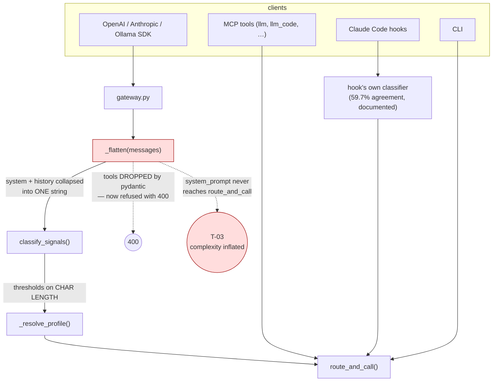
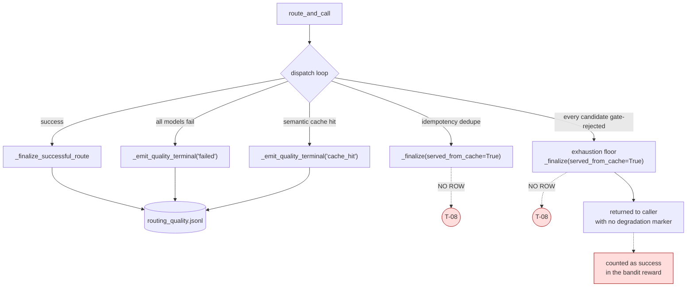
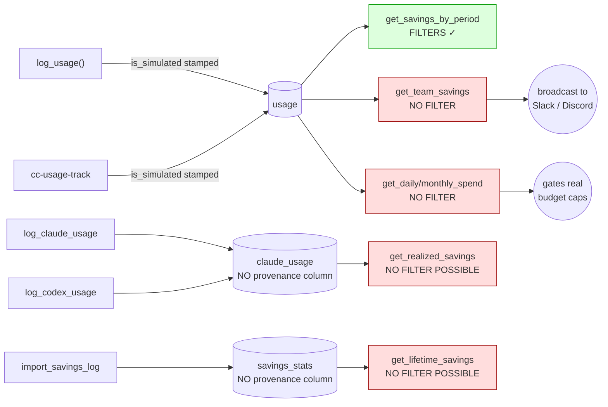
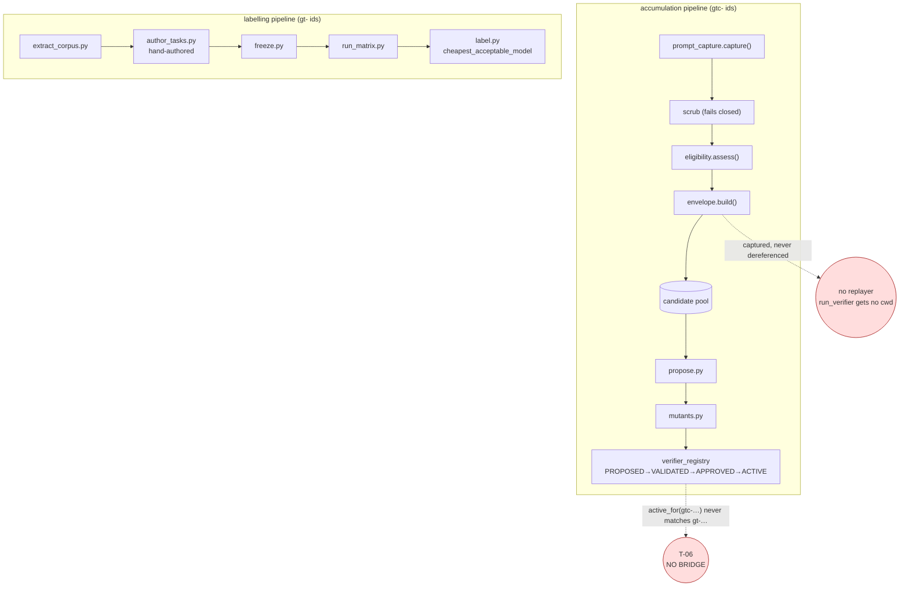
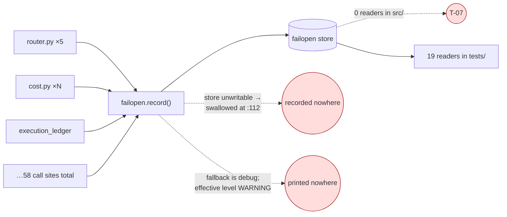

# Architecture as built — 2026-09-22

Derived from traced execution, not documentation. Where a diagram and a docstring
disagree, the diagram is right.

**Scale:** 412 `.py` under `src/llm_router` (127,401 LOC), 723 test files, 159
scripts. 5 console scripts, 51 dispatchable subcommands, 38 hook scripts (13
installed on the audited machine), 52 distinct persistence stores, 11 HTTP routes
on the gateway + 6 on the control plane.

---

## 1. Entry points, and where information is lost

Only the gateway path concatenates the system prompt before classification. The
MCP and hook paths do not.

---

## 2. Terminal outcomes and which ones reach the quality ledger

Three of five terminal states reach the ledger. The two that do not are the two
that describe degradation.

---

## 3. Money surfaces and provenance coverage

The one green box is yesterday's fix. The surface that broadcasts publicly is red.

---

## 4. Ground Truth — two pipelines that never meet

Everything left of the gap is rigorous and unreachable. Everything right of it is
manual and is the only thing producing labels.

---

## 5. Observability — the counter nobody reads

---

## Component classification

| Class | Modules |
|---|---|
| **Runtime-critical** | `router`, `cost`, `config`, `server`, `cli`, `classify`, `providers`, `profiles`, `policy`, `budget`, `session_store`, `routing_quality`, `pricing`, `paths`, `secret_scrubber` |
| **Optional / gated** | `bandit`, `judge`, `semantic_classify`, `semantic_cache`, `result_cache`, `prompt_cache`, `ensemble`, `grounding` |
| **Tooling-only** | `onboard`, `quickstart`, `banner`, `install_hooks`, most of 51 subcommands |
| **Broken at HEAD** | `commands/profile` (ImportError), `commands/dev_refresh` (wrong script name), `budget_lineage_reconciliation.reconcile_budget_lineage_audited` (ImportError on install) |
| **Unshipped by design** | `control_plane/api`, `control_plane/reconciliation` |
| **Orphaned** | the `propose → mutants → verifier_registry` half of Ground Truth |
| **Write-only** | `failopen` |

---

## The shape of the system

Unchanged from the previous audit in kind, changed in degree.

**The execution half** — entry points, classification, chain building, dispatch,
fallback — is coherent and works, with one defect (gateway classification) on its
most advertised path.

**The measurement half** is now *partly* honest. Yesterday's work made the
canonical implementations correct. It did not reach the call sites, and the
verification was aimed at the canonical implementations rather than at adoption,
so nothing noticed.

**The observability half** — the layer that should tell you when either of the
above stops being true — is the weakest of the three, and was not touched.
