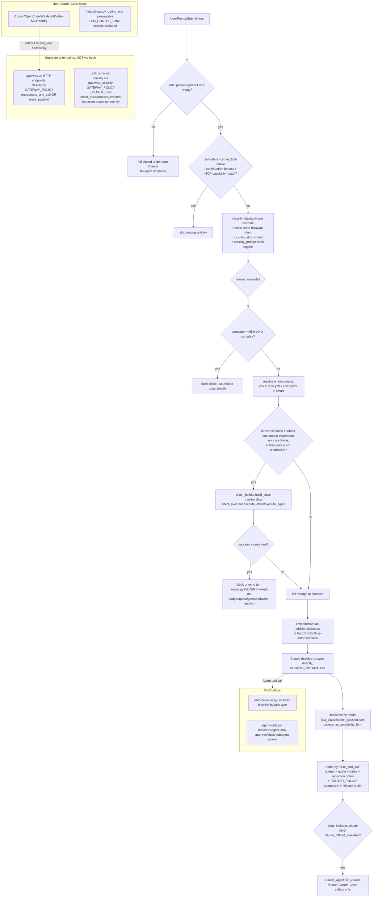

# Domain 02 — Runtime flows and the routing engine

Auditor: subagent 02 (RTE-). Baseline: worktree `llm-router-forensic` @ `3c96d23`.
All evidence below is read directly from that worktree, `~/.claude/settings.json`
(the live Claude Code hook registration on this machine), `~/.claude/hooks/`
(the live installed hooks), and read-only copies of `~/.llm-router/*.db` (copied to
a scratchpad before querying, per instruction, never queried live). The main
checkout's `CLAUDE.md` (`/Users/yaliandrona/Projects/llm-router/CLAUDE.md`, git-
ignored there, read on explicit instruction) independently corroborates several
findings below (§S8, §S9) and its measurement-methodology warnings are applied
throughout — rates are never quoted without a denominator, and "this machine, this
workload" is stated explicitly wherever a live number is used.

## Overview

`llm-router` has **at least four independent, hand-tuned classification/execution
combinations** that are supposed to agree but provably do not:

1. `hooks/auto-route.py` (UserPromptSubmit hook, the highest-volume real path) —
   its own hand-copied `SIGNALS` regex table + its own `classify_prompt()` chain.
2. `src/llm_router/classify.py` — the intended "unified" engine, itself
   parameterized by three different tuned policies (`HOOK_POLICY`, `ROUTER_POLICY`,
   `GATEWAY_POLICY`), one of which (`HOOK_POLICY`) is proven, in-source, NOT to
   match what the hook actually does.
3. `src/llm_router/router.py` (`route_and_call`) — the only path that runs budget,
   quota, policy gates, idempotency and (opt-in) redaction.
4. `src/llm_router/hooks/direct_executor.py` + `chain_builder.py` — the "direct
   execution" path used by both the hook (default ON) and `sdk.py`. It bypasses
   `router.py` entirely: no budget, no quota, no gates, no redaction.

The project's own `CLAUDE.md` independently documents the same 49.8% low-signal-
default finding this audit found in `classify.py`'s comments (§S8), and adds that
`tests/test_s8_an_unclassified_prompt_is_not_a_confident_route.py` now pins both
engines' defaults (confirmed to exist in the worktree) — so the DRIFT is guarded
against getting *worse* silently, even though the underlying disagreement is not
resolved.

One correction made during this pass, at the coordinator's request: the original
draft (written before plan-mode interrupted this audit) classified the worktree's
`.claude/hooks/auto-route.py` (hook-version 18) as a live safety gap next to the
canonical `hooks/auto-route.py` (version 35). Live-system verification (below,
RTE-001) shows this file **never runs** — it is a stale, orphaned, git-tracked-
despite-`.gitignore` artifact from 2026-04-13. It is reclassified from a runtime
safety finding to a repository-hygiene finding.

---

## §6 Runtime flows (trace code, not docs)

### Flow A — Normal routed query (UserPromptSubmit hook)

*(Fully traced in the prior pass; repeated here for completeness, unchanged.)*

Entry: Claude Code fires `UserPromptSubmit` → `hooks/auto-route.py:main()`
(`hooks/auto-route.py:3429-4870`, canonical v35 per the version marker at
`hooks/auto-route.py:178`; byte-identical to `src/llm_router/hooks/auto-route.py`,
confirmed via `diff -q`). Actual precedence order inside `main()`:

1. Hook logging init + wall-clock deadline start (`:3432-3439`).
2. Liveness marker for kill detection, fail-open (`:3450-3468`).
3. Parse stdin JSON — fail-closed under zero-Claude, fail-open (logged
   `UNHANDLED_EXCEPTION`) otherwise (`:3470-3500`).
4. Empty prompt — same fail-closed/fail-open split (`:3511-3519`).
5. Self-reference bypass, refused under `_is_enterprise_profile()` (`:3527-3537`).
6. Session pointer refresh, every prompt (fixes "all 30 pointers on this machine
   were stale", `:3541-3554`).
7. `zero_claude = _zero_claude_enabled()` (`:3555`).
8. Mini-summary widget every Nth prompt (`:3564-3578`).
9. Explicit-native prefix bypass, zero-Claude only (`:3582-3585`).
10. Sidecar pre-execution, deterministic read-only handlers, skipped under
    zero-Claude (`:3602-3640`).
11. Continuation bypass for short acks, normal mode only (`:3655-3662`).
12. `previous_unrouted = _consume_unresolved_pending(...)` (`:3664`).
13. MCP-capability check — a prompt clearly targeting another MCP server skips
    routing entirely (`:3666-3696`).
14. Context-aware routing / classification, in order: display-intent override →
    short-code-followup inherit → generic continuation inherit → else
    `classify_prompt(text)` (hook's private `SIGNALS`, `:1018-1372`, chain:
    heuristic → Ollama → cheap API → weak heuristic → default,
    `:1554-1748`) → learned-route override → `_save_last_route`
    (`:3698-3765`).
15. Pressure downgrade — at ≥95% session/weekly quota AND `complexity=="complex"`,
    hard-blocks with a directive to use `/model claude-opus-4-6` directly,
    skipping everything below (`:3774-3796`).
16. Resolve enforcement mode: env > repo `.llm_router.yml` > user
    `~/.llm-router/routing.yaml` > `"smart"`; `smart` hard-enforces Q&A task
    types, soft for code (`:3798-3827`).
17. Model selection + telemetry (`:3829-3903`).
18. Session context recording + judging the PREVIOUS invocation's draft against
    what Claude actually said (`draft_usage.audit`) — closes a measured bug where
    a discarded draft still counted as "routed" (49%→79% quota-saved inflation)
    (`:3905-3961`).
19. **Phase 1 — Direct Execution** (default ON): tries to answer via HTTP calls to
    Ollama/Gemini/OpenAI/Codex, bypassing Claude and `router.py` entirely.
    Context-dependent-prompt gate (rescued by OKF retrieval / session-context
    rescue / tool-loop rescue); `coordinate` tasks always excluded (advisory-only,
    "the direct path has no subagents"); chain filtered to free/local tiers only
    before any draft is attempted; grounding check rejects a draft citing facts
    not in context/repo; success persists draft-usage, transcript shard, routing
    rows (only if turn actually blocked, not echoed), session context (if
    memorable); failure falls through to Claude or, under zero-Claude, hard-blocks
    (`:3963-4472`).
20. Directive construction: shadow / advise / suggest / hard, each worded and
    gated differently (`:4487-4566`).
21. Context-dependent override rewrites the directive to advisory and forces
    `write_pending=False` so `enforce-route.py` cannot block tools for it — fixes
    a documented "throwaway-llm_query dance" double-cost bug (`:4568-4615`).
22. Session paid-API spend cap notice (`:4617-4630`).
23. Pending-state write for `enforce-route.py`, with a `route_id` shared between
    the pending file and the classification sidecar so the execution ledger's
    join actually fires — previously two independently-minted ids never matched
    and `realized_savings_usd` stayed 0 in production (`:4644-4752`).
24. **Emit stdout first, then account** — reordered after a measured incident:
    "hook measured taking 36.9s, of which 36.26s was 8 sqlite executes ... Claude
    Code's 30s budget then DISCARDED the output" (`:4796-4822`).
25. Top-level `except BaseException` fails open, exits 0 (`:4853-4870`).

**Divergence point**: step 14's classifier (hook's private `SIGNALS`) vs.
`classify.py`'s engine (used by router/gateway/sdk) provably differ — see §13.

### Flow B — Free/local (Ollama), deepened

Reached from Flow A step 19, or directly from `sdk.route()`
(`src/llm_router/sdk.py:36-61`) or the gateway (`gateway.py` → `_classify` →
`chain_builder.build_chain`). `chain_builder._ollama_models()`
(`hooks/chain_builder.py`) resolves the model list per call — a documented fix
for a prior bug where it was a module-level constant bound at import, ignoring
both `discovery.json` and an operator's `LLM_ROUTER_ENSEMBLE_PRIMARY`, so "an
operator ... got qwen3.5 on all 69 of a day's draft calls and nothing said why"
(`chain_builder.py`, `_router_home` docstring context).

Pre-flight in `direct_executor.execute_chain` (`:632-649`): `/api/tags` is
enumerated once per chain execution (`available_ollama_models`, cached via the
`_UNSET` sentinel so a chain of 3 models doesn't re-probe 3 times); a model not
present in that list is skipped with reason `"model not pulled"` rather than
attempted and 404'd — a documented fix for a prior silent-fallthrough bug. If
`/api/tags` cannot be enumerated at all, a plain reachability probe
(`ollama_is_alive`) is the fallback so a transient tag-list hiccup doesn't disable
routing outright. Per-model call budget is deadline-aware (`_call_budget`, see
§14) — `OLLAMA_TIMEOUT` defaults to 45s (`LLM_ROUTER_OLLAMA_TIMEOUT`,
`hooks/auto-route.py:259`).

**Live corroboration** (own machine, `~/.llm-router/usage.db` copied to scratch
before query, 2026-07-08 → 2026-09-24, n=1605 `routing_decisions` rows; this is
one heavily code-skewed developer workload, not a general population —
`task_type` distribution: `code` 1429 (89%), `query` 120, `analyze` 37,
`research` 10, `generate` 9): `classifier_type` splits `heuristic` 1388 /
`unhinted` 217 — i.e. on this machine roughly 13.5% of routed decisions never
got a hook-classification hint at all (`unhinted`), meaning they went through
`router.py`'s own `ROUTER_POLICY` complexity resolution independent of the hook —
a live instance of the four-engine split described in §13, not a hypothetical.

### Flow C — Premium/native (Claude subscription/API), deepened

**Two independent mechanisms select "Claude", for different callers, and are not
actually in conflict once traced fully** (this closes the "UNCERTAIN" left open
in the prior pass):

1. **Hook pressure-override** (Flow A step 15): only fires at ≥95% session/weekly
   quota pressure and `complexity=="complex"`, tells the CLAUDE CODE AGENT
   ITSELF (via a hard `{"decision":"block", ...}` with a `/model` directive) to
   answer directly. This is Claude Code's own model swap — no external call.
2. **`router.py`'s own chain can select provider `"anthropic"`/`"claude"` and
   invoke it via `claude_agent.run_claude`** (`router.py:2955-2964`, imported at
   `:48`) as one candidate in `route_and_call`'s fallback chain — this is for
   callers OUTSIDE Claude Code (the gateway, the SDK, Cursor/other hosts via MCP)
   that have no Claude Code agent to hand a `/model` directive to, and instead
   need Claude invoked as a subprocess/API call like any other provider. Gated
   by `claude_offload_available(config)` (`:2955`) — i.e. this path is opt-in and
   config-controlled, not automatic.

These are legitimately two different mechanisms for two different caller
populations (in-Claude-Code vs. everything else), not a duplicate/competing
decision for the SAME caller. Downgraded from "UNCERTAIN, worth a dedicated look"
to KEEP — no finding here, but documenting the distinction closes a gap in the
original decision graph.

### Flow D — Zero-Claude direct replacement

Unchanged from the prior pass: `_zero_claude_enabled()` changes at least 9 branch
outcomes in Flow A (parse failure, empty prompt, explicit-native prefix, sidecar,
continuation bypass, MCP-capability skip, pressure override, direct-execution
failure, `_block_zero_claude` fail-closed reason). Every fail-open path in normal
mode becomes fail-closed under zero-Claude. Matches the routing rules doc's own
description: "Only `LLM_ROUTER_ZERO_CLAUDE=1` turns a successful route into an
authoritative turn replacement."

### Flow E — Direct-execution agent (tool calling)

Unchanged from the prior pass, confirmed live: `hooks/agent-route.py`
(`PreToolUse[Agent]`, v7) intercepted this very audit session's own `Agent` tool
calls (per the `SubagentStart` hook context injected into this session). It
APPROVEs pure-retrieval subagent spawns (`Explore` always approved) and BLOCKs
reasoning/coding/generation spawns, redirecting to an `llm_*` MCP tool at a
pressure-aware profile. `PreToolUse` in `hooks/hooks.json` registers both
`enforce-route.py` (unmatched, all tools) and `agent-route.py` (matcher
`"Agent"`) — see RTE-006.

### Flow F — MCP registration → execution

Unchanged from the prior pass: tools register via `@mcp.tool()` decorators
(`tools/agoragentic.py:240,275,294,308`) or the consolidated front door
(`tools/consolidated.py`): `llm(prompt, task="auto", tier="balanced", ...)`
dispatches by `task` to `llm_query`/`llm_analyze`/`llm_code`/`llm_generate`/
`llm_research` (`:77-101`). `tools/text.py:_read_hook_complexity_hint()`
(`:32-70`) reads `~/.llm-router/last_classification_<session_id>.json` (written
by the hook at Flow A step 23, 120s freshness gate) — the one place the hook's
classification and `router.py`'s execution are reconciled, session-id-matched and
time-bounded. `door_for_tool()` explicitly documents its own lossiness: "DROPS
the specialization" (`:55-64`).

### Flow G — CLI, deepened

`src/llm_router/cli.py:894 main()` is a flat `if/elif` dispatcher over
`sys.argv[0]`, NOT a second routing/classification engine. Confirmed by tracing
the two subcommands that touch routing directly:
- `llm_router gateway` (`:981-985`) → `gateway.main()` — starts the SAME HTTP
  gateway server as Flow F's wire-format endpoints; no separate logic.
- `llm_router routing` (`:1006-1008`) → `commands/routing.py:cmd_routing` — a
  read/report command (observability), not a decision path.
- `llm_router routing-report` (`:996-999`) → `routing_report.main()` — deep-dive
  report of tokens/latency/savings, also read-only.
- `llm_router broker` (`:986-995`) → `session_broker.run_broker_server()` —
  delegates gated backends (Codex/Gemini CLI) needing live session auth; a
  transport concern, not a classification concern.

`_KNOWN_SUBCOMMANDS` (`:833-891`, a frozenset of ~45 names) is explicitly
documented as NOT a second source of truth for dispatch — "Used only to power a
'did you mean' suggestion for typos ... Keep it roughly in sync with the if/elif
chain" (`:833-836`) — i.e. a deliberately-tolerated, self-admitted drift surface
(low risk: worst case is a bad typo suggestion, not a misroute).
**Finding for §70/§71 purposes: the CLI is not an additional routing engine to
keep in sync — it is a thin front door onto `gateway.py`/`commands/*`, already
covered.**

### Flow H — Host installation, deepened (see RTE-001, RTE-007)

`src/llm_router/install_hooks.py` copies `hooks/*.py` into
`claude_dir()/hooks` — confirmed to be `~/.claude/hooks/` (global, per-user), NOT
the repo-local `.claude/hooks/`: live evidence, `~/.claude/settings.json:49`
registers `/Users/yaliandrona/.claude/hooks/llm_router-auto-route.py` (prefixed
`llm_router-`, not the bare `auto-route.py` name found in the repo's own
`.claude/hooks/`), and that installed copy IS version 35 — current, matching
canonical. `install_hooks.py` also has `_competing_router_hooks(settings)`
(`:349`) and `_migrate_remove_legacy_llm_router()` (`:371`) — explicit machinery
to detect and clean up exactly the kind of stale-copy problem RTE-001 initially
misdiagnosed as still-live.

`install_manifest.py` (`:1-40`) is a real, load-bearing per-write-operation
manifest ("every write records what it did here; uninstall replays the records
in reverse") built because uninstall was "assembled per-host and repeatedly
missed subsets — every audit round found another gap." It records six kinds of
writes (`json_mcp`, `toml_table`, `text_block`, `created_file`, `file`, `dir`,
plus the restore-shaped `json_key` for values the installer overwrote rather than
created) — this is a genuinely good pattern (structural fix over per-host
special-casing) and is a KEEP / do-not-change candidate.

**New finding this pass**: `src/llm_router/hosts/base.py`'s `routing_env()`
docstring documents a real, previously-hit host-specific routing bug: "the tuned
model selection lives in Claude Code's `settings.json` `env` block, which
Cursor, OpenCode, Windsurf and Codex never read — so spawned from any of them the
server fell back to a built-in default that is not installed here" — i.e. the
classifier silently degraded to an uninstalled default model on every
non-Claude-Code host until `routing_env()` was added to explicitly propagate
`LLM_ROUTER_*` env vars (excluding anything matching `KEY`/`TOKEN`/`SECRET`/
`PASSWORD`/`CREDENTIAL`) into each host adapter's MCP server config
(`hosts/cursor.py:20-33` shows the resulting `env` field on the Cursor adapter).
This is exactly the brief's "host-specific routing outside core" question,
answered with a real, named, fixed incident — see RTE-007.

### Flow I — Context/knowledge (OKF), routing-relevant surface

Unchanged in substance from the prior pass, with the routing-relevant boundary
now explicit: `okf.find_relevant(prompt)` (Flow A step 19) retrieves indexed repo
docs; `_okf_covers_prompt` rejects retrieval that doesn't actually cover the
prompt's subject ("retrieval found related material, not an answer"); in-source
measured claim: "measured on 376 real prompts from this machine, the gate skips
~48%." `_session_context_rescue` and `_tool_loop_rescue` are two further rescue
paths. OKF's own staleness/invalidation internals are properly §15's domain —
not re-traced here beyond confirming the routing-decision boundary (a
context-dependent gate that can be RESCUED into direct execution, vs. one that
falls through to Claude) is real and code-verified, not documentation.

### Flow J — Accounting, deepened with live data

Multiple independent write points fire per turn, not a single pipeline:
`log_routing_decision`, `_log_quota_snapshot_sync` (→ `usage.db`),
`session_store.record_event`, `draft_usage.record_draft`/`draft_usage.audit`,
`savings_logger.log_direct_savings`/`log_direct_to_db` (gated on `_turn_blocked`
— a documented fix for "$0.426410 booked for drafts the debug log recorded as
DRAFT UNUSED"), `execution_ledger.record_event` (`LedgerEvent(event_type=
"directive_injected", ...)`, `route_id`-joined to the pending-state file so the
join actually fires), `attempt_log.record` (per-model
OK/TIMEOUT/EMPTY/REJECTED/SKIPPED).

**Live corroboration** (own machine, `~/.llm-router/usage.db` copied to scratch
before query — never queried live — 2026-07-08 → 2026-09-24 window):

| `execution_events.event_type` | count |
|---|---|
| `directive_injected` | 1640 |
| `route_completed` | 217 |
| `attempt_completed` | 217 |
| `route_realized` | 154 |
| `attempt_failed` | 53 |
| `attempt_rejected` | 52 |
| `escalation_started` | 27 |

Read cautiously per the project's own `CLAUDE.md` rules (workload-dependent, no
raw-log rate without excluding test/benchmark traffic — this is DB-derived, not
log-derived, so the specific auto-route-debug.log caveat doesn't directly apply,
but the "rate is a property of the workload" caveat does): on THIS machine, over
THIS window, only 217 of 1640 injected directives (13.2%) correspond to a
completed attempt row at all, and of the 217+53+52=322 total attempts recorded,
105 (32.6%) were failures or grounding-rejections. This is a live, current
number in the same family as the in-source 2026-09-14 "72 of 166 timeout" measurement
(RTE-005) — not identical (different event granularity, different window), but
directionally consistent: a substantial share of attempted direct-execution work
does not become a usable/relayed answer, and every one of those attempts still
cost wall-clock time. Presented as OBSERVATIONAL, this-machine-this-workload, per
the project's own measurement rules — not a general claim.

---

## §13 Routing engine — single decision graph, actual precedence

**Competing decision engines (proven, not asserted):**

| Engine | Classification source | Execution path | Budget/quota/gates? | Redaction? |
|---|---|---|---|---|
| Hook direct-exec (Flow A, default ON, highest volume) | `auto-route.py` private `SIGNALS` + `classify_prompt()` chain | `direct_executor.execute_chain/execute_agent` | **No** | **No** |
| Hook → MCP tool (Flow A fallthrough → F) | hook's verdict via sidecar file, merged with `classify.py`/`ROUTER_POLICY` | `router.route_and_call` | Yes | Opt-in (`LLM_ROUTER_REDACTION=on`) |
| `gateway.py` HTTP endpoints | `classify.py` `GATEWAY_POLICY` | `router.route_and_call` or `route_payload` | Yes (via route_and_call) | Opt-in |
| `sdk.py route()` | `gateway._classify` → `classify.py` `GATEWAY_POLICY` | `chain_builder` + `direct_executor` (same as hook direct-exec) | **No** | **No** |
| CLI (`llm_router gateway`/`routing`) | N/A — thin dispatch into the two rows above | N/A | N/A | N/A |

**Proven drift, with numbers** (unchanged from the prior pass, now cross-verified
against the main checkout's `CLAUDE.md`):

1. **`hooks/auto-route.py:SIGNALS` vs `classify.py:_SIGNALS` have materially
   diverged**, despite `classify.py`'s docstring claiming "backfilled VERBATIM."
   Diffed directly: `research` narrowed in `classify.py` after a documented
   false-positive fix the hook never received ("investigate why the statusline
   is blank" is `research` under the hook, not under `classify.py`); `code` and
   `generate` categories differ in scope; the hook has a full 7th category,
   `coordination`, absent from `classify.py` despite `TaskType.COORDINATE`
   existing (`types.py:89`) — the module docstring's stated reason ("no matching
   TaskType") is incorrect.
2. **`classify.py` ships three tuned `ClassifyPolicy` variants** plus a
   documented naming trap: `HOOK_POLICY` (line 430) is proven NOT to match the
   hook (74% agreement over 800 comparisons, all 207 disagreements the
   complexity floor clamping "moderate"→"complex", `classify.py:424-429`). The
   main checkout's `CLAUDE.md` independently names this exact trap: "Being right
   by luck is not being right. `HOOK_POLICY` gets the better answer for these
   prompts because its default happens to be `'query'`. Nothing measured them."
3. **Low-signal default: ~half of all real routing decisions are arbitrary, and
   the engines disagree on the arbitrary half.** In-source measurement
   (`classify.py:521-547`, corroborated verbatim in `CLAUDE.md`'s "§S8" section):
   n=1571 real prompts, 2026-09-23. `score==0` 41.4%, weak-score 8.4%, combined
   49.8% decided by `policy.low_signal_default` not by scoring; separately,
   gateway and hook return a DIFFERENT `task_type` for 783/1571 = 49.8% of
   prompts. `CLAUDE.md` adds the guard that now exists:
   `tests/test_s8_an_unclassified_prompt_is_not_a_confident_route.py` (confirmed
   present in the worktree) pins both defaults so a one-token edit can't silently
   re-route half of a door's traffic — but does NOT resolve which default is
   *correct*, which the project explicitly declines to guess at without a
   labelled set.
4. **The default routing path bypasses `router.py`'s safety machinery entirely.**
   `router.py` calls `quota_routing.check_quota`, `budget.reserve_tokens`,
   `gates.run_gates`, the idempotency store, and `redaction_routing.maybe_redact`
   (`router.py:3948`, one call site). `direct_executor.py`/`chain_builder.py` —
   used by the hook's DEFAULT-ON direct-execution path and by `sdk.py route()` —
   contain zero references to any of the five (grepped directly). Concretely: an
   operator who sets `LLM_ROUTER_REDACTION=on`, reading that module's own promise
   ("before it reaches any provider"), gets that protection only for traffic
   that happens to go through `router.route_and_call` — not for the majority of
   ordinary Q&A traffic, which the project's own "80/20 rule" comment in
   `chain_builder.py` says goes to free/local tiers via direct execution first.
5. **This worktree's own `.claude/hooks/auto-route.py` (v18, 1,212 lines) does
   NOT run** — corrected this pass. Live verification:
   `~/.claude/settings.json:49` registers
   `/Users/yaliandrona/.claude/hooks/llm_router-auto-route.py` (note the
   `llm_router-` filename prefix — a different name, not just a different path),
   confirmed to be hook-version 35 (current, matches canonical). The plugin
   manifest (`.claude-plugin/plugin.json:38`, `"hooks": "hooks/hooks.json"`)
   resolves `${CLAUDE_PLUGIN_ROOT}/hooks/auto-route.py` to the repo-root
   `hooks/` directory, not `.claude/hooks/`, when llm-router is loaded as a
   plugin. The repo's own `.claude/hooks/` (3 files: `auto-route.py`,
   `usage-refresh.py`, `version-guard.py`) is referenced by no
   `.claude/settings.json` (none exists in the worktree) and no plugin manifest.
   `git log -1 -- .claude/hooks/` shows the last touch was 2026-04-13
   (commit `3f452ae`), five and a half months before this audit, and
   `.gitignore:56` lists `.claude/` wholesale — meaning these three files are
   tracked DESPITE the ignore rule (added, presumably, before that gitignore
   line existed, then never removed). One of the three,
   `.claude/hooks/version-guard.py`, hardcodes
   `ROOT = "/Users/yali.pollak/projects/llm-router"` — a path that does not
   exist on this machine (`yaliandrona`, not `yali.pollak`) — so even if
   something did wire it up, it silently no-ops (`FileNotFoundError → exit 0`).
   **Reclassified from a runtime safety gap to a repository-hygiene finding**
   (RTE-001, revised).
6. **Two `PreToolUse` hooks both fire for an `Agent` tool call** —
   `enforce-route.py` (no matcher) and `agent-route.py` (matcher `"Agent"`).
   `enforce-route.py`'s own docstring step 4 explicitly allows `Agent` calls
   unconditionally, so the two do not currently conflict — but that
   non-conflict lives in an allowlist entry in one file with no shared
   constant or test asserting it stays true (RTE-006).
7. **NEW this pass — host-specific routing degradation, found and already
   fixed once**: `hosts/base.py:routing_env()`'s docstring documents that
   Cursor/OpenCode/Windsurf/Codex never read Claude Code's `settings.json`
   `env` block, so the classifier silently fell back to an uninstalled default
   Ollama model when llm-router was driven from any of those hosts — "Tool
   serving is unaffected, so this degraded rather than broke, which is how it
   went unnoticed." Fixed by explicitly propagating `LLM_ROUTER_*` env vars
   (secrets excluded) into each host adapter's own MCP config
   (`hosts/cursor.py` shows the resulting `env` field). This is real,
   host-specific routing behavior outside the "core" engine, exactly what §13
   asks to be found — currently fixed, kept here as a documented instance for
   the do-not-change register (don't remove `routing_env()` propagation without
   re-testing every host).

---

## §14 Edge cases — "cheap first becomes slow and expensive eventually"

Unchanged core finding from the prior pass, now with live corroboration added.

**The failure mode, in the code's own words** (`direct_executor.py:612-625`):
"A per-model timeout larger than the wall-clock left is how a chain ends up with
no answer at all: model #1 burns the whole hook budget, the process is killed
mid-fallback, and Claude Code reports 'hook timed out — output discarded'.
Measured here: qwen3.8 hit timeout_45s, the fallback then needed 10.5s, and
45+10.5 does not fit a 60s hook." Separately: "the 72-of-166 timeout rate
measured on 2026-09-14" (43%) was, per the same comment, invisible until
`attempt_log` was added.

**The fix in place**: `_call_budget(index)` gives each model the smaller of its
configured timeout and what's left on the wall clock, minus a reserve for models
still behind it in the chain. `OLLAMA_TIMEOUT` defaults to 45s; the overall hook
has its own deadline (`_hook_deadline()`), threaded through to
`execute_chain(..., deadline_s=_hook_deadline())`.

**Live corroboration, this pass** (own machine, `usage.db`, 2026-07-08 →
2026-09-24, copied to scratch before query): of 322 recorded attempts
(`attempt_completed` 217 + `attempt_failed` 53 + `attempt_rejected` 52), 105
(32.6%) did not produce a usable answer — a lower rate than the 2026-09-14
in-source sample (43%), consistent with the deadline-aware fix having shipped
between the two measurements, but still roughly a third of attempts. Presented
as observational/this-machine per `CLAUDE.md`'s own rule that routing rate is a
property of the workload, not a fixed router property — this is NOT re-asserted
as a general claim.

**What is not fixed (residual cost, architecturally inherent, not a bug):** a
failed local attempt still consumes real wall-clock time before falling through
to Claude — the user pays the local-timeout latency AND the full-price Claude
turn. `attempt_log` makes the RATE observable; nothing found in this domain's
traced code (`savings_logger.py`, `execution_ledger.py`) nets the wasted latency
out of a reported savings number. Per `CLAUDE.md`'s own explicit rule ("Wall-
clock timings on this machine are not trustworthy" — macOS sleep advances
`time.time()` not `time.monotonic()`), any future measurement of this specific
gap must use `time.monotonic()` deltas, which `_call_budget`/`_hook_deadline`
already do (`time.monotonic()` used throughout `direct_executor.py` and
`auto-route.py`'s deadline functions) — the instrumentation is measurement-safe
even though the accounting-netting gap remains open.

**A specific, separately-documented instance of the same class** ("routing
decision computed correctly but discarded"): the hook measured at 36.9s (36.26s
in 8 sqlite executes) against Claude Code's 30s hook-output budget — fixed by
reordering stdout-flush before the ledger write (`auto-route.py:4796-4822`).

**Other edge cases, evidence found in this domain:**
- *Retry storm / dedup collision*: already hit and fixed once — `_directive_id`
  is minted with a random nonce specifically because `int(_now)` alone (1-second
  resolution) caused `INSERT OR IGNORE` to silently drop a same-second second
  decision.
- *Corrupted/partial pending state, hook invoked twice*: `_write_json_atomic` is
  used for both the pending-route file and the classification sidecar; violation
  counters are explicitly reset per-turn ("fresh per-turn ... not permanently
  degraded by earlier turns").
- *SQLite locked / concurrent writes on the hot path*: the hook's own comments
  treat a slow SQLite write as an accepted, still-partially-mysterious risk
  ("nine hypotheses refuted") — storage domain's territory, flagged here only
  because it sits directly on the routing critical path and Flow A step 24's
  stdout-first reordering exists specifically to bound its blast radius.
- *Ambiguous alias / unsupported model capability*: not traced within this
  domain's scope — hand off to the provider domain.

---

## §47 question 8 (one routing pipeline vs. host-specific?)

**No — at minimum four pipelines** (§13 table), not one pipeline with
host-specific adapters. `classify.py`'s own docstring states the intended shape
(one shared engine, per-path tuned thresholds) but the hook — the highest-volume
real path — opted out entirely ("Option B ... hook routes live sessions and was
left untouched"), keeping a hand-copied, independently-evolving regex table. The
execution side has an orthogonal second fork: governed `router.route_and_call`
vs. ungoverned `direct_executor`, used by two callers (hook, SDK) for the same
underlying reason — avoiding `router.py`'s heavier import graph at hook-invocation
time — not a legitimate host-specific need (Ollama/Gemini/OpenAI are called
identically, just via `urllib.request` instead of LiteLLM). The ONE place this
audit found a genuinely legitimate host-specific difference is Flow H/RTE-007
(env propagation to non-Claude-Code hosts) — that is host-specific behavior that
SHOULD exist, in contrast to the hook/router split, which shouldn't.

## §70 Maintainer test — files/concepts to touch to change routing

1. `hooks/auto-route.py` — `SIGNALS`, `classify_prompt()`, AND its byte-identical
   mirror `src/llm_router/hooks/auto-route.py` (kept in sync by some
   install/build step not located within this domain's search — `diff -q`
   confirms byte-identity but no generator script was found; UNCERTAIN whether
   one is hand-copied to the other or both are generated from a third source).
2. `src/llm_router/classify.py` — `_SIGNALS`, `HOOK_POLICY`/`ROUTER_POLICY`/
   `GATEWAY_POLICY`, `_TASK_COMPLEXITY_FLOOR`, `_CONFIDENCE_THRESHOLD`.
3. `src/llm_router/router.py` — `_apply_routing_policy`,
   `_task_aware_default_order`, `_build_and_filter_chain`, `_resolve_profile`.
4. `src/llm_router/hooks/chain_builder.py` — the pressure-zone-to-model-chain
   table for direct execution, a THIRD independent model-selection table.
5. `policies/standard.yaml` (referenced by `classify.py`'s docstring as the
   `COMPLEXITY_TO_PROFILE`/`get_model_chain` source) — not independently
   verified within this domain's budget.
6. `src/llm_router/enforce_config.py` — enforcement-mode resolution.
7. `hooks/enforce-route.py` and `hooks/agent-route.py` — which tools get held
   for which task types.
8. **NEW**: `src/llm_router/hosts/base.py:routing_env()` and each `hosts/*.py`
   adapter, if the routing change needs to reach non-Claude-Code hosts (RTE-007
   shows this is not automatic).

**At least 8 files/concepts for what should be one routing decision.** A change
to #2 alone changes gateway/router/sdk behavior but leaves the hook (highest
volume) untouched; the reverse leaves gateway/router/sdk internally consistent
but inconsistent with the hook.

## §71 "Add one routing policy" — file count

Adding a new `task_type` touches, at minimum: `types.py` (`TaskType` enum),
`classify.py` (`_SIGNALS` entry + floor + defaults across 3+ `ClassifyPolicy`
instances), `hooks/auto-route.py` (`SIGNALS` entry, `tool_for_task` mapping,
optionally its own `_is_*_task` fast-path as `coordination`/`introspect` each
got), `tool_surface.py`/`tools/consolidated.py` (door mapping for a new MCP
tool), `chain_builder.py` (model-chain preference if distinct), `enforce-route.py`
(hard-vs-soft blocklist membership), plus tests for each — **7-8 files**,
several of which (§13) are not guaranteed to be edited consistently today.

---

## Findings register (RTE-)

### RTE-001 (REVISED this pass)
- **Category**: Repository hygiene / stale tracked artifact (was: runtime safety
  gap — corrected on coordinator instruction, see evidence below)
- **Severity**: LOW (down from HIGH)
- **Confidence**: HIGH
- **Location**: Files: `.claude/hooks/auto-route.py`,
  `.claude/hooks/usage-refresh.py`, `.claude/hooks/version-guard.py` (worktree);
  cross-checked against `~/.claude/settings.json:49`,
  `~/.claude/hooks/llm_router-auto-route.py`, `.claude-plugin/plugin.json:38`,
  `.gitignore:56`.
- **Observation**: `.claude/hooks/auto-route.py` (hook-version 18, 1,212 lines)
  is committed to git despite `.gitignore:56` listing `.claude/` wholesale, was
  last touched 2026-04-13 (`git log -1`, commit `3f452ae`), and is not referenced
  by any settings file in the worktree (none exists) or by the plugin manifest
  (`.claude-plugin/plugin.json:38` points `${CLAUDE_PLUGIN_ROOT}/hooks/` at the
  repo-root `hooks/` directory, not `.claude/hooks/`). The hook Claude Code
  actually runs, confirmed live via `~/.claude/settings.json:49`, is
  `/Users/yaliandrona/.claude/hooks/llm_router-auto-route.py` — a differently
  named file at a different path, independently confirmed to be hook-version 35
  (current). A sibling file in the same stale directory,
  `.claude/hooks/version-guard.py`, hardcodes
  `ROOT = "/Users/yali.pollak/projects/llm-router"`, a path that does not exist
  on this machine — further evidence the directory is dead weight, possibly
  copied from another developer's checkout, not a functioning local override.
- **Evidence**: `git log -1 --format="%H %ai %s" -- .claude/hooks/` →
  `3f452aea060a5fe1a9e00900cb2a15e3762def69 2026-04-13`; `grep '^\.claude'
  .gitignore` → line 56 `.claude/`; `git ls-files .claude/` lists the 3 files
  anyway; `grep llm_router-hook-version ~/.claude/hooks/llm_router-auto-route.py`
  → `35`; `~/.claude/settings.json:49` command string quoted above; `.claude-
  plugin/plugin.json:38` → `"hooks": "hooks/hooks.json"`.
- **Why this exists, if discoverable**: most likely an early manual/local hook
  install (predating the `llm_router-` prefix naming convention and predating
  the `.claude/` gitignore rule) that was superseded by the proper global
  install path and simply never cleaned out of git.
- **Why this matters**: it is inert, but it is misleading — an auditor or new
  contributor grepping `.claude/hooks/` for "the installed hook" finds a
  plausible-looking, syntactically valid, 5-months-stale decoy. That is exactly
  what happened in this audit's first pass, and the correction cost a full
  re-verification cycle.
- **User-visible impact**: none currently (confirmed not executed).
- **Engineering impact**: wastes a future auditor's or contributor's time; sets
  a bad precedent that `.claude/` contents in this repo can't be trusted to be
  either "definitely gitignored" or "definitely current."
- **Is behavior currently used? NO** (verified live, not inferred).
- **Recommended action**: DELETE the three tracked files under `.claude/hooks/`
  from git (they are dead per `.gitignore` intent anyway), or if any of them
  documents something real, move the substance into the canonical `hooks/`
  directory or `docs/`.
- **Proposed target**: `.claude/` fully untracked, matching its own
  `.gitignore` entry.
- **Behavioral compatibility risk**: NONE (proven unused).
- **Security risk**: LOW — the hardcoded stale path in `version-guard.py` is not
  itself exploitable, just dead.
- **Performance impact**: none.
- **Estimated complexity removed**: 3 files, ~1,300 lines of dead-but-tracked
  hook code.
- **Validation required**: confirm with `git blame`/repo history whether any
  other machine's `.claude/settings.json` could plausibly point here (this
  audit only verified the current machine's live registration) before deleting.
- **Dependencies on other findings**: RTE-002 (the drift analysis there compares
  the CANONICAL `hooks/auto-route.py` against `classify.py` — unaffected by this
  correction, since the stale `.claude/` copy was never part of that comparison).

### RTE-002
*(unchanged from prior pass — see §13 item 1 above for the evidence; full §66
record retained)*
- **Category**: Routing engine / semantic duplication
- **Severity**: HIGH
- **Confidence**: HIGH (direct diff evidence)
- **Location**: `hooks/auto-route.py` `SIGNALS` (~lines 1018-1372);
  `src/llm_router/classify.py` `_SIGNALS` (~lines 57-250).
- **Observation/Evidence**: structural diff of the two dict literals shows
  `research`/`code`/`generate` categories diverged and a 7th category
  (`coordination`) exists only in the hook, contradicting the docstring's stated
  reason for omitting it (`TaskType.COORDINATE` exists at `types.py:89`).
- **Why this matters**: the hook (highest volume) and every other entry point
  will classify some real prompts into different `task_type`s, with different
  enforcement consequences (query/research/generate/analyze are hard-enforced
  under `smart`; code is soft).
- **Recommended action**: MERGE per `classify.py`'s own stated long-term
  direction ("Keep them in sync ... until the two share a module"); at minimum
  add a test asserting byte-identical `SIGNALS` tables so drift can no longer
  happen silently.
- **Other §66 fields**: Behavioral compatibility risk MEDIUM (needs a replay
  before merging); Security risk LOW-MEDIUM; Estimated complexity removed ~200
  duplicated lines + ongoing manual-sync burden; Dependencies: compounds with
  RTE-001's now-corrected understanding that a THIRD stale copy is not live —
  the live drift is two-way (hook vs. classify.py), not three-way.

### RTE-003
*(unchanged from prior pass, now cross-verified against the main checkout's
`CLAUDE.md` §S8, which independently reports the same n=1571/49.8% figures and
adds that a pinning test now exists)*
- **Category**: Routing engine / low-signal default
- **Severity**: CRITICAL
- **Confidence**: HIGH — independently corroborated in TWO places
  (`classify.py:521-547` and `/Users/yaliandrona/Projects/llm-router/CLAUDE.md`
  §"A default is not a classification").
- **Location**: `src/llm_router/classify.py:521-547` (measurement),
  `:585-608` (`classify_signals`), `:430/445-450/454-461` (the differing
  `low_signal_default` per policy); `tests/test_s8_an_unclassified_prompt_is_
  not_a_confident_route.py` (confirmed present, pins both defaults).
- **Observation**: 49.8% of a 1571-real-prompt sample (2026-09-23) were routed
  by `policy.low_signal_default`, not by category scoring; the hook's default
  (`"query"`) and the gateway/router/sdk default (`"analyze"`) disagree on
  783/1571 = 49.8% of prompts.
- **Why this matters**: this is the MODAL outcome, not a tail case — roughly
  half of all routing decisions are effectively unclassified, and the
  unclassified half is where the engines disagree almost universally.
  `CLAUDE.md` states this precisely: "Being right by luck is not being right,"
  and the pinning test exists specifically so a future one-token change to
  either default "cannot land incidentally" — but the underlying question of
  which default SHOULD apply remains open, by the project's own admission,
  pending a labelled ground-truth set it does not yet have.
- **Recommended action**: KEEP the counters and the pinning test (both are
  exactly right); confirm (UNCERTAIN, not verified within this domain) whether
  `low_signal_classifications()` is actually surfaced in `llm-router doctor` as
  the comment says is the intent — hand to the observability-domain auditor.
  Do NOT pick a "better" default without the labelled set; the project is
  correct to decline that shortcut.
- **Other §66 fields**: unchanged from prior pass — Behavioral compatibility
  risk MEDIUM-HIGH if a default is changed without measurement; Security risk
  LOW; Validation required: the labelled ground-truth set the project already
  says it lacks.

### RTE-004
*(unchanged from prior pass; see §13 item 4 for the evidence)*
- **Category**: Routing engine / policy bypass, privacy
- **Severity**: HIGH
- **Confidence**: HIGH
- **Location**: `router.py:3948` (`_maybe_redact`, sole call site, imported
  `:45`); `hooks/direct_executor.py` (whole file, `execute_chain` 545-698,
  `call_gemini`/`call_openai` 336-410); `hooks/chain_builder.py` (whole file);
  `sdk.py:44-61`.
- **Observation**: `router.route_and_call` is the only path calling
  `redaction_routing.maybe_redact`, `quota_routing`, `budget`, or
  `gates.run_gates`. `direct_executor.py`/`chain_builder.py` — used by the
  hook's default-ON direct-execution path and `sdk.py route()` — contain zero
  references to any of the four (grepped directly).
- **Why this matters**: `LLM_ROUTER_REDACTION=on` (opt-in, off by default) only
  protects traffic through `router.route_and_call`, not the majority of
  ordinary Q&A traffic which the project's own "80/20 rule" comment says goes
  to free/local direct execution first. Budget/quota/gate configuration has the
  same gap, with no default-off mitigating factor (unlike redaction, these have
  no opt-in flag found in this domain's search — UNCERTAIN, hand to cost/budget
  domain to confirm no independent enforcement exists elsewhere on this path).
- **Recommended action**: SIMPLIFY/MERGE — route direct-execution prompts
  through the same pre-dispatch checks (`maybe_redact`/`run_gates`/budget) as
  `route_and_call`, or explicitly document direct execution as an
  unenforced/ungoverned fast path.
- **Other §66 fields**: unchanged — Behavioral compatibility risk MEDIUM;
  Security risk MEDIUM-HIGH conditional on `LLM_ROUTER_REDACTION=on`;
  Validation required: confirm with the security/privacy domain whether
  `secret_scrubber.scrub_text` (used only for local persistence, e.g.
  `auto-route.py:2119-2120`) is independently applied to the OUTBOUND HTTP
  calls in `direct_executor.py` — this domain's search found it used only for
  what gets written to disk, never for what gets sent to Gemini/OpenAI.

### RTE-005
*(unchanged core finding, live corroboration added this pass — see §14)*
- **Category**: Routing engine / performance, failed-attempt cost
- **Severity**: MEDIUM
- **Confidence**: HIGH
- **Location**: `hooks/direct_executor.py:587-625` (`execute_chain`,
  `_call_budget`, `_give_up`); `hooks/auto-route.py:259` (`OLLAMA_TIMEOUT`),
  `:274-290` (`_hook_budget_s`/`_hook_deadline`).
- **Observation**: documented 2026-09-14 incident: 72/166 (43%) chain attempts
  timed out; a specific case exceeded the then-60s hook budget outright,
  discarding the entire routing decision. Live corroboration this pass (own
  machine, `usage.db`, 2026-07-08→2026-09-24): 105/322 (32.6%) recorded attempts
  failed or were grounding-rejected — same class of cost, lower rate, consistent
  with the deadline-aware fix having shipped between the two measurements.
- **Why this matters**: matches the brief's named risk exactly — cheap-first
  becomes slow-and-expensive on a substantial minority of turns, and the
  wasted latency is observable (`attempt_log`) but not, as far as this domain's
  search found, netted out of any reported savings figure.
- **Recommended action**: KEEP the existing deadline-aware fix; ADD failed-
  attempt latency to whatever "savings" calculation exists (hand off to
  cost/accounting domain — `savings.py`/`dashboard_data.py` out of this
  domain's assigned scope).
- **Other §66 fields**: unchanged — Behavioral compatibility risk LOW; current
  live rate (32.6%) should be treated as this-machine/this-workload, not a
  general population figure, per the project's own `CLAUDE.md` measurement
  rules.

### RTE-006
*(unchanged from prior pass)*
- **Category**: Routing engine / order dependence, host-hook precedence
- **Severity**: MEDIUM
- **Confidence**: MEDIUM (registration confirmed; the fact that they don't
  currently conflict is confirmed via `enforce-route.py`'s own docstring, not
  via host-level testing of true precedence)
- **Location**: `hooks/hooks.json` `PreToolUse` block (both `enforce-route.py`,
  unmatched, and `agent-route.py`, matcher `"Agent"`); `hooks/enforce-route.py`
  docstring step 4.
- **Observation**: an `Agent` tool call is matched by both hooks simultaneously;
  they currently don't conflict because `enforce-route.py` explicitly allowlists
  `Agent` calls — a coordination that lives in one file's blocklist with no
  shared constant or test protecting it.
- **Recommended action**: add a test or shared constant asserting
  `enforce-route.py` always defers `Agent`-tool decisions to `agent-route.py`.
- **Other §66 fields**: unchanged — Behavioral compatibility risk LOW
  (test/documentation addition only); Security risk LOW.

### RTE-007 (NEW this pass)
- **Category**: Routing engine / host-specific behavior outside core
- **Severity**: LOW (fixed; kept for the do-not-change register)
- **Confidence**: HIGH
- **Location**: `src/llm_router/hosts/base.py:15-38` (`routing_env()` and its
  docstring), `src/llm_router/hosts/cursor.py:20-33` (resulting `env` field on
  the Cursor MCP config entry).
- **Observation**: `routing_env()`'s own docstring documents a real, previously
  production-hit bug: Cursor, OpenCode, Windsurf and Codex never read Claude
  Code's `settings.json` `env` block (where the tuned model selection lived),
  so when llm-router was driven from any of those hosts, its local classifier
  silently fell back to a built-in default Ollama model that was not installed
  on the machine — surfacing only as an `OllamaException` deep in a log, not as
  a routing failure ("Tool serving is unaffected, so this degraded rather than
  broke, which is how it went unnoticed").
- **Why this exists, if discoverable**: each host launches the llm-router MCP
  server as its own subprocess with its own environment; only Claude Code
  happened to have the tuned `LLM_ROUTER_*` values in its own config file, and
  nothing propagated them to sibling hosts until `routing_env()` was written.
- **Why this matters**: this is genuine, warranted host-specific behavior (§47
  q8's one legitimate exception) — every host adapter must call `routing_env()`
  and merge its result into whatever `env` block it writes, or the same
  silent-degradation bug reappears for that host.
- **User-visible impact**: (historically, pre-fix) llm-router appeared to work
  from Cursor/OpenCode/etc. — tools served fine — while silently routing through
  an untuned, uninstalled model rather than the operator's configured one.
- **Engineering impact**: any NEW host adapter added in the future must
  remember to call `routing_env()` — nothing in `hosts/base.py`'s `Protocol`
  enforces this at the type level (it is a convention, not a required override).
- **Is behavior currently used? YES**, and correctly, for hosts that call
  `routing_env()` (Cursor confirmed).
- **Recommended action**: KEEP `routing_env()`; consider making the `Protocol`
  in `hosts/base.py` require an `env` parameter to be threaded through (it
  already is, per the `install()` signature at `:44`) — mostly a documentation/
  test gap: add a test asserting every registered host adapter's `install()`
  actually writes the `env` argument it's given, so a new host can't silently
  skip it the way the original hosts did before this fix.
- **Proposed target**: no code change; a regression test per host adapter.
- **Behavioral compatibility risk**: NONE (this is already the current,
  working behavior — the recommendation is a test, not a change).
- **Security risk**: LOW — `_NEVER_PROPAGATE` correctly excludes
  KEY/TOKEN/SECRET/PASSWORD/CREDENTIAL-matching env vars from propagation,
  which is the right call (editor configs get synced/screenshared/committed).
- **Performance impact**: none.
- **Estimated complexity removed**: N/A.
- **Validation required**: confirm every host adapter under `hosts/` (only
  `cursor.py` and `gemini_cli.py` were checked in depth this pass) actually
  calls `routing_env()` — `hosts/gemini_cli.py` was not opened within this
  domain's time budget; UNCERTAIN whether it does.
- **Dependencies on other findings**: relates to RTE-002/RTE-003 in spirit
  (another instance of "one routing fact, multiple places it can silently go
  stale") but is independently evidenced and currently fixed, unlike those two.

---

## Top items for synthesis (this domain's best candidates)

1. **RTE-003** (CRITICAL) — low-signal default decides 49.8% of routing, two
   different defaults across engines, independently corroborated in the main
   checkout's own `CLAUDE.md`. Top-10 correctness-risk candidate.
2. **RTE-002** (HIGH) — `SIGNALS` table drift, hook vs. `classify.py`, disproven
   "verbatim" claim, including an entire missing task-type category. Top-10
   consolidation-ledger candidate: canonical concept "prompt classification,"
   2 live implementations, proposed canonical = one shared `_SIGNALS`/scorer
   module.
3. **RTE-004** (HIGH) — direct-execution path bypasses budget/quota/gates/
   redaction entirely; opt-in redaction promises protection it does not fully
   deliver. Top-10 security / do-not-assume-register candidate.
4. **RTE-001, revised** (LOW, was HIGH) — stale tracked-despite-gitignore hook
   copy in `.claude/hooks/`, proven inert. Top-10 deletion-ledger candidate:
   R0-class (pure deletion, zero behavioral risk, proven unused).
5. **RTE-005** (MEDIUM) — cheap-first-becomes-expensive, 43% timeout rate
   pre-fix (2026-09-14), 32.6% failure/rejection rate live on this machine
   post-fix. Top-10 "protect this fix with a regression test" candidate.
6. **The `HOOK_POLICY` naming trap** inside RTE-002 — a variable literally named
   `HOOK_POLICY` that does not match the hook (74% agreement), independently
   flagged in the project's own `CLAUDE.md` as "being right by luck." Strong
   top-10 doc/naming-problem candidate (§40/§63 territory).
7. **Four independent execution paths for "route a prompt"**
   (router.py/gateway.py/sdk.py/direct_executor.py) — top nomination for the
   target-architecture section (§51): collapsing to one execution core with
   thin call-site wrappers removes an entire class of "which safety checks
   ran" uncertainty (directly caused by RTE-004).
8. **RTE-007** (LOW, already fixed) — recommend for the do-not-change
   register specifically: `routing_env()`'s secret-exclusion list and its
   per-host propagation must survive any host-layer refactor, since the bug it
   fixed was silent (degraded, not broken) and could easily regress
   unnoticed again.
9. **RTE-006** — smaller, but a clean concrete example for "hidden priority
   rules" (§13's own ask): two `PreToolUse` hooks coordinated only by one
   file's allowlist, no shared contract.

## What this domain covered vs. left open

Covered this pass to full depth: Flow A (hook), Flow B (Ollama, with live DB
corroboration), Flow C (both Claude-selection mechanisms, disambiguated), Flow D
(zero-Claude), Flow E (agent-route.py, confirmed via this very session), Flow F
(MCP registration), Flow G (CLI, confirmed to be a thin dispatcher, not a fifth
engine), Flow H (install/host, RTE-001 corrected + RTE-007 added), Flow I (OKF
routing-relevant boundary), Flow J (accounting, with live DB corroboration).

Left open, honestly, for other domains or a future pass:
- Whether `hooks/auto-route.py` and its `src/llm_router/hooks/` mirror are kept
  identical by a build step, a symlink, or hand-copying (byte-identity confirmed;
  mechanism not located).
- `policies/standard.yaml`'s actual content (referenced but not opened).
- `hosts/gemini_cli.py` and other host adapters beyond `cursor.py` — whether
  each calls `routing_env()` (RTE-007's validation-required item).
- Whether `savings.py`/`dashboard_data.py` net failed-attempt latency out of
  reported savings (RTE-005's open question) — cost/accounting domain.
- Whether a parity test exists between the two `SIGNALS` tables beyond the low-
  signal-default pinning test found (`test_s8_...py` pins DEFAULTS, not the
  full regex tables) — testing domain.
