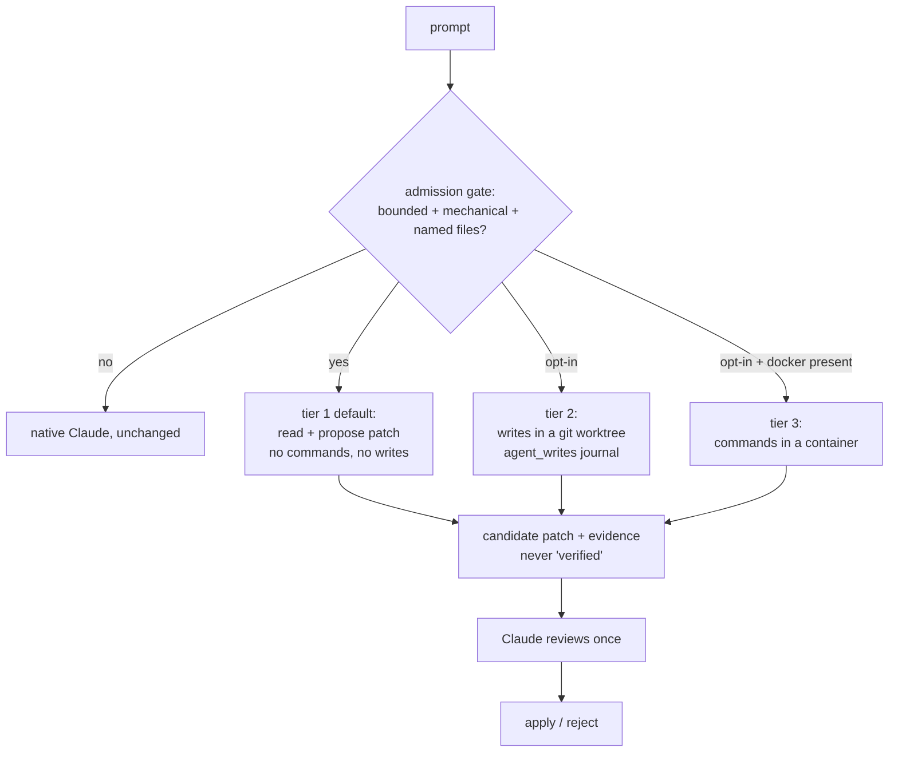

# Plan: local execution that a normal llm-router user actually gets

Written 2026-09-13, after a day of measuring. Every number here was taken on
this machine; nothing is projected.

## What the measurements force

| Finding | Consequence for the plan |
|---|---|
| Cost is **turns × context**, not execution. 6 prompts → 464 tool calls; 542 turns at 200-380K context | The saving comes from *collapsing turns*, not from moving execution. Any design that keeps one Claude turn per tool call saves nothing |
| A PreToolUse deny **blocks reliably, cannot answer**. 3 controlled runs; the model calls the substituted text prompt injection and retries via another tool | No mid-turn interception. Stop proposing it |
| `UserPromptSubmit` fires **once per prompt**, blind to the tool calls that follow | Automatic routing has to own the prompt *before* an agent starts, or not be automatic |
| Local is **8/11** on the brutal suite — 7/9 mechanical edits, 1/2 investigation — stable across 5 runs and unmoved by budget, acceptance checks, or fixing two broken tools | This is a ceiling. Scope to mechanical work; never route investigation |
| `br-money-total` and `br-trace-today` produced **confident wrong results**, one certified `verified_complete` by a check that passed while the objective was not met | A check that does not test the objective launders failure into success |
| llm-router installs with `pip`. Users have Python and maybe Ollama | **Docker must never be required.** Gating the headline feature behind a 2GB install kills adoption |

## The shape



Docker moves from *how you get the feature* to *how you get the strongest
guarantee*. Absent Docker you drop a tier, you do not lose the feature.

## Phase 0 — Measure the two things that could kill this  (do first)

Neither needs new code. Both use what shipped today.

**0.1 Does native review re-do the work?**
Codex's own warning: *"native review repeats all the work — savings can
disappear; benchmark this explicitly."* Run N tasks two ways — Claude alone, vs
`llm_local_task` then Claude reviewing the candidate — and compare **total
Claude input+output tokens and turn count**, not wall clock.
→ **Kill criterion: if review costs ≥80% of doing it directly, stop here.** The
whole architecture nets zero and no amount of confinement changes that.

**0.2 Would any gate admit real prompts?**
`needs_claude_tools` matched **0 of 6** real prompts. Replay a corpus — the six
measured prompts, paraphrases, mixed objectives, investigations, negatives —
against (a) the legacy predicate, (b) capability routing promoted out of shadow
mode, (c) a small local classifier.
→ **Kill criterion: if nothing reaches ~60% admission on genuinely mechanical
prompts with near-zero false admits, the trigger does not exist yet** and the
honest answer stays "an explicit command".

Both are a day's work and decide whether Phases 1-3 are worth building.

## Phase 1 — Fix what shipped, add the no-dependency tier

**1.1 The worker must not grade its own homework.** Codex found it: the
acceptance check runs in the worker's own directory (`local_task.py:86`), so the
worker can modify the code the check runs against. Run the check against a clean
copy at the recorded base commit.

**1.2 Retire `verified_complete` as currently defined.** It is emitted when a
supplied command exits 0 — which certified a wrong answer on `br-trace-today`.
Replace with `checks_passed` plus an explicit `objective_verified: false`.
Nothing the local model produces gets called verified.

**1.3 Tier 1: read-only, zero new dependencies.** The model reads the repo and
returns a candidate patch. No commands, no writes. Works on any machine that
already runs llm-router.
*Honest cost:* it cannot run tests, and running tests is part of how local
scored 7/9 on edits. Tier 1 is genuinely weaker, not merely safer.

**1.4 Tier 2: writes in a git worktree.** Today's behaviour, but isolated —
`agentic/worktree.py` exists and its create/merge path already needs the
hardening noted in the backlog. Never touches the user's working tree.

## Phase 2 — Make it fire without anyone remembering

**2.1 `/local <objective>` — ship immediately.** Zero risk, zero inference, and
it removes "Claude forgot" as the failure mode for anyone willing to type it.
This is the honest 80% of the value.

**2.2 Prompt-owning entrypoint — only if 0.2 passed.** Codex's `route()`: a
launcher wrapper that sees the prompt before any agent starts, admits or
declines, and hands the native agent the objective plus any candidate. Automatic
for prompts entering it; **no coverage if the user launches Claude directly**,
which must be stated in the README rather than discovered.

**2.3 PreToolUse counter — telemetry only.** Count distinct tool-use IDs per
prompt; log when a prompt crosses ~12. It cannot intervene (deny cannot answer),
but it builds the corpus that tells you which prompts *should* have been routed.

## Phase 3 — Confinement, only if Phase 0 said it pays

Docker tier, **auto-detected, never required**. If Docker is present, commands
run in a container with no mounts, no network, no credentials. If absent, tier 2
runs with an explicit warning. The current `agent_writes` allowlist admits
`python`, `node`, `pytest`, `go`, `cargo` — each can write anywhere and reach the
network — so tier 2's warning is not theatre.

## Phase 4 — Report honestly

`effective_rate` (drafts *used* / prompts) becomes the headline instead of
"routes: 200", which is the `limit=200` argument saturating. Savings are claimed
only from measured token deltas — never from "a local model ran".

## Sequencing

```
0.1 savings ──┐
              ├─► gate ─► 1.1 1.2 (fixes, do regardless) ─► 2.1 /local ─► 1.3 tier1 ─► 2.2 entrypoint ─► 3 docker
0.2 classifier┘
```

1.1 and 1.2 ship regardless — they are corrections to something already live.
Everything else waits on Phase 0.

## What this plan refuses to promise

- That tool calls get intercepted mid-turn. They do not; it is measured.
- That local matches cloud. It is 8/11 against 10/11 and did not move.
- That silent wrong answers get detected. Without an objective oracle there is
  no general detector — the design limits the *consequence* instead.
- That any of this saves money. That is Phase 0.1, and it is unmeasured.
