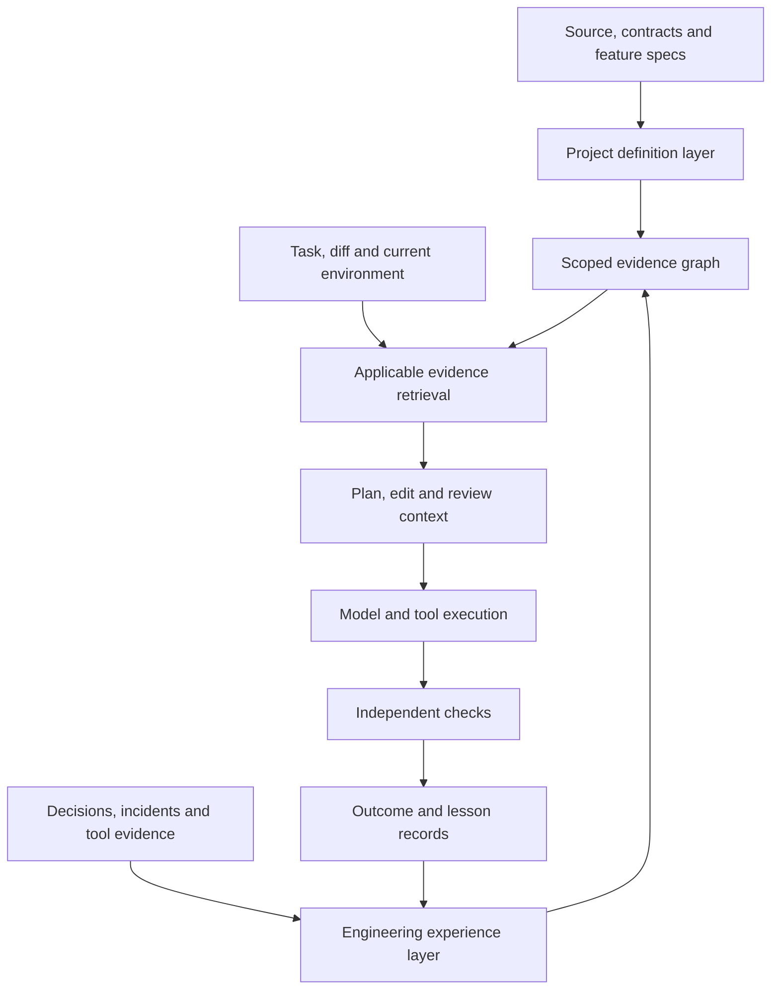

# llm-router: project semantics and engineering memory research and implementation blueprint

**Revised decision: build two connected, per-project semantic layers: project definition and engineering experience. Keep OKF, derive a searchable evidence graph, and connect validated lessons to development checks. Measure prevention of recurring mistakes as well as task quality before changing model-selection policy.**

Prepared 17 September 2026. Revision 2 incorporates durable engineering knowledge: decisions, errors, problems, performance, fixes, features and states. Repository inspected: [ypollak2/llm-router](https://github.com/ypollak2/llm-router), main at [0ebb439378b89369221fa4a60615f894b782e9f6](https://github.com/ypollak2/llm-router/commit/0ebb439378b89369221fa4a60615f894b782e9f6), package version 13.3.2.

This is research and a proposed design, not an implemented feature or a measured claim of graph-related improvement. The review examined 28 selected source, configuration, documentation and test files, the repository tree, primary research, and three isolated executable probes. Revision 2 adds static inspection of event harvesting, chapter sealing, the project-memory store and biography merging; it does not add new runtime probes. It did not run the full application, model benchmarks or test suite, and it did not change the GitHub repository.

**The revised recommendation**

1. Layer 1 describes the project: structure, domain concepts, features, contracts and invariants. Layer 2 records engineering experience: decisions, incidents, attempted fixes, measured outcomes and state changes.
2. These are connected views over one scoped evidence graph, not seven new services or databases. Every important memory links back to evidence and affected project entities.
3. Keep OKF for readable knowledge and a rebuildable SQLite index for retrieval. Preserve the original events and accepted knowledge outside the derived index.
4. Retrieve applicable lessons before planning, changing affected code and reviewing a diff. Where a lesson supports a reproducible check, connect it to a regression test or an explicitly adopted project rule.
5. Fix scope propagation, source verification and scoring first. The earlier probes remain relevant: a system that remembers a false diagnosis can repeat it more confidently.
6. Initially hold model routing fixed. Compare basic history retrieval, typed engineering memory and memory-guided checks separately, then test routing changes.
7. Measure repeat-failure rates, false warnings, obsolete-rule application, verified task completion and total resources. Remembering an incident is not proof of preventing it.

## 1. What problem are we actually trying to solve?

There are five distinct questions:

| Objective | Desired improvement | How a semantic layer might help |
|---|---|---|
| Context retrieval | Find the evidence needed for this task | Connect an unfamiliar business term to its implementation; retrieve callers, interfaces and related tests |
| Answer or implementation accuracy | Produce a correct explanation or working patch | Supply the actual contract and relevant dependencies, with current source spans |
| Engineering learning | Avoid repeating known failures while still permitting justified change | Retrieve conditional lessons, alternatives and regression checks at the relevant development step |
| Routing quality | Choose a model and execution mode that can complete the task | Estimate difficulty and missing information after inspecting project evidence |
| Evaluation validity | Measure real improvement | Record evidence provenance and context versions, then compare independently checked outcomes |

The structural graph targets retrieval. Its contribution to answer and implementation quality is plausible and supported by repository-level research. Engineering memory additionally requires extracting and maintaining useful lessons, checking their applicability and changing development behavior. Contributions to routing quality and recurrence prevention remain hypotheses for llm-router. Evaluation validity requires a redesign regardless of whether either graph view is built.

Do not use “semantic layer” to mean three interchangeable things. Embeddings retrieve similar meanings; a code graph represents structural relationships; a project ontology connects domain concepts, rules and decisions to code. The useful system combines these selectively.

A valuable question for llm-router is: **“Given this project's current evidence and the available tools, which execution option is likely to succeed?”** Prompt complexity alone cannot answer that.

**Revision to the original framing:** the first plan underweighted the knowledge experienced developers carry: why an apparently simple change was rejected, which workaround is temporary, what a failure looked like, and which conditions made a fix succeed. A code graph cannot reconstruct all of this from source. It must be captured from decisions, discussions, experiments and execution evidence.

The objective is to remember both what worked and what failed, together with their conditions. The system should help a future developer reconsider a decision intelligently, not freeze the project around its oldest choices.

## 2. What the current repository already provides

The existing implementation is more substantial than a basic keyword router. A new design should consolidate it.

| Existing component | What the inspected code does | Consequence for the proposal |
|---|---|---|
| OKF project scope | Resolves a Git root and uses a directory name derived from the resolved absolute path | Preserve project isolation; pass the resolved scope explicitly through all reads and writes |
| OKF source index | Reads tracked source files and extracts definition names using regular expressions; writes SourceFile documents with “Defines” lists | Useful navigation seed, but normally insufficient evidence for behavior, data flow or callers |
| OKF retrieval | Weighted lexical matching, default limit of three, with an identifier/path anchor requirement for bulk source documents | Precision is intentionally favored over recall; natural-language concept questions can miss relevant implementation |
| Shared injection module | Combines OKF, observed repository facts and optional session context | Extend this interface instead of adding another independent injection mechanism |
| Router's main execution path | Still performs direct OKF injection separately; its context-preparation call omits project_dir | The common injection abstraction is not yet universal |
| AST code context | Has optional tree-sitter parsing and budgeted source/signature rendering; candidate discovery is largely filename-driven | Reuse parsing and rendering work, but implement actual repository-wide relationships |
| Prompt semantic classifier | Embedding prototypes classify task type and subject, with fallback behavior | This is prompt semantics, not project semantics; keep the concepts separate |
| Semantic response cache | Uses a project scope derived from a different environment variable or cwd | Unify scope and add snapshot-aware invalidation for project-dependent answers |
| Session memory and repository facts | Store conversation/working context and inspect present Git state | A static graph must complement these, not pretend to replace them |
| Routing-quality ledger | Distinguishes usable responses, verification, technical fallback and quality escalation | Extend this ledger; preserve unknown verification as unknown |

Source references: [OKF](https://github.com/ypollak2/llm-router/blob/0ebb439378b89369221fa4a60615f894b782e9f6/src/llm_router/okf.py), [context injection](https://github.com/ypollak2/llm-router/blob/0ebb439378b89369221fa4a60615f894b782e9f6/src/llm_router/context_injection.py), [router integration](https://github.com/ypollak2/llm-router/blob/0ebb439378b89369221fa4a60615f894b782e9f6/src/llm_router/router.py#L4141), [code context](https://github.com/ypollak2/llm-router/blob/0ebb439378b89369221fa4a60615f894b782e9f6/src/llm_router/code_context.py), [semantic classifier](https://github.com/ypollak2/llm-router/blob/0ebb439378b89369221fa4a60615f894b782e9f6/src/llm_router/semantic_classify.py), [semantic cache](https://github.com/ypollak2/llm-router/blob/0ebb439378b89369221fa4a60615f894b782e9f6/src/llm_router/semantic_cache.py), [quality ledger](https://github.com/ypollak2/llm-router/blob/0ebb439378b89369221fa4a60615f894b782e9f6/src/llm_router/routing_quality.py).

**A specific discrepancy matters:** code_context.py describes callers and related tests in its module documentation, but the inspected extraction path gathers matching definitions and renders source or signatures. It does not implement the described caller traversal. Likewise, the shared-injection test explicitly exempts router.py from its prohibition on separate injection. Documentation intent should not be mistaken for runtime capability. [Extraction implementation](https://github.com/ypollak2/llm-router/blob/0ebb439378b89369221fa4a60615f894b782e9f6/src/llm_router/code_context.py#L227), [injection test](https://github.com/ypollak2/llm-router/blob/0ebb439378b89369221fa4a60615f894b782e9f6/tests/test_okf_choke_point.py).

### Existing engineering-memory foundation

The repository already contains a project-memory subsystem that should be extended:

| Component | Inspected behavior | Gap for organizational knowledge |
|---|---|---|
| [library-harvest.py](https://github.com/ypollak2/llm-router/blob/0ebb439378b89369221fa4a60615f894b782e9f6/src/llm_router/hooks/library-harvest.py) | Records tool events and working-memory material | Recorded command outcomes need reliable observed/unknown semantics and causal links; a successful command is not proof of a successful fix |
| [library/sealer.py](https://github.com/ypollak2/llm-router/blob/0ebb439378b89369221fa4a60615f894b782e9f6/src/llm_router/library/sealer.py) | Seals event-derived chapters with event IDs and Git metadata | Reuse source references, but validate each extracted claim rather than treating a cited chapter as proof of every sentence |
| [library/book_closer.py](https://github.com/ypollak2/llm-router/blob/0ebb439378b89369221fa4a60615f894b782e9f6/src/llm_router/library/book_closer.py) | Produces session summaries and appends proposed durable facts into a biography | Durable claims lack the planned applicability, contradiction, verification and supersession machinery |
| [library/store.py](https://github.com/ypollak2/llm-router/blob/0ebb439378b89369221fa4a60615f894b782e9f6/src/llm_router/library/store.py) | Writes OKF-compatible memory under the repository's ignored .llm_router/context directory | Add a shared project identity and a versioned typed-record contract; do not create a competing history collector |

A specific limitation in book_closer.py is MAX_BIO_FACTS = 40: on merges into an existing biography, older bullet facts retain their space and new additions are trimmed to remaining capacity. Increasing that constant would postpone saturation. A searchable collection of small, versioned lessons with query-specific selection addresses the underlying issue.

Also, library-harvest.py's _outcome defaults to an “ok” outcome when it cannot derive a recognized failure or exit code. The revised design must preserve “unknown/not observed” instead of promoting that fallback into proof that an operation, test or repair succeeded. These are static code findings, not additional reproduced end-to-end defects.

### Three reproduced prerequisites

These are results from the inspected functions in temporary directories, without model calls.

| Probe | Setup and observed result | Required correction |
|---|---|---|
| Explicit-root indexing | From repository A, call index_project(root=B, base=temp_store). It reports one indexed file and B's store, but writes the document under A. B's expected document is absent. | Pass the resolved root into _write_source_concept and every enrichment/session writer. Do not recover scope from process cwd at the write boundary. |
| Unverified enrichment | Supply nonexistent_module.py and a response containing a definition of fabricated_symbol. The source file does not exist, but a concept is written and can be retrieved. | Treat extracted names as candidates. Read and parse allowed source files before asserting definitions. Retain unverified proposals separately if useful. |
| Wrong-directory answer accepted | Pass wrong_directory/okf.py to the grounding benchmark with gold answer src/llm_router/okf.py. The scorer returns true. | Parse and compare the exact normalized repository-relative answer; reject extra or contradictory paths. |

The first issue follows from index_project accepting root while _write_source_concept recomputes its destination without it. The second follows from enrichment extracting syntactic patterns without a source-existence/definition check in that path. “Checkable” is not the same as “checked.” The third follows from accepting either the full path or its basename as a substring. [Index and writer](https://github.com/ypollak2/llm-router/blob/0ebb439378b89369221fa4a60615f894b782e9f6/src/llm_router/okf.py#L835), [enrichment](https://github.com/ypollak2/llm-router/blob/0ebb439378b89369221fa4a60615f894b782e9f6/src/llm_router/okf.py#L913), [benchmark scorer](https://github.com/ypollak2/llm-router/blob/0ebb439378b89369221fa4a60615f894b782e9f6/scripts/bench_grounding.py#L124).

Two additional static findings belong in the same prerequisite work: router.py calls prepare_prompt without project_dir, so that call cannot activate the project-dependent AST branch; and the current semantic cache scope convention differs from OKF's. These were established by source inspection, not end-to-end reproduction.

**Priority:** fix these and measure the corrected baseline before attributing any subsequent improvement to a graph. Otherwise a scope fix or richer source snippet could receive credit as a semantic-graph gain.

## 3. What the research supports, and what it does not

| Primary source | Evidence relevant to this decision | Applicability and limitation |
|---|---|---|
| [RepoGraph, ICLR 2025](https://arxiv.org/html/2410.14684v2) | Adds repository code relationships to multiple software-engineering systems. Its main SWE-bench Lite table reports Agentless resolve rate increasing from 27.33% to 29.67%, with average reported inference cost rising from $0.34 to $0.39. | Strong rationale for a controlled code-graph experiment. This is a 2.34 percentage-point gain in that setup, not a prediction for llm-router. Main experiments were Python and Lite, using older model versions. |
| [CodexGraph, revised July 2026](https://arxiv.org/abs/2408.03910v3) | Integrates code graphs with agent query interfaces; evaluates repository tasks using CrossCodeEval, SWE-bench and EvoCodeBench. | Supports structured navigation for complex repository questions. Does not establish that a graph database service or unrestricted generated graph queries are necessary for this project. |
| [Repoformer, ICML 2024](https://arxiv.org/abs/2403.10059) | Shows why retrieving on every request is wasteful and sometimes harmful; investigates selective retrieval. | Supports an explicit “no retrieval” choice. Its completion-model training and reported serving gains do not transfer automatically to a general agent router. |
| [Microsoft GraphRAG](https://arxiv.org/abs/2404.16130) | Uses an entity graph and community summaries to improve global sensemaking over large text collections. | Potential later fit for broad architecture/document questions. Its main task is not code change correctness or model routing. Do not treat this paper as proof for an LLM-extracted graph over every file. |
| [Aider repository map](https://aider.chat/docs/repomap.html) | Uses compact code definitions and dependency-based graph ranking within a token budget. | A practical precedent for a small repository map and selective expansion. Documentation describes an implementation, not an independent causal evaluation. |
| [RouteLLM](https://arxiv.org/abs/2406.18665) | Learns routing decisions from preference data and studies quality/cost trade-offs. | Supports outcome-based routing evaluation. It supplies no evidence that project graph topology alone predicts the best model. |
| [RouterBench](https://arxiv.org/abs/2403.12031) | Provides a framework and recorded model outcomes for comparing routing policies. | Useful inspiration for a task-by-model outcome matrix. Once context or tools change, old output rows no longer represent the new treatment. |
| [SWE-bench](https://arxiv.org/abs/2310.06770) | Evaluates repository changes against real issue tasks and executable checks. | Provides an end-to-end task pattern. Keep future solution patches and evaluation-only tests out of retrieval. |
| [CrossCodeEval](https://arxiv.org/abs/2310.11248) | Evaluates completion requiring cross-file context across several languages. | Useful for context-sensitive retrieval/completion checks, but completion scores are not agent task success. |
| [Lost in the Middle](https://arxiv.org/abs/2307.03172) | Demonstrates position sensitivity and degraded use of relevant evidence in long contexts for the evaluated models/tasks. | Supports measuring context placement and volume. It does not establish an identical effect size for current models. |

**Synthesis:** the research supports repository structure as a useful retrieval aid. It does not establish that more graph content always helps, that small models become reliable merely by adding context, or that graph-assisted routing beats the existing router. Those remain local experimental questions.

### Additional research for engineering experience and long-term memory

| Primary source | Relevant evidence or practice | Implication and limit |
|---|---|---|
| [Reflexion](https://arxiv.org/abs/2303.11366) | Agents retain feedback-derived reflections across trials without updating model weights | Supports carrying useful experience into later attempts. A reflection is still an inference and does not automatically establish a software root cause. |
| [ExpeL, AAAI 2024](https://arxiv.org/html/2308.10144v3) | Extracts and recalls insights from prior task experience; an ablation found that adding reflections to insight generation could hurt performance | Supports conditional lessons and evaluation of extraction quality. Its task results are not evidence of reduced production regressions in llm-router. |
| [A-MEM, 2025](https://arxiv.org/abs/2502.12110) | Proposes dynamically organized, linked memory notes | Supports connecting experiences by meaning rather than storing only chronological transcripts. Automatically created associations need provenance and validation here. |
| [Zep temporal memory architecture, 2025](https://arxiv.org/html/2501.13956v1) | Distinguishes event time from ingestion time and tracks time-dependent relationships | Useful temporal design inspiration. This is the system authors' memory research, not independent evidence of fewer software defects. Do not adopt “newer claim wins” as a truth rule. |
| [LongMemEval, ICLR 2025](https://arxiv.org/abs/2410.10813) | Tests extraction, multi-session reasoning, time reasoning, updates and abstention | Adapt these dimensions to engineering history, then add executable development outcomes. Conversational recall alone cannot measure prevention. |
| [Michael Nygard: Documenting Architecture Decisions](https://cognitect.com/blog/2011/11/15/documenting-architecture-decisions) | Records decision context, status and consequences while retaining superseded choices | Use compact decision records with revisit conditions. This is engineering practice, not a controlled experiment establishing a graph advantage. |
| [Google SRE: Postmortem Culture](https://sre.google/sre-book/postmortem-culture/) | Connects incident understanding to reviewed preventive actions | Link lessons to completed checks and corrective work. Preserve contributing conditions rather than personal blame. This does not prove that storing a postmortem prevents recurrence. |

**Revised synthesis:** the literature supports experience retrieval, structured decisions, temporal memory and preventive actions as complementary mechanisms. None of these sources establishes that their combination will reliably prevent recurring bugs in this repository. The proposal below is a testable design inference.

### OKF is compatible with this direction

The [upstream OKF specification](https://github.com/GoogleCloudPlatform/knowledge-catalog/blob/main/okf/SPEC.md) already defines cross-concept Markdown links and optional provenance, trust and lifecycle fields. Links express relationships, but relationship type is conveyed in surrounding prose; generic graph consumers usually see untyped directed links.

Therefore:

- Keep curated concepts and project rules in OKF.
- Extract explicit links as links, without inventing a stronger type.
- Add a versioned llm-router extension for typed code relations when needed.
- Build the executable retrieval index as a derived view, preserving source IDs and provenance.
- Do not claim upstream OKF mandates the proposed schema or already provides the planned traversal engine.

The local parser preserves additional frontmatter in extra, but find_relevant does not traverse a typed relationship graph. The gap is largely in extraction, query behavior and evidence handling, not in needing a replacement Markdown format.

## 4. Alternatives and the recommended scope

| Approach | Main benefit | Main weakness | Decision |
|---|---|---|---|
| Correct existing OKF and AST delivery | Cheapest route to better evidence delivery | Limited natural-language and relationship retrieval | Mandatory baseline |
| Exact symbol index plus lexical search | Fast, deterministic navigation | Can miss paraphrases and indirect relationships | Build first |
| Lexical plus embedding retrieval | Finds conceptual similarity without exact identifiers | Similar chunks need not be the required dependencies | Strong comparator; optional production component |
| Hybrid retrieval plus bounded code graph | Retrieves related evidence even when vocabulary differs | Freshness, resolution and maintenance complexity | Recommended experiment |
| Search over ADRs, incidents and past attempts | Makes useful engineering history available with little ontology work | Can retrieve outdated or irrelevant advice | Mandatory experience-memory baseline |
| Typed engineering memory linked to code and checks | Connects conditions, decisions, attempts and verified results to future work | Causal mistakes, obsolete lessons and workflow integration | Recommended second-layer experiment |
| LLM-generated whole-repository knowledge graph and summaries | Broad document-level navigation | Inferred edges, ingestion expense, stale summaries and contamination risk | Defer |
| Graph neural network or graph embeddings for routing | Potential learned structural features | Needs suitable labels and adds another training problem | Defer until simpler features show value |

The graph should earn its place by beating **the corrected, budget-matched non-graph baseline**. Beating the current symbol-name-only index is too weak a test.

Start with Python, because it is directly useful to llm-router and permits precise extraction with the standard AST. Provide explicit coverage reports. Add TypeScript through a language adapter later if cross-project demand justifies it. Tree-sitter supplies syntax structure; it is not, by itself, a complete cross-file semantic resolver.

SQLite is a design choice for a local, bounded MVP: adjacency tables, metadata and FTS search can live in one file with no service deployment. Add an optional embedding index only after the lexical baseline. Reconsider a dedicated graph engine only if measured graph size or query requirements exceed this design.

## 5. Proposed per-project architecture



The graph is a knowledge and retrieval component. It should not absorb provider execution, session lifecycle, authorization, budget accounting or the agent state machine.

### 5.1 Project identity and isolation

Resolve a ProjectScope once at the request boundary and pass it as an immutable value. It contains:

- Canonical project root, existing OKF project slug and a full root fingerprint.
- Worktree identity and base commit, when Git is available.
- Snapshot identity, dirty-file manifest and indexing generation.
- Provider/privacy constraints and session identifier where applicable.

Store the new derived data next to that project's existing OKF material:

```text
~/.llm-router/knowledge/projects/<existing-project-slug>/semantic/index.sqlite
```

Use database tables for the manifest and schema versions, avoiding a second competing manifest. Existing OKF files remain where they are. Large optional vectors may live in a separate file under the same semantic directory.

The path-derived OKF slug is useful for compatibility but contains only an eight-character hash suffix. Persist and check the full fingerprint before opening an index. Scope every read, write, cache entry and async job with the same resolved identity.

Rules:

1. Different clones and worktrees are isolated by default, even with the same remote or directory basename.
2. Branch names are descriptive metadata; they do not identify a snapshot. Use commit plus indexed-content manifest.
3. Dirty edits and allowed untracked files belong to the working snapshot. Unsaved editor buffers require an explicit buffer adapter and a separate overlay.
4. Monorepos initially use one repository scope with package/subproject metadata. Nested repositories remain separate unless explicitly configured otherwise.
5. Non-Git projects require an explicit root. An unresolved or ambiguous workspace must not silently select the server's home directory.
6. Symlinks cannot expand collection outside the allowed root. Renames, deletes and parser failures must invalidate obsolete evidence.
7. Moving a checkout creates a new scope by default. A future explicit migration can preserve portable curated knowledge.
8. Shared model metadata can remain global. Source, session material, embeddings, concept mappings and task outcomes must retain their project boundaries.

Do not solve async scope propagation with per-request changes to process environment variables. Concurrent requests would race.

For durable knowledge across checkouts, distinguish a logical project identity from checkout/worktree identity. By default keep the existing isolation. An explicit project registration can associate trusted worktrees with one logical project and make reviewed lessons available across them, while source snapshots, active state and raw session histories remain scoped. Validate applicability against the receiving branch before using a shared lesson. Do not infer permission to share merely from matching remote URLs or directory names. This prevents a new worktree from losing explicitly shared project knowledge without reopening automatic cross-project contamination.

### 5.2 Two primary layers with connected views

Use two principal layers inside one per-project graph. Domain meaning belongs alongside structure in Layer 1. Layer 2 contains several kinds of experience, each with its own evidence and lifecycle.

| Layer/view | What it remembers | Example nodes and relationships |
|---|---|---|
| 1A. Structure | What exists and how components connect | File, Module, Symbol, Test; DEFINES, IMPORTS, REFERENCES, CALL_CANDIDATE |
| 1B. Product meaning | What features and rules mean | Feature, Capability, DomainConcept, Contract, Invariant; IMPLEMENTED_BY, CONSTRAINED_BY, ACCEPTANCE_CRITERION |
| 2A. Decisions | Why an option was chosen and what was rejected | Decision, Alternative, Constraint; CHOSEN_OVER, JUSTIFIED_BY, SUPERSEDES |
| 2B. Problems and incidents | Symptoms, impact, conditions and diagnoses | Problem, Incident, FailureSignature, CauseHypothesis; OBSERVED_IN, SUSPECTED_CAUSE, SUPPORTED_CAUSE |
| 2C. Attempts and fixes | What was tried, what changed and what was verified | Attempt, Patch, Outcome, Lesson, Procedure; ATTEMPTED_FOR, FAILED_UNDER, VERIFIED_FIX_FOR, PREVENTED_BY |
| 2D. Performance | Measured trade-offs in a specified environment | Experiment, Workload, Measurement, Baseline; MEASURED_ON, COMPARED_WITH, REGRESSES_UNDER |
| 2E. Feature and state history | How the project evolved and what is currently known | FeatureTransition, DeploymentObservation, KnownLimitation; TRANSITIONS_TO, OBSERVED_AT, REVERTS, ENABLED_IN |

A test importing a function is evidence of a reference, not proof of behavioral coverage. Runtime coverage applies only to the measured revision and execution. A statically found call can be unresolved or merely possible because of aliases, decorators, dynamic dispatch and dependency injection.

Cross-layer links give these views value. A proposed change to a cache can retrieve the affected module, the tenant-isolation invariant, the previous leakage incident, the rejected cache-key design, its verified replacement and the regression check.

For llm-router, “project isolation” is a useful initial concept. For other projects the same mechanism could connect “subscription renewal,” “tax classification” or “forecast reconciliation” to their implementation and history. Start with a small vocabulary per project; do not create an exhaustive ontology in advance.

### 5.3 Minimal storage contract

| Record | Required fields |
|---|---|
| Snapshot | scope_id, snapshot_id, base_commit, manifest_hash, schema_version, extractor_version, status, created_at |
| File | snapshot_id, relative_path, language, content_hash, parse_status, ignored_reason |
| Entity | snapshot_id, entity_id, kind, qualified_name, relative_path, source_span, source_hash |
| Relation | snapshot_id, relation_id, source_id, type, target_id or unresolved_reference, evidence_id, resolution_status |
| Evidence | evidence_id, provenance_kind, resource, source_span, source_hash, observed_at, validity_state |
| Concept claim | claim_id, concept_id, statement, evidence_ids, author/origin, review_state, supersedes |
| Experience event | project_id, event_id, source_system, source_id, source_revision, session_id, event_time, recorded_at, evidence_uri, evidence_hash, observed_outcome |
| Versioned memory claim | project_id, claim_id, claim_version, kind, statement, evidence_ids, applicability, valid_from, valid_until, known_from, known_until, review_state, validation_state, supersedes |
| Development lesson | lesson_id, failure_family, triggers, preconditions, exceptions, suggested_action, check_refs, affected_entities, last_validated_at |
| Performance observation | experiment_id, commit, environment, workload_hash, metric, unit, sample_count, measurement_method, baseline_id, uncertainty |
| Intervention trace | task_id, memory_snapshot_id, retrieval_reason, applicable_lessons, action_taken, checks_run, outcomes, unobserved_steps |
| Retrieval trace | route_id, snapshot_id, memory_snapshot_id, retriever_version, seeds, traversed_edges, selected_evidence_ids, token_budget, omissions, status |

Entity identity should include language, module/path, kind and qualified name, with an explicit disambiguator for repeated or overloaded definitions. Keep identity within a snapshot distinct from an optional cross-snapshot logical ID. A rename should not silently equate two entities based on a similar name.

Index outgoing and incoming relations. Referential integrity, parser versions and atomic generation switches matter more than an elaborate graph schema. Source entities belong to a code snapshot; engineering claims span snapshots through explicit applicability and validity. Do not delete durable lessons whenever the source index is rebuilt.

### 5.4 Incremental indexing and freshness

1. Enumerate allowed files, apply size/type exclusions, and compute a content manifest.
2. Read changed files once and parse the exact bytes that were hashed.
3. Extract definitions, signatures, imports and references. Resolve only what the language adapter can support.
4. Replace entities and relations owned by changed files in a transaction; remove deleted-file records.
5. Re-resolve affected import/reference boundaries, because a definition change can invalidate another file's edge.
6. Invalidate derived summaries or concept associations whose evidence changed.
7. Publish a complete index generation atomically.
8. At retrieval, verify selected source hashes against the requested working snapshot. Refresh or omit changed evidence and expose the omission.

Use dirty-file hooks to enqueue updates, with a bounded background worker and periodic reconciliation for missed events. Avoid rebuilding the repository synchronously on every prompt.

Parser failure must produce an explicit “unavailable for this snapshot” state. Do not retain old relationships as though they describe new code. A prior snapshot can be queried only when intentionally requested.

For the structural MVP, parse source and curated documents without an LLM. The experience MVP starts with manually reviewed lesson records and deterministic event adapters. A later bounded extraction job may propose lessons from histories, with cost accounting, exact source references and an unverified status. It may not silently promote a proposal into a project constraint.

### 5.5 Capture experience without turning speculation into knowledge

Use an evidence-first pipeline:

1. Capture an original event or document revision.
2. Extract candidate assertions with exact references.
3. Resolve affected features, components, symbols and environments.
4. Distinguish observation, author assertion and causal hypothesis.
5. Validate what can be checked; review significant diagnoses or decisions.
6. Publish an applicable lesson and link its checks.
7. Reassess it when assumptions change or contradictory evidence arrives.

The existing raw session events and sealed chapters remain source records. Index them through an adapter rather than rebuilding a second collector. Chapters, biographies and summaries are navigation aids; individual assertions must remain traceable to original events. Legacy biography entries start as source-attributed claims, not automatically verified lessons.

For externally retrieved issue/PR/incident material, retain an authorized immutable source revision or content hash and available timestamps. Synchronization uses source IDs, revisions and cursors for idempotence. A changed issue body becomes a new source revision; a repeated webhook cannot create an independent “confirmation.” Restrict ingestion to authorized project sources and preserve their access boundaries.

| Source | What it can establish | What it cannot establish alone |
|---|---|---|
| Git diff or commit | A specific change exists at a revision | Why it was made or whether it solved the problem |
| Issue or PR discussion | Someone described a symptom, rationale or proposed fix | That the description is correct or the proposed fix shipped |
| Test/CI receipt | Named checks ran with a recorded result on a specific snapshot | That all relevant behavior is correct |
| Incident record | Reviewed timeline, evidence and stated contributing causes | A universal causal rule for unrelated systems |
| Session conversation | The user or agent said or decided something | That an intended action was executed |
| Performance run | A measurement under recorded conditions | Comparable performance on different hardware or workloads |
| Deployment observation | A version or flag was observed in an environment | That a merged change is deployed everywhere |

A failed test followed by an edit and a passing test suggests an effective repair. It does not prove the diagnosed mechanism, exclude a flaky test, or establish a general rule. Separate CauseHypothesis, observed patch outcome and accepted causal explanation.

### 5.6 Compact records that future developers can use

Each durable lesson should answer these questions:

| Field | Purpose |
|---|---|
| Problem and impact | What failed, for whom, and with what consequence? |
| Trigger and conditions | What must be true for this lesson to apply? |
| Affected entities | Which features, modules, contracts and environments are involved? |
| Diagnosis | What is observed, suspected, contradicted or independently supported? |
| Attempt history | Which approaches failed, partly worked or were not tried? |
| Successful approach | Which repair or procedure has evidence of success, and at what scope? |
| Prevention | Which test, invariant, review check or operational check detects recurrence? |
| Exceptions and revisit conditions | When is the prior advice no longer appropriate? |
| Evidence and validity | Which source revisions support it, and when was it last checked? |

Decision records additionally include considered alternatives, trade-offs, owner or decision authority, adoption status and consequences. A team preference is not an empirical fact. A rejected option must retain the reason for rejection, including constraints that could later disappear.

**Concrete starter record, based on the first review's isolated probe:**

| Property | Proposed content |
|---|---|
| ID | experience/project-scope-write-001 |
| Symptom | Indexing project B while running in A writes B's source document into A's knowledge directory |
| Affected code | okf.index_project and okf._write_source_concept at inspected commit 0ebb439 |
| Supporting evidence | The isolated explicit-root probe described in section 2 |
| Supported mechanism | The indexer accepts root; the writer computes project_knowledge_dir without that root |
| Suggested repair | Carry immutable project scope through reads, writers, enrichment and background jobs |
| Repair status | Proposed; this research did not implement or verify the repair |
| Prevention check | Run the explicit-B/cwd-A case and concurrent A/B writes, asserting destinations and retrieval isolation |
| Applicability | Shared processes or calls where requested project and process cwd can differ |
| Narrow exception | A command intentionally operating only on its own resolved project still needs a clearly scoped boundary |
| Enforcement | Advisory until a reviewed regression check or explicit project rule is adopted |

This record is useful even before a repair lands, because it tells the next developer what remains unverified. It must not claim “fixed” simply because the recommended change appears in this document.

### 5.7 Time, contradictions, feature states and performance

Store two timelines: when an assertion applies in the project, and when the memory system learned or revised it. The temporal distinction is inspired by [Zep](https://arxiv.org/html/2501.13956v1); the code- and environment-specific applicability below is this proposal.

Use explicit, separate state axes:

- Review: extracted, reviewed, disputed or rejected.
- Validation: untested, supported-by-observation, reproduced, or contradicted.
- Applicability: active, needs-revalidation, superseded, or retired.
- Enforcement: advisory, selected-check, or adopted-project-rule.

An accepted design decision can still have no empirical validation. A reproduced old bug can be fixed while its prevention lesson remains active. An unresolved issue must remain discoverable without being presented as an established root cause.

For current development, filter by project, relevant components, commit ancestry/version, environment, feature flags and remaining assumptions. Two maintenance branches can have different valid decisions at the same wall-clock time. Do not treat the most recent timestamp as the winner.

When evidence conflicts, retain both claims and their provenance. A resolver may propose supersession, but absent authoritative evidence the system should surface the conflict. If a current test contradicts a historic lesson, investigate scope and test adequacy before either discarding the lesson or overriding the test.

Feature state has multiple dimensions: requested/planned/in-progress/implemented, tested status, merged status, and deployment/flag status per environment. Preserve allowed transitions, transition evidence and reversals. “Merged” never implies “deployed”; a local successful run never implies “healthy in production.” Future transition validation is a deterministic reducer over observed events, not a model's impression of progress.

Performance observations must carry code/model version, hardware, concurrency, workload/data hash, warm/cold cache state, measurement window, sample count, units and uncertainty. Store raw observations alongside conclusions. Historical “this path is fast” claims expire or require revalidation when those conditions change.

Long-lived invariants should not expire just because they are old. Live service-health observations should have short validity. Age is one factor in retrieval, not a substitute for applicability.

### 5.8 Persistence and curation

Retain the existing project's .llm_router/context source history. Add reviewed OKF lesson/decision records under the same project's knowledge namespace, for example experience/lessons and experience/decisions; the SQLite graph is a derived index over them and the original evidence. Connector snapshots, when needed, also live within that project namespace. Index rebuilds must not erase original history or the authoritative accepted records.

Do not put every event into every future prompt. Keep raw evidence under explicit retention rules, deduplicate events, and rank compact lessons for the task. Never discard a high-impact lesson solely to preserve the first 40 biography bullets.

Use one versioned record format and serializer for the new schema. The inspected memory store has a minimal YAML-subset parser; do not assume it already supports arbitrarily nested lesson objects. Either extend and validate that boundary or store complex payloads as schema-validated sidecar JSON with simple OKF links.

Support concurrent writers with idempotent source IDs and transactional claim versions. Session identity belongs on every event; a shared current-book marker must not determine ownership for concurrent sessions.

A project archive or restore must include accepted lessons, their evidence references and source history, not only the graph database. Sensitive evidence requires scoped access and deletion across derived claims, embeddings and caches. Event immutability is a history design, not a reason to preserve material that must be removed.

Start with 10-20 important, reviewed lessons per project and a few decision records. Local drafts can be captured automatically; converting a model-generated lesson into an enforceable project policy follows the project's existing change process. This is a proposed product control, not a request for approval to update this research.

## 6. Retrieval, context packaging and routing

### Retrieval flow

1. Check whether the request needs project evidence or development history. Generic questions can bypass retrieval. For edits, use the requested change and diff as retrieval inputs, not only the original prompt.
2. Resolve explicit paths/symbols and the active file, then search lexical fields and curated concept aliases.
3. Optionally add embedding candidates, after applying project and provider/privacy constraints.
4. Merge candidate rankings, for example with reciprocal-rank fusion, without treating cosine similarity as probability of correctness.
5. Expand relation types appropriate to the task, initially at most one or two hops with a hard node/edge cap. For development work, traverse affected entities to applicable incidents, decisions, attempted fixes and prevention checks.
6. Rerank with query relevance, provenance, source freshness and diversity. Penalize unresolved relations and generic high-degree utility nodes.
7. Read source spans and exact historical evidence. Assemble a small pack with separate current-source and applicable-experience slots; include unresolved conflicts and missing checks.
8. Return missing-evidence and budget-truncation information. An empty pack is a legitimate result.

Starting caps such as 20 seeds, 100 expanded entities and a 2,000-token evidence budget are **experimental defaults**, not measured optima. Sweep budgets such as 1k, 2k and 4k on the development split, then freeze them before the holdout.

Task-specific traversal is important:

| Request | Expansion |
|---|---|
| Where is a function defined? | Exact symbol lookup; no graph expansion necessary |
| What changes if this signature changes? | Reverse references, supported callers and interface relationships |
| Why does this rule reject the input? | Rule/decision evidence, implementation and relevant test assertions |
| Fix this cross-module failure | Traceback/issue seeds, nearby dependencies and test evidence |
| Is CI green or has the PR merged? | Use current external tool observations; static repository knowledge is insufficient |
| Refactor or optimize an existing component | Retrieve applicable past failures, rejected alternatives, performance assumptions and prevention checks |
| Continue a feature after several sessions | Retrieve evidenced state transitions, unresolved blockers and accepted decisions; verify current checkout and environment |
| Revisit an old decision | Retrieve its original constraints, counterevidence and explicit replacement or revisit criteria |

### Evidence pack

Return a typed ContextPack, then render it consistently for each provider:

```json
{
  "schema_version": 2,
  "memory_snapshot_id": "<as-known-claim-generation>",
  "applicable_lessons": [],
  "decision_constraints": [],
  "suggested_checks": [],
  "unresolved_conflicts": [],
  "scope_id": "<resolved-project-fingerprint>",
  "snapshot_id": "<commit-and-content-manifest>",
  "retrieval_status": "partial",
  "evidence": [
    {
      "id": "e1",
      "path": "src/llm_router/okf.py",
      "symbol": "project_slug",
      "source_hash": "<actual-content-hash>",
      "span": {"start_line": 95, "end_line": 106},
      "origin": "source_parser",
      "resolution": "definition_observed"
    }
  ],
  "missing_requirements": ["current_external_status"],
  "retrieved_tokens": 1200,
  "budget_tokens": 2000
}
```

This is an illustrative contract, not output from an implemented retriever. A real pack also includes selected source excerpts, edge evidence and omissions. Each applicable lesson includes its ID/version, trigger, matching conditions, exceptions, source evidence, status and why it was selected. Suggested checks are typed references resolved by the host, not executable commands copied from retrieved prose.

Maintain separate slots for user instructions, source evidence, session state and live observations. Deduplicate by evidence identity and source hash. Do not repeatedly prepend the same pack on retries. Preserve space for the task, tool history and output.

Retrieved comments, docs and model-authored notes are untrusted content. They cannot change tool permissions, data-exfiltration policy, provider constraints or system instructions. Apply the same privacy policy to embeddings, cached excerpts and inference. The graph's derived status never makes a secret safe to transmit.

An index outage should fall back to existing routing and direct tools. A scope mismatch or disallowed content should fail closed for retrieval. “Retrieval failed” must remain observable, not be counted as “no relevant evidence exists.”

### Integration with this repository

| Location | Proposed change |
|---|---|
| okf.py and commands/okf.py | Make scope explicit through reads/writes; verify enrichment; retain existing commands and portable notes |
| New semantic/scope.py and semantic/store.py | Shared scope/snapshot contract and SQLite storage |
| New semantic/extractors/python.py | Deterministic source extraction and bounded reference resolution |
| New semantic/indexer.py | Incremental updates and atomic publication |
| New semantic/retrieve.py and semantic/pack.py | Hybrid retrieval, traversal and evidence packing |
| code_context.py | Reuse source parsing/rendering through the new provider; retire duplicate discovery logic progressively |
| context_injection.py | Accept a prepared pack and enforce one attach/budget policy |
| router.py | Pass project scope into preparation; replace separate injection; expose pre-selection evidence features |
| hooks/auto-route.py | Replace “some OKF docs exist” with an explicit evidence-availability assessment appropriate to the task |
| semantic_cache.py and related caches | Use the shared scope and snapshot contract; invalidate project-dependent answers when evidence changes |
| library/store.py, library/sealer.py and library/book_closer.py | Reuse event provenance; replace the fixed biography-fact cap with versioned, retrievable records; keep source history and separate proposed from validated knowledge |
| hooks/library-harvest.py | Add reliable observed/unknown outcomes, stable event identity and per-session ownership; record verification receipts without interpreting missing evidence as success |
| New semantic/experience.py and semantic/applicability.py | Typed experience records, temporal/branch validity, contradiction handling and lesson matching |
| Host hook/MCP adapters and CI integration | Deliver lessons at planning/edit/review boundaries; connect adopted regression checks to the existing development workflow |
| routing_quality.py | Version the telemetry extension, retaining current null/unknown semantics; link task outcomes to memory and intervention versions |

These filenames under semantic are a proposed module layout. Keep changes incremental rather than rewriting the large router and hook files at once.

### When to change model selection

First, keep the same model policy and test context quality. Next, expose small structural features:

- Whether required entities were resolved and evidence is current.
- Whether relevant bodies/contracts fit the budget.
- Number and types of affected modules, capped to avoid size dominating.
- Unresolved references, ambiguities and required live observations.
- Tool requirements, execution mode and known runtime access.
- Test availability and recent verified outcomes for comparable tasks.

None of these is a reliable model-quality predictor by itself. In particular, a large graph is not automatically a hard task, and a short prompt is not automatically easy.

Define eligibility from capabilities, privacy, tools and context limits first. Later fit a calibrated success predictor on held-out, context-conditioned outcomes, then select a low-resource eligible option above a quality threshold. Keep fallback and verification in the loop.

Do not relax tool requirements because a graph returned a plausible answer. Reading a graph cannot execute a requested edit, run a test, inspect live CI or preserve agent state by itself.

### Development workflow that can actually prevent recurrence

A passive history search leaves prevention to chance. The proposed loop has five explicit integration points:

| Point | Behavior | Evidence of useful action |
|---|---|---|
| Before planning | Retrieve relevant decisions, known limitations, prior unsuccessful approaches and conditional lessons | Plan references the applicable constraints and identifies checks |
| Before editing an affected component | Match affected entities and change intent to high-impact lessons; expand retrieval if new files enter scope | Brief warning or checklist explains the trigger and supporting incident |
| After editing | Inspect the actual diff for applicable invariants and known failure mechanisms | A concrete finding or a “not applicable” explanation tied to the diff |
| During verification | Run relevant adopted checks through existing permitted tools; keep task-specific checks too | Command/test receipts at the changed snapshot |
| At completion | Record actual attempts, outcomes, remaining uncertainty and candidate new lessons | A verified outcome or an explicitly unresolved problem, not an optimistic summary |

Use a small lesson budget, initially about 3-5 high-value lessons within a tunable history-token allowance. Deduplicate repeated warnings within a task. An important omitted lesson due to the budget must remain visible in diagnostics.

Checks provide the strongest prevention mechanism. A reliable regression test in CI continues protecting the project even when the agent fails to retrieve the lesson. Use AI advice for interpretation and check selection; use reproducible tests or established policies for enforceable behavior. Do not create tests that merely match a code shape or freeze an implementation choice.

Retrieved prose alone cannot create a hard block, run arbitrary commands, expand permissions or impose a new organizational rule. A warning is advisory unless the project has adopted the corresponding policy or check. Legitimate exceptions are recorded with the changed conditions and evidence.

llm-router can deliver evidence to routed models, but a normal completion call does not necessarily observe the host's later edits or test executions. Claude Code or another host must invoke supported hooks/tools, and independent CI must run the applicable checks. Mark each task's prevention coverage as observed, partial or unavailable. Do not claim an error was prevented when the relevant action was outside the observed workflow.

The MVP can expose proposed structured operations such as experience.lookup(task, scope, diff), experience.record(event), and experience.review(diff, scope). These are proposed APIs, not existing commands. Keep them within the existing tool/permission and context-delivery architecture.

A key retrieval example is a future task saying “share this cache across workspaces.” The desired output is the prior scope failure, its triggering conditions, the supported scope-propagation lesson and the cross-project check. The agent should then produce a design that passes that check. Merely repeating “be careful about isolation” does not meet the objective.

## 7. Evaluation that can distinguish real gains

### 7.1 Establish these baselines

| Arm | Context | Routing |
|---|---|---|
| A | Current pinned behavior, retained for historical comparison | Current policy |
| B | Corrected OKF, scope handling, exact scoring and working source-context delivery | Fixed policy |
| C | Budget-matched lexical plus optional vector retrieval, no graph traversal | Same fixed policy |
| D | Same retriever/content as C plus bounded graph expansion | Same fixed policy |
| E | Same context engine as D | Graph-feature routing policy |
| F | Tool-driven repository search/read baseline | Fixed model or policy as specified |
| M0 | Structural baseline plus budget-matched lexical/vector search over the same allowed raw history and ADRs | Fixed policy and host tools |
| M1 | Structural baseline plus typed, applicable engineering-memory records derived from that history | Same fixed policy and host tools |
| M2 | M1 plus memory-guided planning/review and selection from an identical available check suite | Same fixed policy and host tools |

B versus A measures foundational fixes. D versus C estimates incremental graph value. E versus D estimates routing-policy value. F tests whether direct tools already solve the relevant problem effectively. M1 versus M0 tests whether typed experience and applicability improve over simply searching history. M2 versus M1 tests the added development workflow. Do not change model routing simultaneously with memory trials.

For a routing-only comparison, replay the same precomputed ContextPack to each router and keep the model pool, tool availability and budgets identical. For a complete-system comparison, allow each system its own retrieval but charge all ingestion, retrieval and execution resources. Label these as different experiments.

Add an oracle-evidence arm on a diagnostic subset: if the same model still fails with the required evidence, the bottleneck is unlikely to be retrieval alone.

### 7.2 Task set

Start with about 150 curated pilot tasks across at least three projects, including llm-router. The pilot is for fault finding and effect-size estimation, not a universal improvement claim. Build a larger, frozen confirmation set, for example 500 or more tasks across additional projects, only after a power analysis informed by the pilot.

Include:

- Exact symbol/file questions with same-basename decoys.
- Natural-language concepts that do not name the implementation.
- Multi-file relationship and impact questions.
- Small repository edits checked by independent tests.
- Rule/decision explanations requiring cited evidence.
- Session continuations whose referents must be resolved.
- Branch switches, dirty edits, deleted symbols and renamed files.
- Unsupported language and unresolved dynamic-call cases.
- Generic prompts where no project context should be injected.
- Questions with no answer in the repository.
- Two simultaneous projects containing the same names but different behavior.
- Live-state requests that require tools, plus injected instructions inside retrieved text.
- Repeated failure mechanisms expressed through new features or renamed code.
- Rejected designs whose original constraints still apply, and counterexamples where those constraints have changed.
- Open incidents, superseded diagnoses, failed fixes, reverted fixes and disputed lessons.
- Performance claims with mismatched workloads/hardware, and feature states that differ by deployment environment.

Report both a production-weighted aggregate and individual task strata. An intentionally graph-heavy diagnostic set alone cannot establish general product value.

### 7.3 Independent ground truth and contamination controls

For source lookup, derive gold answers from an independently checked source snapshot and require exact normalized paths. For relationship queries, use a reviewed set of relevant evidence and explicitly permit multiple valid answer sets. A human patch's touched files are useful but not a complete list of every valid solution.

For edits, run task-specific hidden checks plus the relevant regression suite in an isolated environment. Do not index the target solution, later commits, hidden evaluator tests or post-task session notes. Existing tests present in the task's starting repository are legitimate context.

Split by repository and time/commit boundaries. Group paraphrases and related issue families so near-duplicates cannot cross train/dev/test. Audit any RouterArena data already used for tuning; retain its published protocol for external comparability and add a separate project-context track.

Do not generate all evaluation questions or gold labels from the graph being evaluated. That rewards the extractor's own vocabulary and blind spots. LLM-created task drafts may help, but source verification and independent review are required.

Any LLM judge is secondary: blind it to the treatment, use a fixed rubric, check agreement against human review, and report disagreement. A polished explanation is not equivalent to a correct patch.

### 7.4 Metrics

| Layer | Primary metrics | What to avoid |
|---|---|---|
| Retrieval | Evidence recall/precision at a fixed token budget; required-relation coverage; answerability/abstention quality | Counting retrieved nodes as useful context |
| Context delivery | Evidence tokens, duplicate fraction, budget overflows, missing-evidence rate | Counting a successful injection call as sufficient context |
| Grounding | Citation correctness, supported factual claims, stale-evidence rate, wrong-project evidence incidents | Treating an existing filename as proof of the claim about it |
| Task result | Exact lookup accuracy, independently verified completion, patch resolve rate, critical failures | Using draft acceptance or “response returned” as accuracy |
| Engineering learning | Recurrence under relevant change opportunities, lesson applicability precision, missed warnings, stale-rule use, memory-induced regressions | Counting recalled lessons or cited incidents as prevented bugs |
| Routing | Quality regret, quality-driven escalation, calibrated success prediction, routing coverage | Treating a timeout or provider outage as proof of wrong model selection |
| Efficiency | End-to-end p50/p95 latency, first index and update time, resource use per verified completion | Reporting only the successful final model call |
| Safety and isolation | Scope violations, unauthorized content retrieval, prompt-injection effect on permissions | Averaging a cross-project leak away inside an overall score |

For eligible models/execution modes m, task i, and a fixed context condition c, estimate quality Q(i,m,c) from repeated, independently checked outcomes.

**Quality regret** is the mean of max_m Q(i,m,c) minus Q(i,chosen(i),c). This is price-independent and compares routers on the same feasible pool and evidence. An oracle calculated from one stochastic run is noisy; repeat runs on the confirmation set and report uncertainty. Use the oracle only for evaluation, never as inference-time knowledge.

Also report success-versus-resource frontiers and quality at fixed budgets. A single combined score conceals policy choices. If a scalar is eventually needed, publish its weights and sensitivity analysis.

For success predictions, report Brier score and calibration curves. Report coverage alongside selective risk: a system that declines every hard task should not look accurate simply because it returns little.

### 7.5 Fair treatment of local and subscription models

Zero marginal API price is a legitimate accounting fact in some configurations. It is not zero resource use, and charging a fictional API tariff is also misleading.

Publish separate views:

1. Actual marginal money spent, including retries and indexing calls.
2. Resource usage: wall time, tokens, local hardware specification, model size/quantization, memory and compute time where measurable.
3. An optional ownership-cost scenario with explicit amortization, utilization and energy assumptions.
4. Subscription/quota consumption as a separate constrained resource.

Token counts differ by tokenizer and do not make compute identical. Record tokens per provider plus comparable wall-time/hardware conditions. State what is estimated and what is measured.

Total cost per verified completion includes failed attempts, fallbacks, judge calls, embedding/indexing and amortized index maintenance. Show cold-start and steady-state separately; state the assumed number of queries used for amortization.

Do not reuse cached model outputs from a no-graph experiment as though those models saw graph context. Build a task × context-arm × model/execution-mode × repeat outcome matrix. Offline policy replay is valid only for rows generated under the evaluated evidence and tool conditions. End-to-end adaptive agents still need real execution runs.

### 7.6 Statistical discipline and adoption gates

Randomize arm order, pin model versions and parameters, record local hardware/load, and distinguish warm/cold cache conditions. Use paired comparisons and confidence intervals clustered by task and project. Show per-project results and leave-one-project-out sensitivity. With very few projects, acknowledge that uncertainty about new-project performance remains large.

**Proposed gates, to calibrate and freeze before the confirmation run:**

- D beats the strongest corrected non-graph baseline by at least 3 percentage points on the predeclared relationship-heavy primary stratum, with a 95% paired interval excluding zero.
- Aggregate verified success is non-inferior within a predeclared 1-point margin, or achieves a predeclared resource reduction at non-inferior quality.
- No observed wrong-project retrieval or policy violations in the adversarial isolation suite. This is a release gate, not proof of zero future risk.
- At least 98% of audited factual citations point to supporting evidence at the evaluated snapshot.
- Warm retrieval overhead initially targets p95 below 200 ms on a declared reference machine for a declared repository size, with all optional embedding work included or separately disclosed.
- The new routing policy must show additional benefit over D. If it does not, ship the retrieval improvement alone.

These numbers are engineering decision thresholds, not literature results or promised performance. A 150-task pilot may be far too small to establish a three-point gain or one-point non-inferiority. Use the observed paired disagreement rate to set confirmation sample size.

If graph traversal cannot beat corrected hybrid retrieval under these controls, keep the simpler retrieval system. That is a useful outcome, not a reason to redesign the benchmark until the graph wins.

### 7.7 Evaluate experience over time, not just memory recall

Construct a temporal engineering-history track:

1. Choose a historical cutoff and a project snapshot.
2. Build memory only from authorized material actually available by that cutoff. Use both event time and ingestion/availability time.
3. Give the agent a later task that can trigger a previously seen failure mechanism.
4. Run the same model, tools, available checks and budget under M0, M1 and M2.
5. Evaluate the patch with independent task and recurrence checks.
6. Include negative controls: similar symptoms with different causes, obsolete rules, changed constraints, unrelated tasks and genuinely new failures.

If an earlier incident's fix and regression check predate the cutoff, they are legitimate memory. The later target task's solution, future reviews, hidden checks and post-cutoff diagnoses must remain excluded. Group task variants by incident/failure family and use repository holdouts to avoid rewarding memorized patches.

Use identical fixed history snapshots first to measure retrieval effects. Then run a separate sequential experiment in which each arm accumulates its own experience from completed tasks, under the same update rules. This exposes self-poisoning, duplication and forgetting that a frozen retrieval benchmark can miss.

Keep independently authored task tests and check access matched across arms. If M2 runs more checks, charge that time and compare with a fixed-check policy using a matched execution budget. Adding a new regression test to only one arm would confound test availability with the benefit of memory. In a separate production study, measure the combined value of memory and newly adopted protections explicitly.

| Metric | Definition or interpretation |
|---|---|
| Recurrence rate | Tasks reintroducing a known failure divided by independently labeled opportunities where that mechanism could recur |
| Lesson applicability precision/recall | Relevant applicable lessons retrieved versus independently annotated relevant lessons, including missed high-impact lessons |
| False-warning rate | Inapplicable warnings per relevant development task; report interruption cost |
| Obsolete-rule application | Tasks where superseded or out-of-scope advice changes the plan or patch incorrectly |
| Memory-induced regression | Paired tasks that pass without the memory treatment but fail with it; investigate causality rather than infer it from one noisy run |
| Effective verification | Relevant adopted checks actually executed, their results and independently caught failures |
| Resolution effort | Attempts, wall time, tool calls, tokens and money per independently verified completion |
| Temporal/state accuracy | Correctly distinguishes proposed, implemented, verified, merged, deployed and reverted states at the requested time/environment |
| Provenance coverage | Actionable claims with resolvable supporting evidence and explicit validity |
| Capture quality | Precision of extracted causes/lessons, duplicate rate, contradiction handling and curation time |

Logs saying “the agent followed the lesson” do not establish prevention. Online “mistakes avoided” is counterfactual and cannot be read directly from an intervention log. Use controlled comparisons and report observed changes.

For an initial pilot, curate roughly 30-50 historical incident/decision families with later task variants and matched negative controls across several projects. This is for feasibility and failure analysis, not a powered effectiveness claim. Freeze a larger confirmation set and use paired confidence intervals clustered by incident family and project.

**Additional proposed release gates, to pre-register after the pilot:**

- At least 20% relative reduction in recurrence versus the strongest matched history baseline, with an interval excluding no benefit; always show absolute counts and rates. If the baseline recurrence rate is zero, relative reduction is undefined and cannot be used as a success claim.
- Aggregate task success meets the same predeclared non-inferiority margin as the structural experiment.
- Applicable-lesson precision of at least 90% on a reviewed test set, with high-impact misses reported separately.
- No observed enforcement caused solely by an unreviewed memory claim; no cross-project evidence exposure.
- Review burden, false warnings, runtime overhead and curation effort remain within predeclared operational budgets.

These are proposed engineering thresholds, not results or guarantees. Rare recurrence may require many more tasks or longer observation. If structured memory adds no value over searchable ADRs/history, retain the simpler memory path. If checks help without a graph, keep those checks regardless.

## 8. Revised delivery plan

The original 3-5 week estimate covered a structural retrieval MVP. The expanded goal adds historical ingestion, validity, prevention integration and a new evaluation track. Planning estimate for one engineer familiar with the code: approximately **6-9 weeks for a narrow two-layer pilot**. This is not a commitment, and it excludes open-ended history cleanup, broad language support and production deployment integrations.

Build a thin experience layer early, using 10-20 reviewed lessons, rather than postponing all memory work until a comprehensive code graph is finished.

| Phase | Work | Exit condition |
|---|---|---|
| 0: Correct the baseline, 2-3 days | Explicit-root writes, source verification, exact scoring, project_dir delivery and shared scope | Existing probes become meaningful regression cases |
| 1: Evidence and thin memory, 4-6 days | Reuse current event store; typed lesson/decision records, observed/unknown outcomes, identity and legacy-biography adapter | Reviewed starter lessons have evidence, conditions and separate repair status |
| 2: Structural index, 3-5 days | Python source graph, source spans, snapshot generations and invalidation | Code entities link to the starter lessons without breaking project isolation |
| 3: Applicable retrieval, 4-6 days | Current-code and history retrieval, budgeted pack, branch/time filters, conflicts and state projections | Correctly retrieves applicable lessons and rejects stale or unrelated advice |
| 4: Development workflow, 4-6 days | Planning/edit/review integration, selected checks, completion receipts and coverage reporting | Demonstrates a known failure caught by the available regression check in an observed host workflow |
| 5: Controlled evaluation, 5-8 days plus runs/review | B/C/D/F structural comparisons and M0/M1/M2 history comparisons, fixed and sequential memory trials | Quantifies incremental graph value and recurrence reduction with uncertainty |
| 6: Optional expansion, separate decision | Broader automatic extraction, more languages, performance/incident connectors and calibrated routing | Each expansion demonstrates incremental benefit over the simpler baseline |

This sums to about 22-34 engineering days before contingency, data curation and review, making 6-9 calendar working weeks a planning range rather than an aggressive coding-only estimate. Routing changes move behind evidence of retrieval and experience value.

Suggested feature modes: off, shadow and on. Version these controls separately for source retrieval, history retrieval and intervention. Shadow mode must not alter the selected context, model or development behavior, though its actual overhead is still recorded.

Potential CLI additions, all **proposed rather than existing**:

- llm-router semantic index/status/explain/inspect: source and graph diagnostics.
- llm-router experience lookup: relevant prior decisions, failures and fixes for a task or diff.
- llm-router experience record: capture a structured event or proposed lesson.
- llm-router experience review: inspect lesson validity, contradictions and missing evidence.
- llm-router experience supersede: record a replacement with rationale and source evidence.
- llm-router experience export/import: portable reviewed knowledge with project identity and provenance validation, following existing data-access rules.

Prioritize a readable explanation over a graph dashboard: “This change touches a component involved in incident X; conditions Y match; check Z protects the known failure.” Display exceptions and unverified status when present.

## 9. Concrete acceptance cases

| Case | Required behavior |
|---|---|
| Explicit project B requested while server cwd is A | All indexing, retrieval and enrichment remain scoped to B |
| Two concurrent projects share function names | No shared mutable request scope and no cross-project answer-cache hit |
| Model response invents a source definition | It cannot become verified source evidence without reading the corresponding source |
| File changes during indexing | Published snapshot reflects consistent hashed bytes; race is detected or retried |
| Branch changes or file is deleted | No obsolete relationship is silently presented as current |
| Definition has aliases or dynamic dispatch | Return candidate/unresolved status when resolution is incomplete |
| Curated business rule conflicts with source | Show both the rule claim and observed implementation with provenance; flag the conflict |
| Graph contains a high-degree helper | Hard expansion and token caps prevent irrelevant neighborhood flooding |
| Retrieved text requests permission bypass or data export | Treat it as data; permissions remain unchanged |
| Question concerns current CI state | Require a fresh tool observation, or state that it is unknown |
| Graph unavailable or corrupt | Existing router/tools continue; retrieval failure is recorded |
| Prompt is generic and self-contained | Retrieval may abstain; no forced project material |
| Source evidence cannot fit the budget | Report omissions; do not declare the task fully grounded |
| Draft cites a real file but makes a false behavioral claim | Grounding is not considered verified merely because the file exists |
| A cheap model fails and a stronger model succeeds | Record all resources and the quality escalation, without claiming the cheap attempt as savings |
| A historic failure has been fixed but its mechanism is still possible | Keep the prevention lesson active while marking the particular incident resolved |
| An old rejected approach becomes valid after an architecture change | Show the original rejection and changed conditions; allow a justified new decision |
| A model invents a root cause after a failed run | Preserve it as a hypothesis; no verified-cause or enforceable-rule promotion |
| An incident has two disputed diagnoses | Retrieve both with evidence and uncertainty |
| A “successful” command has no reliable result receipt | Record unknown outcome; do not mark the fix verified |
| A feature is merged but disabled in production | Keep merged and deployment/flag states separate |
| A performance claim uses a different workload or machine | Flag it as non-comparable until conditions are matched |
| A biography already contains 40 facts | New useful knowledge remains indexable; older records are not automatically privileged |
| A host action bypasses the router's observation points | Report partial prevention coverage and retain independent CI protection |
| A historical summary is regenerated | Preserve source identity and avoid counting it as independent confirmation |
| A known lesson is irrelevant to the current task | Abstain instead of injecting an unnecessary warning |
| A new task reintroduces a known mechanism | Select the applicable lesson and verify against a relevant check; record the actual outcome |

These tests protect architecture-level behavior. They should supplement the existing suite with meaningful scope, freshness and end-to-end integration checks, not merely assert that a module imports a particular helper.

## 10. Revised decision

**Proceed with two connected per-project layers: project definition and engineering experience. Keep OKF, preserve original evidence, and use a derived graph to retrieve current structure together with applicable history.**

The original plan was incomplete for the goal of retaining organizational knowledge. Source relationships explain what the project contains. Engineering experience explains why it became that way, which mistakes have already been investigated, what remains uncertain and when earlier advice should be revisited.

Avoid a large automatic knowledge platform as the starting point. First connect a small number of important, reviewed lessons to real code entities and real development checks. This exposes whether the memory is useful before investing in broad extraction.

The expanded hypotheses are: **current project relationships improve verified task outcomes; applicable engineering experience reduces recurring failures; and explicit development checks make that experience operational.** Measure each independently. Remembering more history and preventing more mistakes are different achievements.

